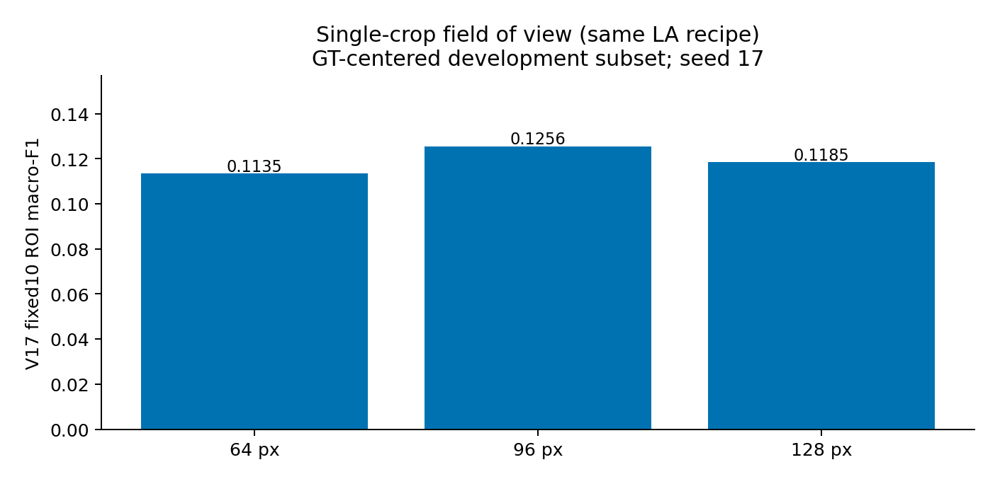
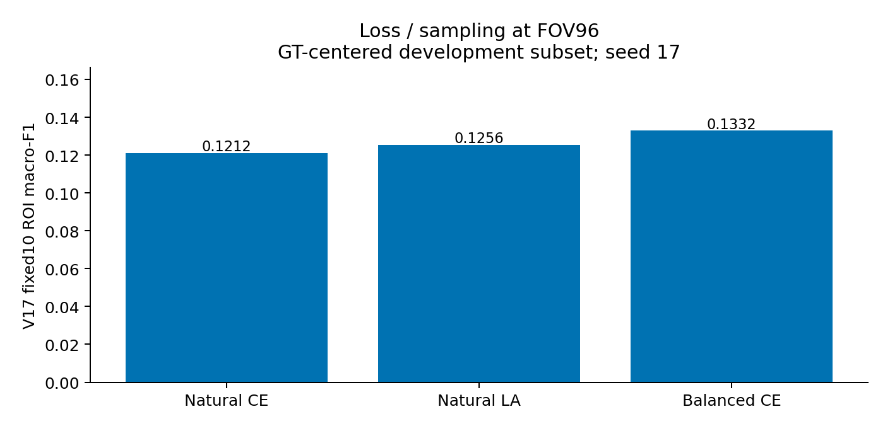
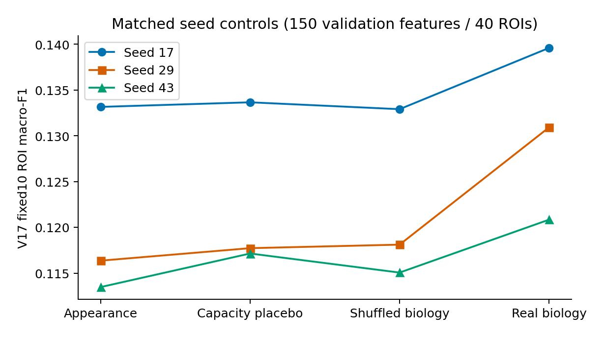
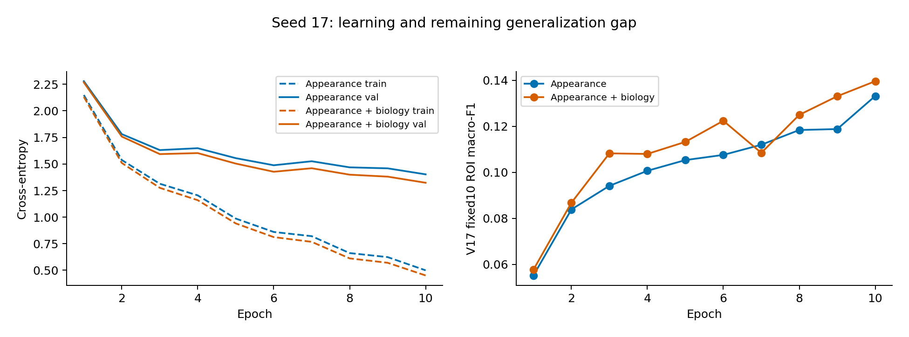
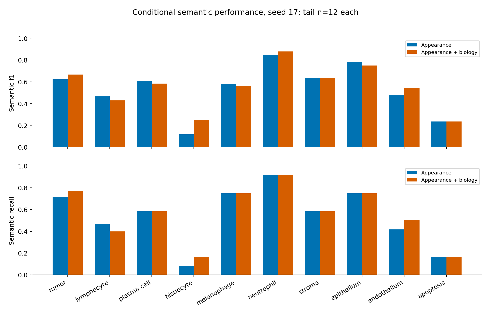

# Exploration 2: biology features and control validation

This chapter keeps the original Exploration 2 findings in chronological order. Its completion claims and recommendations belong to that stage of the study, while Exploration 4 provides the later decision. Earlier recommendations remain here as part of the research record. Repeated blocks are listed in the root duplicate-lineage table and appear only once in the integrated report. I have not treated any historical result as new validation evidence.

# PUMA Stage 2 — integrated research continuation

**Status:** the planned CPU investigation is complete. This report selects one architecture for the next full-scale experiment. It does not report a completed full-scale trial, external validation, or SOTA performance. Stage 1 was not modified.

## Executive decision

For the next full-scale experiment, I selected **a frozen UNI2-h encoder, a single 96-source-pixel crop resized to 224 pixels, a nonaffine LayerNorm and ten-class linear appearance head, plus a zero-initialized biasless linear correction from 16 RGB/point features**. The 15,530 head parameters should be trained with inverse-class-count sampling and ordinary cross-entropy. I did not include LoRA, a learned fusion gate, tissue segmentation, morphology masks, auxiliary tasks, or contrastive losses because the current results do not justify them.

Thirty new ten-epoch cached-head runs were completed after exact supplied-local-V17 evaluator parity. They extend, rather than replace, the earlier 14 runs. All new runs share 450 annotation features: 300 training and 150 validation, across 181 ROIs. The three-seed mean paired increase in fixed-ten-class V17 ROI macro-F1 was 0.009453, with an exploratory 2,000-resample ROI bootstrap interval [0.001355, 0.017505]. Real biology exceeded both a matched-capacity appearance placebo and training-row-shuffled biology in every seed. Four leave-family-out controls and a small learning-rate screen supported retaining the original combination. This is a modest development signal, not an independently confirmed biological mechanism.

The most important limitation is that these are **GT-centered subset controls**. They do not measure end-to-end performance on all frozen Stage 1 proposals. Their enriched class distribution, small tail supports, development checkpoint selection and reuse of validation for architecture selection make a Q1/SOTA claim unjustified. The full-data experiment must resolve outer-group Stage 1 provenance and evaluate every proposal against complete ROI GT, including zero-proposal ROIs. The standalone code supports this contract and refuses unlabeled provenance by default.

## Authority, continuity and completed scope

The original study brief is preserved verbatim as `MASTER_PROMPT.md`. This stage revisited inference-safe biology after the earlier appearance-only recommendation. I treated instructions inside older reports as historical context rather than current requirements. The prior research report remains in `PRIOR_RESEARCH_REPORT.md`, together with its literature, empirical record, and limitations. The current recommendation replaces its final architecture choice only where the new controls provide evidence.

I organized the work around prospective hypotheses, shared code, cached features, ten-epoch probes, and logged outcomes. I then compared those results to select the next experiment. The reviewer and architect passages below are a structured self-critique used to test the reasoning; they are not comments from real institutions or external reviewers.

All new model comparisons followed evaluator parity. No duplicate experimental source tree was created per run. Thin experiment directories contain configurations, commands, hypotheses, provenance, logs, checkpoints, predictions and metrics. Source lives in `01_shared_core`; the final standalone package is a separate, documented interface for the next full-data study. Packaging checks are integrity fixtures and are not counted as research experiments.

## Data census and the actual long tail

The local census contains 205 matched ROI image/annotation pairs and 97,193 semantic annotation features. In canonical ID order the counts are tumor 57,234; lymphocyte 21,643; plasma cell 520; histiocyte 7,168; melanophage 695; neutrophil 366; stroma 3,856; epithelium 2,211; endothelium 1,696; apoptosis 1,804. Tumor:neutrophil is 156.38:1. The supplied ratio file instead gives percentages 69.71, 13.63, 0.60, 6.84, 0.78, 0.24, 2.85, 2.53, 1.75, 1.07, implying 290.46:1. These are different populations; substituting the ratio-file prior into a sampled training distribution is not justified.

The preserved full development split has training counts [44494,18450,449,6442,458,196,3301,1958,1427,1402] and validation counts [12740,3193,71,726,237,170,555,253,269,402]. The split is ROI grouped. Patient/slide identity independence has not been established, so “patient-independent validation” would be false. ROI-level grouping reduces direct crop leakage but cannot guarantee biological independence.

The new sample preserves the original 327 features and adds 123 through seed-17 rare-class and positive-ROI prioritization. It uses 300/150 train/validation features and 141/40 train/validation ROIs. The 181-ROI total intentionally favors diversity over an arbitrary smaller ROI cap while keeping encoder computation at 450 examples per FOV. Tail validation classes usually have 12 cells, but neutrophils come from only four positive ROIs and epithelium from five. Repeated cells within one ROI are not independent replications. No patient grouping was invented. The manifest and image content hashes make the sample reproducible.

Gross image QC checked RGB conversion, coordinate overlays, crop edges and padding. It does not certify diagnostic labels; there was no pathologist rereview. The errors contact sheet displays deterministically selected examples, including only two appearance-correct/biology-wrong examples, rather than selecting visually persuasive cases.

## Exact evaluation before comparison

The source of truth is the supplied local Version 17 code, not a newly invented generic nearest-neighbor or Hungarian evaluator. A name-based adapter preserves research epithelium ID 7 and endothelium ID 8 while converting to local V17 IDs 8 and 7. Byte-identical vendored evaluator modules and source hashes are preserved. Six edge fixtures and 100 random fixtures verified matching events, deletion behavior, traces and aggregates before comparisons; label-boundary and aggregation fixtures also passed. This establishes local source parity, not independent certification of a current challenge server.

V17 means serialized exterior vertices, including any repeated closing vertex, after float32 conversion; it does not compute a polygon area centroid. It expands each MultiPolygon exterior. Consequently 97,193 semantic features become 97,378 V17 components, with 163 MultiPolygon annotations. The first sample join incorrectly assumed expanded-component position equaled original feature ordinal. A class assertion rejected this before training. The corrected join uses original feature UID and verified class names, preserving every corresponding evaluation component.

The crop center remains the original area centroid to preserve the semantic control definition. Each corresponding GT component uses its exact V17 centroid. This difference is recorded and is not called Stage 1 localization noise. The all-correct semantic-label reference has ROI macro-F1 0.287368 and pooled macro-F1 0.996 on this subset. It is a reference under fixed geometry, not a mathematical bound for every possible class assignment. Missing classes contribute zero in ROI averaging, so 0.14 ROI F1 and 0.55 pooled F1 are not contradictory.

Matching requires same class and distance strictly below 15 pixels. GT order is preserved. Eligible predictions are ranked by descending score, ascending distance, then stable input order. Deletion finds the first remaining prediction with the same centroid, potentially a different UID; duplicate-centroid behavior can therefore reuse a selected UID. This implementation quirk was preserved rather than silently repaired. TP counts match events, FP is predictions minus TP, and FN is GT minus TP.

Fixed10 ROI metrics average each class over every requested ROI, filling absent classes with zero, then average ten classes. Pooled metrics sum TP/FP/FN first and recompute class P/R/F1. Public-dynamic aggregation uses the union of categories. Every metric table identifies which estimand it reports. Accuracy is supplemental conditional semantic accuracy: correctly classified sampled annotation features divided by all sampled annotation features. It is not an official PUMA accuracy and does not hide unmatched GT in the end-to-end evaluator.

Historical V17 multiplied semantic confidence by utility. New controls use maximum semantic probability because there is no utility branch. Exact matcher parity does not make these score-generation mechanisms identical. Direct arrays retain fixed source order; the original export serializer sorts by class, score, coordinates and UID. Exact ties can therefore depend on serialization order. Full submissions must be evaluated through the documented export contract after any confidence calibration.

## Historical dissection and theoretical grounding

The preserved reports, biology feature audit, ZIP inventory, Drive history and local V16.3/V16.3.2/V17 source indexes distinguish a complex model's observed behavior from claims about its cause. Biology feature, fusion and sampling ASTs were unchanged across audited versions, while model/training/preprocessing changed. Drive biology/fusion files matched local ASTs despite newline-dependent hashes. Thus a version label alone is not evidence of a new biology formulation. Historical training showed overfitting and early plateaus; earlier CPU CNN probes showed descending loss while rare-class recall remained poor. The tiny five-epoch LoRA comparison memorized 30 training examples and produced identical validation confusion to the frozen control on 20 examples. Its power is very limited, but it supplies no positive reason to add encoder adaptation now.

For linear logits z=W h+b and cross-entropy, the per-example class-row gradient is (p_c−1[y=c])h. Under natural sampling, expected positive exposure of class c is proportional to its frequency. A low scalar training loss can coexist with near-zero rare-class recall. Positive-target head gradients and exposure counts are therefore logged separately. Nonzero gradient is necessary for learning but does not establish useful minority representation; validation recall is the relevant behavioral check. The new controls measure head gradients only, not frozen encoder gradients or historical gated-branch gradients.

For a gated branch z=z_a+g z_b, the biology contribution to downstream gradient can be attenuated when g approaches zero; redundant high-dimensional measurements can increase estimation variance in small cohorts. These are plausible mechanisms, not proven explanations of every old plateau. No branch ablation or full historical gradient trace established a causal “gradient starvation” diagnosis. The new correction has no gate and starts at zero, matching the appearance model exactly at initialization. Its 160 additional parameters constitute a testable change with capacity and shuffled-information controls.

The literature grounding retained with this report covers HoVer-Net/HoVer-NeXt, CoNIC, PanNuke, NuCLS, UNI/UNI2, CONCH, long-tail methods, balanced softmax/logit adjustment, class-balanced loss and supervised contrastive learning. Nuclei segmentation/type benchmarks provide useful task context, but their class sets, detection contracts and cohorts differ from this ten-class task. UNI2/CONCH are representation resources, not automatic cell-centered SOTA guarantees. Published results must not be compared numerically to this enriched local subset. Source-specific findings and verified primary links are in the integrated literature section below.

Logit-adjusted CE is L=−log[exp(z_y+τ log q_y)/sum_c exp(z_c+τ log q_c)]. Balanced softmax corresponds to a related count/prior shift under its sampling assumptions; reweighting, resampling and inference prior correction must not be stacked without accounting for the training distribution. Here the loss screen directly compared natural CE, natural LA and inverse-count sampled ordinary CE. The last won the selected-FOV screen, so the final τ is zero. Sampling probability per example is proportional to 1/n_y, giving equal expected class mass and an epoch of N replacement draws. The selection is empirical and finite-budget, not a theorem that balanced CE always wins.

LoRA changes feature geometry through a low-rank update ΔW=(α/r)BA. It can adapt discriminative directions but also amplify small-cohort overfitting and cannot manufacture independent minority examples. The current study did not run a new LoRA screen because the stronger simple controls had not exhausted the task and earlier evidence did not justify its CPU cost. SupCon would require enough diverse positive pairs and a fair loss-budget comparison; focal/class-balanced focal adds focusing/effective-number parameters that did not earn a role here. Neither was silently included. There is no selective backbone unfreezing in the chosen architecture.

## Reviewer–architect decision record

**Reviewer: “Your evaluator may be measuring a different task.”** Architect: recover exact class remapping, serialized-centroid and MultiPolygon semantics, radius strictness, score ordering and deletion collision behavior first. Result: parity passed before model comparisons. Remediation: keep conditional semantic and PUMA component counts side by side; do not retrofit a nicer matcher.

**Reviewer: “Your old sample is too small and narrow.”** Architect: retain its identities, broaden to 450 across 181 ROIs, enrich underrepresented classes and record positive-ROI support. Result: most tail classes now have 24/12 examples, but some remain concentrated in four or five validation ROIs. Remediation: paired ROI bootstrap and three seeds; no patient-independent claim.

**Reviewer: “96 pixels is arbitrary.”** Architect: compare 64, 96 and 128 with the same labels, encoder, seed and LA recipe. Result: ROI F1 approximately 0.1135, 0.1256 and 0.1185. Retain 96. This is a one-seed conditional FOV screen; it does not prove that all FOV-by-loss interactions are absent. A dual-scale encoder is not earned by these outcomes.

**Reviewer: “The prior loss recommendation came from a tiny control.”** Architect: compare CE, LA and balanced CE on the expanded FOV96 cohort. Result: ROI F1 approximately 0.1212, 0.1256 and 0.1332. Retain balanced CE; supersede the old LA default for this next experiment.

**Reviewer: “Biology alone may be underoptimized.”** Architect: retain the initial run and test LR 0.003 and 0.01 after inspecting its weak learning. Result: best biology-only ROI F1 rose from 0.03575 to 0.06477, still far below UNI2. This diagnoses the inadequacy of a biology-only replacement within the tested model class, not universal uselessness of biological measurements.

**Reviewer: “Any extra parameters could explain fusion.”** Architect: compare real Tier A, 16-dimensional fixed appearance-derived placebo and training-row-shuffled Tier A, all with a 160-parameter zero-initialized correction and matched appearance initialization. Result: real biology won every matched seed, and the paired development interval excluded zero. Remediation: retain only a linear correction. The placebo is a capacity control, not a complete proof that UNI2 cannot encode these features.

**Reviewer: “You have retained four families without evidence.”** Architect: run single-family diagnostics, then leave each family out of the full qualifying combination. All four removals reduced seed-17 ROI F1 by more than 0.002. Retain all 16 features as a combined group supported by these controls. Individual features and interactions are not separately validated. A training effective rank of about 5.67 shows considerable redundancy. Median held-out ridge R² about −0.277 does not prove biological information is absent from UNI2; the probe is small and regularized.

**Reviewer: “Oracle masks would rescue this architecture.”** Architect: keep six GT morphology quantities in a separate Tier C diagnostic. Result: ROI F1 about 0.1337, below real Tier A. It is not deployment-eligible and is not a formal performance upper bound. No reliable Stage 1 mask artifact was established, so Tier B was not manufactured from GT or heuristic masks. Spatial neighborhoods were likewise not invented from GT labels.

**Reviewer: “You tuned until something worked.”** Architect: the prospective final-selection protocol required all-seed improvement, control superiority and a positive paired ROI interval, then family removal and a fixed 0.0003/0.001/0.003 LR check with a 0.002 tie preference for 0.001. The two new LR alternatives lost. Ten complete cached epochs were cheaper and simpler than successive-halving optimizer/RNG resume machinery. No further weight-decay grid or unbounded seed search was run. Development reuse remains a limitation despite the protocol.

**Reviewer: “This still fails clinically important cells.”** Architect: agree. In seed 17 histiocyte recall improved from 1/12 to 2/12; apoptosis stayed 2/12. Lymphocyte recall fell from 7/15 to 6/15. Five previously wrong cases became correct and two correct cases became wrong. The evidence supports a small average gain, not a solved tail problem. All failures remain visible in the per-class tables and confusion records.

## Compute economics and stopping rationale

The verified environment is torch 2.11.0+cpu, CUDA unavailable, timm 1.0.20 and 16 logical CPUs. The original wrong checkpoint had 1024-dimensional embeddings and 16-pixel patches and was rejected. The supplied UNI2-h checkpoint passed strict shape/state loading and SHA256 verification. Three fresh feature caches were created because the old cache lacked sufficient image-content provenance for reuse; no old cache was destroyed or relabeled.

Eight CPU threads and batch four were selected by measurement. A 32-item loader check took 0.658 seconds with zero workers versus 7.556 seconds with two including startup. Four-thread forward throughput was around 0.24–0.30 examples/s versus 0.62 for eight threads/batch four. The three full caches took 743.63, 729.05 and 661.79 seconds for FOV96,64,128 respectively, around 35.6 minutes total. These differences are not a physical FOV speed law: all encoder inputs are 224 square and timings include system variability.

Tier A ROI preprocessing took 30.13 seconds for 181 ROIs and 450 points; ROI channels were computed once per image. Most of its cost was channel preparation, not point aggregation. The eager cached head was already fast: a compile probe required 64.26 seconds initially and 100 compiled forwards took 0.0324 seconds versus eager 0.0158. Compilation was rejected for this workload; this is not a benchmark of compiling the full encoder. The caches amortize deterministic encoder cost across 30 training runs.

No new expensive experiment remains necessary to select one next full-data architecture under the requested scope. Full-scale Stage 1 evaluation is an explicitly separate next experiment requiring trustworthy center/outer-split provenance; it was not simulated or silently substituted with GT. The bounded study is complete even though external validity and full-data learning remain open.

## Fixed Stage 1 and the next full-scale experiment

The supplied summary reports 109,637 proposals, 94,345 matched and 15,292 rejected, with no zero-proposal ROIs. Its five target-fold checkpoints exclude their target folds, but that alone does not show exclusion of every outer validation group in the current classification split. The artifact summary is retained; a verified local complete proposal/mask set for this exact experiment was not established. Therefore the GT-versus-Stage1 center hypothesis and predicted-mask Tier B were documented as unavailable from currently verified artifacts. No Stage 1 threshold, score, suppression, detector weight or tissue model was changed.

For the **one next full-scale experiment**, keep the selected architecture unchanged and classify the complete fixed Stage 1 proposal population. Preserve proposal UIDs, coordinates and original metadata. Use verified out-of-fold training centers and document all exclusions of held-out outer groups; derive patient groups from real metadata if available. Keep training, development, calibration and locked test groups disjoint. Label −1 identifies proposals without a known semantic training target: exclude them from ten-class CE, but include every proposal in end-to-end V17 scoring. Do not create an eleventh reject class or optimize rejection thresholds in this study.

Run seeds 17, 29 and 43 as independent repeats of this single architecture, not an ensemble or three competing architectures. Use maximum 20 head epochs, constant LR 0.001, AdamW weight decay 0.01, batch 64, accumulation one and gradient norm clipping one. Stop after five epochs without at least 0.0001 development fixed10 ROI-F1 improvement. The pilot used ten epochs and its exact saved selection tolerance; the longer schedule is a prospective full-data recommendation and has not been executed. Reserve one full locked test evaluation per finalized seed after choices are fixed. Report uncertainty clustered by the highest verified independent unit, not individual nuclei.

Optional scalar temperature fitting is confined to a separate naturally sampled calibration partition with 161 log-spaced candidates from 0.1 to 10. Raw balanced-trained probabilities are not automatically population-calibrated. A positive scalar preserves class argmax but can change relative confidence ordering between proposals and thus greedy matching; rerun the exact evaluator on the exported calibrated predictions. Development ECE from the enriched sample is diagnostic only. No calibration temperature was selected on these 150 validation examples for deployment.

## Limitations and falsification criteria

The new evidence is vulnerable to development selection, only three training seeds, rare-class ROI concentration, GT-centered sampling, label uncertainty, and unverified patient independence. Reported bootstrap intervals are conditional on the selected models and fixed sampled cohort and do not incorporate all architecture-search uncertainty. The 16 features include stain/intensity proxies and boundary-availability signals; their gain may reflect acquisition or ROI artifacts. The correction is not a causal biomarker. Local V17 parity does not guarantee parity to later challenge-server revisions.

The next study should reject a superiority claim if the locked evaluation does not reproduce improvement, if subgroup loss offsets aggregate benefit, or if provenance reveals leakage. These are validity conditions for the one proposed experiment, not additional alternative architectures. “Loss strictly descending” is an empirical diagnostic, not a mathematical training requirement: sampling can make it increase while held-out performance improves. Every epoch's objective, validation loss, recall and positive target gradients is preserved below, including nonmonotonic runs.

## Reproduction and evidence navigation

Read `README.md` for executable commands and input schemas and `ARCHITECTURE.md` for exact implementation. The full tables are `master_experiment_table.csv` and `per_class_results.csv`. Source hashes, parity fixtures, census, historical component index, prospective protocols, performance JSON and sample manifest are under `00_reference` and `01_sample_definition`. Experiment folders contain full per-ROI counts and traces/metrics; this report includes complete per-class and epoch summaries without duplicating source in every folder.

The following sections are generated directly from completed experiment outputs, followed by the preserved literature synthesis and prior research record. Numerical tables are authoritative for rounding and run-specific details. Historical conclusions remain labeled historical; the executive decision above is the single current recommendation.


## Empirical master table: all 30 new runs

| Run | Seed | Params | ROI F1 | Pooled F1 | Semantic accuracy | Semantic F1 | Balanced acc. | NLL | ECE15 | Epoch | Seconds |
| --- | --- | --- | --- | --- | --- | --- | --- | --- | --- | --- | --- |
| exp_biology_lr_0.003 | 17 | 170 | 0.05095 | 0.14403 | 0.17333 | 0.14442 | 0.17628 | 2.22779 | 0.03211 | 8 | 1.38379 |
| exp_biology_lr_0.01 | 17 | 170 | 0.06477 | 0.18066 | 0.22000 | 0.18093 | 0.18756 | 2.11895 | 0.03502 | 7 | 1.30667 |
| exp_biology_only | 17 | 170 | 0.03575 | 0.11214 | 0.12667 | 0.11214 | 0.12949 | 2.32794 | 0.05583 | 10 | 1.44177 |
| exp_drop_gradient_texture | 17 | 15490 | 0.13283 | 0.52845 | 0.57333 | 0.53136 | 0.54103 | 1.35559 | 0.17281 | 10 | 0.84641 |
| exp_drop_ring | 17 | 15480 | 0.13451 | 0.53550 | 0.58000 | 0.53889 | 0.54359 | 1.32573 | 0.11611 | 10 | 1.03566 |
| exp_drop_roi_relative | 17 | 15510 | 0.13636 | 0.54417 | 0.58667 | 0.54755 | 0.55026 | 1.33028 | 0.11964 | 10 | 1.06333 |
| exp_drop_stain | 17 | 15480 | 0.13577 | 0.54026 | 0.58667 | 0.54340 | 0.55026 | 1.34883 | 0.13909 | 10 | 1.23283 |
| exp_family_gradient_texture | 17 | 15410 | 0.13210 | 0.53674 | 0.58000 | 0.54012 | 0.54192 | 1.36341 | 0.10255 | 10 | 1.21535 |
| exp_family_ring | 17 | 15420 | 0.13317 | 0.53334 | 0.57333 | 0.53648 | 0.54346 | 1.39510 | 0.15920 | 10 | 1.21834 |
| exp_family_roi_relative | 17 | 15390 | 0.13367 | 0.53811 | 0.58000 | 0.54124 | 0.54603 | 1.39187 | 0.11933 | 10 | 1.18162 |
| exp_family_stain | 17 | 15420 | 0.13024 | 0.52332 | 0.54667 | 0.52623 | 0.53487 | 1.42721 | 0.12984 | 9 | 1.12544 |
| exp_fov128_la | 17 | 15370 | 0.11855 | 0.48461 | 0.50667 | 0.48651 | 0.52449 | 1.56289 | 0.13089 | 9 | 1.35439 |
| exp_fov64_la | 17 | 15370 | 0.11345 | 0.47596 | 0.49333 | 0.47958 | 0.49462 | 1.52935 | 0.09442 | 10 | 1.65097 |
| exp_fov96_la | 17 | 15370 | 0.12555 | 0.49858 | 0.53333 | 0.50072 | 0.54051 | 1.43917 | 0.13228 | 9 | 1.46576 |
| exp_fusion_oracle | 17 | 15430 | 0.13367 | 0.54047 | 0.58000 | 0.54360 | 0.54603 | 1.36687 | 0.11069 | 10 | 1.21721 |
| exp_fusion_placebo | 17 | 15530 | 0.13367 | 0.53919 | 0.58000 | 0.54232 | 0.54603 | 1.39882 | 0.12198 | 10 | 1.18072 |
| exp_fusion_shuffle | 17 | 15530 | 0.13292 | 0.53190 | 0.57333 | 0.53481 | 0.54346 | 1.40504 | 0.13273 | 10 | 1.21951 |
| exp_fusion_tierA | 17 | 15530 | 0.13961 | 0.55043 | 0.59333 | 0.55382 | 0.55859 | 1.32300 | 0.12594 | 10 | 1.14370 |
| exp_loss_balanced_ce | 17 | 15370 | 0.13317 | 0.53411 | 0.57333 | 0.53725 | 0.54346 | 1.40221 | 0.12740 | 10 | 1.23265 |
| exp_loss_ce | 17 | 15370 | 0.12120 | 0.48958 | 0.56000 | 0.49186 | 0.50705 | 1.44028 | 0.14064 | 10 | 1.55893 |
| exp_rep_none_29 | 29 | 15370 | 0.11637 | 0.46776 | 0.51333 | 0.47004 | 0.50231 | 1.46855 | 0.12443 | 9 | 1.20702 |
| exp_rep_none_43 | 43 | 15370 | 0.11349 | 0.44631 | 0.50667 | 0.44884 | 0.50308 | 1.45834 | 0.11542 | 8 | 1.06223 |
| exp_rep_placebo_29 | 29 | 15530 | 0.11774 | 0.48864 | 0.52000 | 0.49135 | 0.50487 | 1.43764 | 0.06948 | 8 | 1.12028 |
| exp_rep_placebo_43 | 43 | 15530 | 0.11715 | 0.45235 | 0.52000 | 0.45488 | 0.50821 | 1.45410 | 0.12342 | 8 | 1.05384 |
| exp_rep_shuffle_29 | 29 | 15530 | 0.11812 | 0.47437 | 0.51333 | 0.47651 | 0.51218 | 1.47781 | 0.09923 | 9 | 1.13537 |
| exp_rep_shuffle_43 | 43 | 15530 | 0.11507 | 0.46524 | 0.52000 | 0.46815 | 0.51397 | 1.45625 | 0.10931 | 8 | 1.08517 |
| exp_rep_tierA_29 | 29 | 15530 | 0.13093 | 0.53909 | 0.57333 | 0.54223 | 0.55256 | 1.37514 | 0.10125 | 8 | 1.19750 |
| exp_rep_tierA_43 | 43 | 15530 | 0.12085 | 0.47537 | 0.53333 | 0.47828 | 0.52897 | 1.38923 | 0.10845 | 8 | 1.12966 |
| exp_tune_bio_lr_0.0003 | 17 | 15530 | 0.11837 | 0.47801 | 0.50000 | 0.47991 | 0.52026 | 1.61488 | 0.14686 | 9 | 1.03060 |
| exp_tune_bio_lr_0.003 | 17 | 15530 | 0.12804 | 0.50387 | 0.56000 | 0.50645 | 0.51026 | 1.59606 | 0.16257 | 10 | 0.99899 |


## Figures



FOV screen; no error bars from a single seed.



Matched loss/sampling screen at selected FOV.



All three seeds; lines connect matched experimental controls, not time.



Training and validation loss, and exact ROI-F1, for seed 17.



Conditional semantic scores; consult the V17 TP/FP/FN tables for end-to-end definitions.

## Exact sample and positive-ROI support

| ID | Class | Train cells | Train positive ROIs | Val cells | Val positive ROIs |
| --- | --- | --- | --- | --- | --- |
| 0 | tumor | 71 | 57 | 39 | 26 |
| 1 | lymphocyte | 37 | 32 | 15 | 13 |
| 2 | plasma_cell | 24 | 22 | 12 | 12 |
| 3 | histiocyte | 24 | 23 | 12 | 9 |
| 4 | melanophage | 24 | 24 | 12 | 10 |
| 5 | neutrophil | 24 | 24 | 12 | 4 |
| 6 | stroma | 24 | 24 | 12 | 12 |
| 7 | epithelium | 24 | 24 | 12 | 5 |
| 8 | endothelium | 24 | 24 | 12 | 12 |
| 9 | apoptosis | 24 | 23 | 12 | 12 |


## Matched seed promotion evidence

| Seed | Appearance ROI F1 | Placebo | Shuffle | Real Tier A | Real minus appearance |
| --- | --- | --- | --- | --- | --- |
| 17 | 0.13317 | 0.13367 | 0.13292 | 0.13961 | 0.00644 |
| 29 | 0.11637 | 0.11774 | 0.11812 | 0.13093 | 0.01456 |
| 43 | 0.11349 | 0.11715 | 0.11507 | 0.12085 | 0.00736 |


Mean delta 0.00945; 95% paired ROI percentile interval [0.0013550250172532797, 0.017504623878536917]. Resample 40 ROIs 2,000 times after averaging paired per-ROI differences across three seeds. This is a conditional exploratory interval, not a correction for all model selection.

## Detailed run-by-run evidence and dialectic

All epoch numbers are one-based. Validation is the same fixed enriched development cohort. “Gradient” columns are positive-target head-gradient norms, not encoder gradients. Objective uses each run’s sampling/loss; train and validation loss columns are unadjusted semantic CE. Every displayed per-class value is from that run’s ROI-selected checkpoint.

### exp_biology_lr_0.003

**Hypothesis:** Exploratory correction of linear biology under-optimization.

**Controlled setup:** same 300/150 feature manifest, fixed encoder cache, canonical labels and V17 contract. Configuration below identifies all changes; counts and FOV-dependent inputs are explicit. Head-only wall time 1.3838 seconds; CPU time 2.4688 seconds; sampled RSS 0.2677 GB. Trainable parameters 170.

```json
{
  "id": "exp_biology_lr_0.003",
  "biology": "tierA",
  "biology_only": true,
  "epochs": 10,
  "seed": 17,
  "fov": 96,
  "tau": 1,
  "sampler": "natural",
  "lr": 0.003,
  "weight_decay": 0.01,
  "hypothesis": "Exploratory correction of linear biology under-optimization"
}
```

**Reviewer:** A lower objective is insufficient; does the held-out metric improve, and which classes still receive no recall? **Architect:** the objective increased in 0 of nine epoch transitions; selected epoch 8, best semantic epoch 8, best pooled epoch 8. Selected train-minus-validation semantic-F1 gap -0.00257. Zero-recall classes: lymphocyte,melanophage. **Decision:** Control / diagnostic; not selected as a separate full-scale architecture.

| Epoch | Objective | Train CE | Val CE | Train semantic F1 | Val semantic F1 | Val ROI F1 | Val pooled F1 | Min positive grad | Min class exposure |
| --- | --- | --- | --- | --- | --- | --- | --- | --- | --- |
| 1 | 2.35426 | 2.30811 | 2.30598 | 0.08895 | 0.08017 | 0.02683 | 0.08017 | 2.59370 | 24 |
| 2 | 2.28842 | 2.25481 | 2.26502 | 0.09105 | 0.09633 | 0.03100 | 0.09633 | 2.58152 | 24 |
| 3 | 2.23830 | 2.20821 | 2.22859 | 0.11600 | 0.10332 | 0.03300 | 0.10332 | 2.57090 | 24 |
| 4 | 2.19441 | 2.16848 | 2.19925 | 0.11392 | 0.10593 | 0.03450 | 0.10593 | 2.56225 | 24 |
| 5 | 2.15709 | 2.13399 | 2.17437 | 0.10625 | 0.12358 | 0.03995 | 0.12318 | 2.55485 | 24 |
| 6 | 2.12404 | 2.10429 | 2.15309 | 0.12038 | 0.11545 | 0.03704 | 0.11505 | 2.54898 | 24 |
| 7 | 2.09418 | 2.07853 | 2.13466 | 0.12624 | 0.12332 | 0.04079 | 0.12288 | 2.54578 | 24 |
| 8 | 2.07133 | 2.05541 | 2.11833 | 0.14185 | 0.14442 | 0.05095 | 0.14403 | 2.54577 | 24 |
| 9 | 2.04903 | 2.03523 | 2.10544 | 0.16052 | 0.14073 | 0.04804 | 0.14037 | 2.54717 | 24 |
| 10 | 2.02885 | 2.01759 | 2.09420 | 0.16279 | 0.13043 | 0.04595 | 0.13012 | 2.54644 | 24 |


| Class | n | Pred n | Semantic P | Semantic R | Semantic F1 | V17 TP | FP | FN | Pooled P | R | F1 | ROI P | R | F1 | Main FN destination | Main FP source |
| --- | --- | --- | --- | --- | --- | --- | --- | --- | --- | --- | --- | --- | --- | --- | --- | --- |
| tumor | 39 | 12 | 0.58333 | 0.17949 | 0.27451 | 7 | 5 | 32 | 0.58333 | 0.17949 | 0.27451 | 0.13750 | 0.12917 | 0.12833 | endothelium | melanophage |
| lymphocyte | 15 | 4 | 0.00000 | 0.00000 | 0.00000 | 0 | 4 | 15 | 0.00000 | 0.00000 | 0.00000 | 0.00000 | 0.00000 | 0.00000 | plasma_cell | tumor |
| plasma_cell | 12 | 20 | 0.30000 | 0.50000 | 0.37500 | 6 | 14 | 6 | 0.30000 | 0.50000 | 0.37500 | 0.11667 | 0.15000 | 0.12500 | epithelium | lymphocyte |
| histiocyte | 12 | 31 | 0.06452 | 0.16667 | 0.09302 | 2 | 29 | 10 | 0.06452 | 0.16667 | 0.09302 | 0.03750 | 0.05000 | 0.04167 | endothelium | tumor |
| melanophage | 12 | 0 | 0.00000 | 0.00000 | 0.00000 | 0 | 0 | 12 | 0.00000 | 0.00000 | 0.00000 | 0.00000 | 0.00000 | 0.00000 | tumor | none |
| neutrophil | 12 | 10 | 0.10000 | 0.08333 | 0.09091 | 1 | 9 | 12 | 0.10000 | 0.07692 | 0.08696 | 0.02500 | 0.00250 | 0.00455 | histiocyte | tumor |
| stroma | 12 | 12 | 0.08333 | 0.08333 | 0.08333 | 1 | 11 | 11 | 0.08333 | 0.08333 | 0.08333 | 0.01250 | 0.02500 | 0.01667 | endothelium | lymphocyte |
| epithelium | 12 | 11 | 0.09091 | 0.08333 | 0.08696 | 1 | 10 | 11 | 0.09091 | 0.08333 | 0.08696 | 0.01250 | 0.02500 | 0.01667 | histiocyte | endothelium |
| endothelium | 12 | 30 | 0.13333 | 0.33333 | 0.19048 | 4 | 26 | 8 | 0.13333 | 0.33333 | 0.19048 | 0.08125 | 0.10000 | 0.08500 | histiocyte | tumor |
| apoptosis | 12 | 20 | 0.20000 | 0.33333 | 0.25000 | 4 | 16 | 8 | 0.20000 | 0.33333 | 0.25000 | 0.08750 | 0.10000 | 0.09167 | plasma_cell | lymphocyte |


Full evidence: [metrics](../../RESULTS/METRICS/BIOLOGY_ONLY_tierA/RUNS/exp_biology_lr_0.003/summary.json), [all epochs including per-ROI and gradient arrays](../../RESULTS/EPOCH_HISTORY/BIOLOGY_ONLY_tierA/RUNS/exp_biology_lr_0.003/history.jsonl), [provenance](../../RESULTS/METRICS/BIOLOGY_ONLY_tierA/RUNS/exp_biology_lr_0.003/provenance.json).

### exp_biology_lr_0.01

**Hypothesis:** Exploratory correction of linear biology under-optimization.

**Controlled setup:** same 300/150 feature manifest, fixed encoder cache, canonical labels and V17 contract. Configuration below identifies all changes; counts and FOV-dependent inputs are explicit. Head-only wall time 1.3067 seconds; CPU time 2.4062 seconds; sampled RSS 0.2684 GB. Trainable parameters 170.

```json
{
  "id": "exp_biology_lr_0.01",
  "biology": "tierA",
  "biology_only": true,
  "epochs": 10,
  "seed": 17,
  "fov": 96,
  "tau": 1,
  "sampler": "natural",
  "lr": 0.01,
  "weight_decay": 0.01,
  "hypothesis": "Exploratory correction of linear biology under-optimization"
}
```

**Reviewer:** A lower objective is insufficient; does the held-out metric improve, and which classes still receive no recall? **Architect:** the objective increased in 0 of nine epoch transitions; selected epoch 7, best semantic epoch 10, best pooled epoch 10. Selected train-minus-validation semantic-F1 gap 0.05416. Zero-recall classes: histiocyte,melanophage. **Decision:** Control / diagnostic; not selected as a separate full-scale architecture.

| Epoch | Objective | Train CE | Val CE | Train semantic F1 | Val semantic F1 | Val ROI F1 | Val pooled F1 | Min positive grad | Min class exposure |
| --- | --- | --- | --- | --- | --- | --- | --- | --- | --- |
| 1 | 2.31774 | 2.19038 | 2.21371 | 0.10907 | 0.11277 | 0.03733 | 0.11277 | 2.58897 | 24 |
| 2 | 2.14974 | 2.08172 | 2.13376 | 0.12285 | 0.12384 | 0.04104 | 0.12336 | 2.55533 | 24 |
| 3 | 2.05821 | 2.01058 | 2.08137 | 0.16801 | 0.13843 | 0.04762 | 0.13784 | 2.54694 | 24 |
| 4 | 1.99657 | 1.96405 | 2.05566 | 0.19067 | 0.13727 | 0.04720 | 0.13693 | 2.54628 | 24 |
| 5 | 1.95723 | 1.93040 | 2.03894 | 0.21381 | 0.17187 | 0.06012 | 0.17160 | 2.55003 | 24 |
| 6 | 1.92449 | 1.90619 | 2.02856 | 0.21991 | 0.15459 | 0.05126 | 0.15436 | 2.54925 | 24 |
| 7 | 1.90338 | 1.88719 | 2.01919 | 0.23509 | 0.18093 | 0.06477 | 0.18066 | 2.54448 | 24 |
| 8 | 1.88554 | 1.87220 | 2.01341 | 0.24776 | 0.16932 | 0.05977 | 0.16906 | 2.51515 | 24 |
| 9 | 1.87062 | 1.85957 | 2.01402 | 0.25855 | 0.17635 | 0.05944 | 0.17589 | 2.48648 | 24 |
| 10 | 1.85827 | 1.84919 | 2.01343 | 0.25207 | 0.18434 | 0.05843 | 0.18381 | 2.45571 | 24 |


| Class | n | Pred n | Semantic P | Semantic R | Semantic F1 | V17 TP | FP | FN | Pooled P | R | F1 | ROI P | R | F1 | Main FN destination | Main FP source |
| --- | --- | --- | --- | --- | --- | --- | --- | --- | --- | --- | --- | --- | --- | --- | --- | --- |
| tumor | 39 | 27 | 0.51852 | 0.35897 | 0.42424 | 14 | 13 | 25 | 0.51852 | 0.35897 | 0.42424 | 0.28125 | 0.27500 | 0.26500 | endothelium | histiocyte |
| lymphocyte | 15 | 14 | 0.28571 | 0.26667 | 0.27586 | 4 | 10 | 11 | 0.28571 | 0.26667 | 0.27586 | 0.06000 | 0.07500 | 0.06429 | stroma | stroma |
| plasma_cell | 12 | 9 | 0.33333 | 0.25000 | 0.28571 | 3 | 6 | 9 | 0.33333 | 0.25000 | 0.28571 | 0.07500 | 0.07500 | 0.07500 | neutrophil | tumor |
| histiocyte | 12 | 9 | 0.00000 | 0.00000 | 0.00000 | 0 | 9 | 12 | 0.00000 | 0.00000 | 0.00000 | 0.00000 | 0.00000 | 0.00000 | tumor | tumor |
| melanophage | 12 | 2 | 0.00000 | 0.00000 | 0.00000 | 0 | 2 | 12 | 0.00000 | 0.00000 | 0.00000 | 0.00000 | 0.00000 | 0.00000 | lymphocyte | epithelium |
| neutrophil | 12 | 15 | 0.06667 | 0.08333 | 0.07407 | 1 | 14 | 12 | 0.06667 | 0.07692 | 0.07143 | 0.02500 | 0.00250 | 0.00455 | stroma | lymphocyte |
| stroma | 12 | 35 | 0.08571 | 0.25000 | 0.12766 | 3 | 32 | 9 | 0.08571 | 0.25000 | 0.12766 | 0.06250 | 0.07500 | 0.06667 | lymphocyte | neutrophil |
| epithelium | 12 | 14 | 0.07143 | 0.08333 | 0.07692 | 1 | 13 | 11 | 0.07143 | 0.08333 | 0.07692 | 0.02500 | 0.00313 | 0.00556 | tumor | histiocyte |
| endothelium | 12 | 19 | 0.26316 | 0.41667 | 0.32258 | 5 | 14 | 7 | 0.26316 | 0.41667 | 0.32258 | 0.11250 | 0.12500 | 0.11667 | stroma | tumor |
| apoptosis | 12 | 6 | 0.33333 | 0.16667 | 0.22222 | 2 | 4 | 10 | 0.33333 | 0.16667 | 0.22222 | 0.05000 | 0.05000 | 0.05000 | stroma | lymphocyte |


Full evidence: [metrics](../../RESULTS/METRICS/BIOLOGY_ONLY_tierA/RUNS/exp_biology_lr_0.01/summary.json), [all epochs including per-ROI and gradient arrays](../../RESULTS/EPOCH_HISTORY/BIOLOGY_ONLY_tierA/RUNS/exp_biology_lr_0.01/history.jsonl), [provenance](../../RESULTS/METRICS/BIOLOGY_ONLY_tierA/RUNS/exp_biology_lr_0.01/provenance.json).

### exp_biology_only

**Hypothesis:** Does direct RGB biology generalize by itself?.

**Controlled setup:** same 300/150 feature manifest, fixed encoder cache, canonical labels and V17 contract. Configuration below identifies all changes; counts and FOV-dependent inputs are explicit. Head-only wall time 1.4418 seconds; CPU time 2.6094 seconds; sampled RSS 0.2683 GB. Trainable parameters 170.

```json
{
  "id": "exp_biology_only",
  "epochs": 10,
  "seed": 17,
  "fov": 96,
  "tau": 1,
  "sampler": "natural",
  "lr": 0.001,
  "weight_decay": 0.01,
  "biology": "tierA",
  "biology_only": true,
  "hypothesis": "Does direct RGB biology generalize by itself?"
}
```

**Reviewer:** A lower objective is insufficient; does the held-out metric improve, and which classes still receive no recall? **Architect:** the objective increased in 0 of nine epoch transitions; selected epoch 10, best semantic epoch 10, best pooled epoch 10. Selected train-minus-validation semantic-F1 gap 0.00221. Zero-recall classes: lymphocyte,melanophage,neutrophil,stroma. **Decision:** Control / diagnostic; not selected as a separate full-scale architecture.

| Epoch | Objective | Train CE | Val CE | Train semantic F1 | Val semantic F1 | Val ROI F1 | Val pooled F1 | Min positive grad | Min class exposure |
| --- | --- | --- | --- | --- | --- | --- | --- | --- | --- |
| 1 | 2.36668 | 2.35046 | 2.33914 | 0.09395 | 0.07471 | 0.02433 | 0.07471 | 2.59513 | 24 |
| 2 | 2.34296 | 2.32995 | 2.32326 | 0.09675 | 0.08302 | 0.02683 | 0.08302 | 2.59104 | 24 |
| 3 | 2.32294 | 2.31013 | 2.30763 | 0.09463 | 0.08204 | 0.02683 | 0.08204 | 2.58723 | 24 |
| 4 | 2.30352 | 2.29141 | 2.29326 | 0.09419 | 0.08094 | 0.02683 | 0.08094 | 2.58377 | 24 |
| 5 | 2.28530 | 2.27350 | 2.27960 | 0.09799 | 0.07893 | 0.02683 | 0.07893 | 2.58008 | 24 |
| 6 | 2.26770 | 2.25663 | 2.26666 | 0.09696 | 0.08407 | 0.02767 | 0.08407 | 2.57678 | 24 |
| 7 | 2.25029 | 2.24078 | 2.25449 | 0.09580 | 0.08306 | 0.02725 | 0.08306 | 2.57311 | 24 |
| 8 | 2.23567 | 2.22544 | 2.24274 | 0.10909 | 0.08858 | 0.02892 | 0.08858 | 2.56988 | 24 |
| 9 | 2.22071 | 2.21112 | 2.23218 | 0.10416 | 0.10601 | 0.03475 | 0.10601 | 2.56793 | 24 |
| 10 | 2.20635 | 2.19779 | 2.22233 | 0.11434 | 0.11214 | 0.03575 | 0.11214 | 2.56471 | 24 |


| Class | n | Pred n | Semantic P | Semantic R | Semantic F1 | V17 TP | FP | FN | Pooled P | R | F1 | ROI P | R | F1 | Main FN destination | Main FP source |
| --- | --- | --- | --- | --- | --- | --- | --- | --- | --- | --- | --- | --- | --- | --- | --- | --- |
| tumor | 39 | 10 | 0.50000 | 0.12821 | 0.20408 | 5 | 5 | 34 | 0.50000 | 0.12821 | 0.20408 | 0.12500 | 0.07708 | 0.08917 | histiocyte | melanophage |
| lymphocyte | 15 | 11 | 0.00000 | 0.00000 | 0.00000 | 0 | 11 | 15 | 0.00000 | 0.00000 | 0.00000 | 0.00000 | 0.00000 | 0.00000 | neutrophil | tumor |
| plasma_cell | 12 | 15 | 0.40000 | 0.50000 | 0.44444 | 6 | 9 | 6 | 0.40000 | 0.50000 | 0.44444 | 0.11250 | 0.15000 | 0.12500 | histiocyte | lymphocyte |
| histiocyte | 12 | 37 | 0.05405 | 0.16667 | 0.08163 | 2 | 35 | 10 | 0.05405 | 0.16667 | 0.08163 | 0.01667 | 0.05000 | 0.02500 | endothelium | tumor |
| melanophage | 12 | 7 | 0.00000 | 0.00000 | 0.00000 | 0 | 7 | 12 | 0.00000 | 0.00000 | 0.00000 | 0.00000 | 0.00000 | 0.00000 | histiocyte | tumor |
| neutrophil | 12 | 12 | 0.00000 | 0.00000 | 0.00000 | 0 | 12 | 13 | 0.00000 | 0.00000 | 0.00000 | 0.00000 | 0.00000 | 0.00000 | histiocyte | lymphocyte |
| stroma | 12 | 8 | 0.00000 | 0.00000 | 0.00000 | 0 | 8 | 12 | 0.00000 | 0.00000 | 0.00000 | 0.00000 | 0.00000 | 0.00000 | apoptosis | tumor |
| epithelium | 12 | 11 | 0.09091 | 0.08333 | 0.08696 | 1 | 10 | 11 | 0.09091 | 0.08333 | 0.08696 | 0.01250 | 0.02500 | 0.01667 | histiocyte | stroma |
| endothelium | 12 | 17 | 0.05882 | 0.08333 | 0.06897 | 1 | 16 | 11 | 0.05882 | 0.08333 | 0.06897 | 0.00625 | 0.02500 | 0.01000 | histiocyte | tumor |
| apoptosis | 12 | 22 | 0.18182 | 0.33333 | 0.23529 | 4 | 18 | 8 | 0.18182 | 0.33333 | 0.23529 | 0.08750 | 0.10000 | 0.09167 | plasma_cell | lymphocyte |


Full evidence: [metrics](../../RESULTS/METRICS/BIOLOGY_ONLY_tierA/RUNS/exp_biology_only/summary.json), [all epochs including per-ROI and gradient arrays](../../RESULTS/EPOCH_HISTORY/BIOLOGY_ONLY_tierA/RUNS/exp_biology_only/history.jsonl), [provenance](../../RESULTS/METRICS/BIOLOGY_ONLY_tierA/RUNS/exp_biology_only/provenance.json).

### exp_drop_gradient_texture

**Hypothesis:** Leave one family out of the qualifying full TierA model.

**Controlled setup:** same 300/150 feature manifest, fixed encoder cache, canonical labels and V17 contract. Configuration below identifies all changes; counts and FOV-dependent inputs are explicit. Head-only wall time 0.8464 seconds; CPU time 1.6719 seconds; sampled RSS 0.2791 GB. Trainable parameters 15490.

```json
{
  "id": "exp_drop_gradient_texture",
  "epochs": 10,
  "seed": 17,
  "fov": 96,
  "tau": 0,
  "sampler": "balanced",
  "lr": 0.001,
  "weight_decay": 0.01,
  "biology": "tierA",
  "families": [
    "stain",
    "ring",
    "roi_relative"
  ],
  "hypothesis": "Leave one family out of the qualifying full TierA model"
}
```

**Reviewer:** A lower objective is insufficient; does the held-out metric improve, and which classes still receive no recall? **Architect:** the objective increased in 0 of nine epoch transitions; selected epoch 10, best semantic epoch 10, best pooled epoch 10. Selected train-minus-validation semantic-F1 gap 0.38826. Zero-recall classes: none. **Decision:** Control / diagnostic; not selected as a separate full-scale architecture.

| Epoch | Objective | Train CE | Val CE | Train semantic F1 | Val semantic F1 | Val ROI F1 | Val pooled F1 | Min positive grad | Min class exposure |
| --- | --- | --- | --- | --- | --- | --- | --- | --- | --- |
| 1 | 2.26277 | 2.13877 | 2.27380 | 0.35726 | 0.27850 | 0.05763 | 0.27757 | 31.13950 | 17 |
| 2 | 1.77777 | 1.52004 | 1.76824 | 0.50903 | 0.36882 | 0.08676 | 0.36720 | 25.43188 | 25 |
| 3 | 1.49223 | 1.29024 | 1.60935 | 0.57567 | 0.46682 | 0.10656 | 0.46391 | 18.16067 | 22 |
| 4 | 1.18908 | 1.17515 | 1.62265 | 0.66098 | 0.42087 | 0.10048 | 0.41859 | 18.94701 | 26 |
| 5 | 0.95520 | 0.95551 | 1.52617 | 0.74136 | 0.46992 | 0.11197 | 0.46790 | 10.17435 | 24 |
| 6 | 0.83169 | 0.82727 | 1.45197 | 0.79474 | 0.50720 | 0.12156 | 0.50445 | 8.91198 | 25 |
| 7 | 0.74898 | 0.78601 | 1.48947 | 0.82201 | 0.44689 | 0.10387 | 0.44462 | 6.74335 | 24 |
| 8 | 0.58970 | 0.62589 | 1.42637 | 0.87422 | 0.49662 | 0.12289 | 0.49448 | 5.42177 | 24 |
| 9 | 0.58066 | 0.58837 | 1.41370 | 0.85171 | 0.52189 | 0.12949 | 0.51898 | 6.36159 | 25 |
| 10 | 0.51515 | 0.46542 | 1.35559 | 0.91961 | 0.53136 | 0.13283 | 0.52845 | 3.82547 | 24 |


| Class | n | Pred n | Semantic P | Semantic R | Semantic F1 | V17 TP | FP | FN | Pooled P | R | F1 | ROI P | R | F1 | Main FN destination | Main FP source |
| --- | --- | --- | --- | --- | --- | --- | --- | --- | --- | --- | --- | --- | --- | --- | --- | --- |
| tumor | 39 | 52 | 0.55769 | 0.74359 | 0.63736 | 29 | 23 | 10 | 0.55769 | 0.74359 | 0.63736 | 0.40375 | 0.47083 | 0.41940 | apoptosis | apoptosis |
| lymphocyte | 15 | 13 | 0.38462 | 0.33333 | 0.35714 | 5 | 8 | 10 | 0.38462 | 0.33333 | 0.35714 | 0.10000 | 0.11250 | 0.10417 | tumor | histiocyte |
| plasma_cell | 12 | 11 | 0.63636 | 0.58333 | 0.60870 | 7 | 4 | 5 | 0.63636 | 0.58333 | 0.60870 | 0.16250 | 0.17500 | 0.16667 | melanophage | lymphocyte |
| histiocyte | 12 | 3 | 0.33333 | 0.08333 | 0.13333 | 1 | 2 | 11 | 0.33333 | 0.08333 | 0.13333 | 0.01250 | 0.01250 | 0.01250 | tumor | lymphocyte |
| melanophage | 12 | 20 | 0.45000 | 0.75000 | 0.56250 | 9 | 11 | 3 | 0.45000 | 0.75000 | 0.56250 | 0.14583 | 0.17500 | 0.15417 | tumor | plasma_cell |
| neutrophil | 12 | 15 | 0.73333 | 0.91667 | 0.81481 | 11 | 4 | 2 | 0.73333 | 0.84615 | 0.78571 | 0.05795 | 0.07250 | 0.06310 | tumor | tumor |
| stroma | 12 | 10 | 0.70000 | 0.58333 | 0.63636 | 7 | 3 | 5 | 0.70000 | 0.58333 | 0.63636 | 0.16250 | 0.17500 | 0.16667 | tumor | tumor |
| epithelium | 12 | 11 | 0.81818 | 0.75000 | 0.78261 | 9 | 2 | 3 | 0.81818 | 0.75000 | 0.78261 | 0.05000 | 0.05000 | 0.05000 | tumor | tumor |
| endothelium | 12 | 10 | 0.60000 | 0.50000 | 0.54545 | 6 | 4 | 6 | 0.60000 | 0.50000 | 0.54545 | 0.13750 | 0.15000 | 0.14167 | melanophage | lymphocyte |
| apoptosis | 12 | 5 | 0.40000 | 0.16667 | 0.23529 | 2 | 3 | 10 | 0.40000 | 0.16667 | 0.23529 | 0.05000 | 0.05000 | 0.05000 | tumor | tumor |


Full evidence: [metrics](../../RESULTS/METRICS/FROZEN_UNI2_tierA/RUNS/exp_drop_gradient_texture/summary.json), [all epochs including per-ROI and gradient arrays](../../RESULTS/EPOCH_HISTORY/FROZEN_UNI2_tierA/RUNS/exp_drop_gradient_texture/history.jsonl), [provenance](../../RESULTS/METRICS/FROZEN_UNI2_tierA/RUNS/exp_drop_gradient_texture/provenance.json).

### exp_drop_ring

**Hypothesis:** Leave one family out of the qualifying full TierA model.

**Controlled setup:** same 300/150 feature manifest, fixed encoder cache, canonical labels and V17 contract. Configuration below identifies all changes; counts and FOV-dependent inputs are explicit. Head-only wall time 1.0357 seconds; CPU time 2.0469 seconds; sampled RSS 0.2793 GB. Trainable parameters 15480.

```json
{
  "id": "exp_drop_ring",
  "epochs": 10,
  "seed": 17,
  "fov": 96,
  "tau": 0,
  "sampler": "balanced",
  "lr": 0.001,
  "weight_decay": 0.01,
  "biology": "tierA",
  "families": [
    "stain",
    "gradient_texture",
    "roi_relative"
  ],
  "hypothesis": "Leave one family out of the qualifying full TierA model"
}
```

**Reviewer:** A lower objective is insufficient; does the held-out metric improve, and which classes still receive no recall? **Architect:** the objective increased in 0 of nine epoch transitions; selected epoch 10, best semantic epoch 10, best pooled epoch 10. Selected train-minus-validation semantic-F1 gap 0.38544. Zero-recall classes: none. **Decision:** Control / diagnostic; not selected as a separate full-scale architecture.

| Epoch | Objective | Train CE | Val CE | Train semantic F1 | Val semantic F1 | Val ROI F1 | Val pooled F1 | Min positive grad | Min class exposure |
| --- | --- | --- | --- | --- | --- | --- | --- | --- | --- |
| 1 | 2.26105 | 2.13434 | 2.26836 | 0.35830 | 0.27794 | 0.05763 | 0.27700 | 31.12126 | 17 |
| 2 | 1.77120 | 1.51373 | 1.75978 | 0.52609 | 0.37068 | 0.08926 | 0.36906 | 25.34003 | 25 |
| 3 | 1.48464 | 1.28075 | 1.59530 | 0.57338 | 0.47367 | 0.10914 | 0.47076 | 18.10185 | 22 |
| 4 | 1.18475 | 1.16687 | 1.60625 | 0.66888 | 0.43724 | 0.10890 | 0.43482 | 18.99454 | 26 |
| 5 | 0.95040 | 0.94881 | 1.50764 | 0.73605 | 0.47517 | 0.11322 | 0.47315 | 10.17360 | 24 |
| 6 | 0.82674 | 0.81952 | 1.43063 | 0.79378 | 0.51198 | 0.12239 | 0.50902 | 8.92051 | 25 |
| 7 | 0.74561 | 0.77451 | 1.46239 | 0.81442 | 0.47338 | 0.11396 | 0.47096 | 6.80523 | 24 |
| 8 | 0.58233 | 0.61976 | 1.40283 | 0.87394 | 0.50967 | 0.12455 | 0.50765 | 5.46003 | 24 |
| 9 | 0.57245 | 0.57802 | 1.38447 | 0.86363 | 0.53188 | 0.13057 | 0.52897 | 6.36674 | 25 |
| 10 | 0.50993 | 0.45798 | 1.32573 | 0.92433 | 0.53889 | 0.13451 | 0.53550 | 3.89360 | 24 |


| Class | n | Pred n | Semantic P | Semantic R | Semantic F1 | V17 TP | FP | FN | Pooled P | R | F1 | ROI P | R | F1 | Main FN destination | Main FP source |
| --- | --- | --- | --- | --- | --- | --- | --- | --- | --- | --- | --- | --- | --- | --- | --- | --- |
| tumor | 39 | 52 | 0.57692 | 0.76923 | 0.65934 | 30 | 22 | 9 | 0.57692 | 0.76923 | 0.65934 | 0.41875 | 0.49583 | 0.43929 | apoptosis | apoptosis |
| lymphocyte | 15 | 11 | 0.45455 | 0.33333 | 0.38462 | 5 | 6 | 10 | 0.45455 | 0.33333 | 0.38462 | 0.11250 | 0.11250 | 0.10833 | tumor | tumor |
| plasma_cell | 12 | 12 | 0.50000 | 0.50000 | 0.50000 | 6 | 6 | 6 | 0.50000 | 0.50000 | 0.50000 | 0.12500 | 0.15000 | 0.13333 | melanophage | lymphocyte |
| histiocyte | 12 | 5 | 0.40000 | 0.16667 | 0.23529 | 2 | 3 | 10 | 0.40000 | 0.16667 | 0.23529 | 0.03750 | 0.02500 | 0.02917 | tumor | lymphocyte |
| melanophage | 12 | 20 | 0.45000 | 0.75000 | 0.56250 | 9 | 11 | 3 | 0.45000 | 0.75000 | 0.56250 | 0.14583 | 0.17500 | 0.15417 | tumor | plasma_cell |
| neutrophil | 12 | 13 | 0.84615 | 0.91667 | 0.88000 | 11 | 2 | 2 | 0.84615 | 0.84615 | 0.84615 | 0.07250 | 0.07250 | 0.07250 | tumor | stroma |
| stroma | 12 | 10 | 0.70000 | 0.58333 | 0.63636 | 7 | 3 | 5 | 0.70000 | 0.58333 | 0.63636 | 0.16250 | 0.17500 | 0.16667 | tumor | tumor |
| epithelium | 12 | 12 | 0.75000 | 0.75000 | 0.75000 | 9 | 3 | 3 | 0.75000 | 0.75000 | 0.75000 | 0.05000 | 0.05000 | 0.05000 | tumor | tumor |
| endothelium | 12 | 10 | 0.60000 | 0.50000 | 0.54545 | 6 | 4 | 6 | 0.60000 | 0.50000 | 0.54545 | 0.13750 | 0.15000 | 0.14167 | melanophage | lymphocyte |
| apoptosis | 12 | 5 | 0.40000 | 0.16667 | 0.23529 | 2 | 3 | 10 | 0.40000 | 0.16667 | 0.23529 | 0.05000 | 0.05000 | 0.05000 | tumor | tumor |


Full evidence: [metrics](../../RESULTS/METRICS/FROZEN_UNI2_tierA/RUNS/exp_drop_ring/summary.json), [all epochs including per-ROI and gradient arrays](../../RESULTS/EPOCH_HISTORY/FROZEN_UNI2_tierA/RUNS/exp_drop_ring/history.jsonl), [provenance](../../RESULTS/METRICS/FROZEN_UNI2_tierA/RUNS/exp_drop_ring/provenance.json).

### exp_drop_roi_relative

**Hypothesis:** Leave one family out of the qualifying full TierA model.

**Controlled setup:** same 300/150 feature manifest, fixed encoder cache, canonical labels and V17 contract. Configuration below identifies all changes; counts and FOV-dependent inputs are explicit. Head-only wall time 1.0633 seconds; CPU time 2.0938 seconds; sampled RSS 0.2794 GB. Trainable parameters 15510.

```json
{
  "id": "exp_drop_roi_relative",
  "epochs": 10,
  "seed": 17,
  "fov": 96,
  "tau": 0,
  "sampler": "balanced",
  "lr": 0.001,
  "weight_decay": 0.01,
  "biology": "tierA",
  "families": [
    "stain",
    "gradient_texture",
    "ring"
  ],
  "hypothesis": "Leave one family out of the qualifying full TierA model"
}
```

**Reviewer:** A lower objective is insufficient; does the held-out metric improve, and which classes still receive no recall? **Architect:** the objective increased in 0 of nine epoch transitions; selected epoch 10, best semantic epoch 10, best pooled epoch 10. Selected train-minus-validation semantic-F1 gap 0.38363. Zero-recall classes: none. **Decision:** Control / diagnostic; not selected as a separate full-scale architecture.

| Epoch | Objective | Train CE | Val CE | Train semantic F1 | Val semantic F1 | Val ROI F1 | Val pooled F1 | Min positive grad | Min class exposure |
| --- | --- | --- | --- | --- | --- | --- | --- | --- | --- |
| 1 | 2.26065 | 2.13304 | 2.26922 | 0.36289 | 0.27794 | 0.05763 | 0.27700 | 31.12663 | 17 |
| 2 | 1.76938 | 1.51139 | 1.76010 | 0.51797 | 0.37891 | 0.09167 | 0.37711 | 25.33663 | 25 |
| 3 | 1.48204 | 1.27853 | 1.59666 | 0.57239 | 0.47367 | 0.10914 | 0.47076 | 18.16122 | 22 |
| 4 | 1.18009 | 1.16279 | 1.60746 | 0.65743 | 0.44124 | 0.11131 | 0.43897 | 18.85876 | 26 |
| 5 | 0.94766 | 0.94403 | 1.50890 | 0.74425 | 0.47060 | 0.11089 | 0.46858 | 10.13430 | 24 |
| 6 | 0.82309 | 0.81560 | 1.43250 | 0.80713 | 0.50540 | 0.11999 | 0.50245 | 8.91989 | 25 |
| 7 | 0.74181 | 0.77080 | 1.46537 | 0.81191 | 0.47587 | 0.11438 | 0.47345 | 6.72026 | 24 |
| 8 | 0.57940 | 0.61586 | 1.40747 | 0.87364 | 0.50133 | 0.12180 | 0.49932 | 5.39426 | 24 |
| 9 | 0.57032 | 0.57443 | 1.38823 | 0.85861 | 0.53294 | 0.13232 | 0.53003 | 6.34465 | 25 |
| 10 | 0.50470 | 0.45471 | 1.33028 | 0.93118 | 0.54755 | 0.13636 | 0.54417 | 3.93173 | 24 |


| Class | n | Pred n | Semantic P | Semantic R | Semantic F1 | V17 TP | FP | FN | Pooled P | R | F1 | ROI P | R | F1 | Main FN destination | Main FP source |
| --- | --- | --- | --- | --- | --- | --- | --- | --- | --- | --- | --- | --- | --- | --- | --- | --- |
| tumor | 39 | 52 | 0.57692 | 0.76923 | 0.65934 | 30 | 22 | 9 | 0.57692 | 0.76923 | 0.65934 | 0.41625 | 0.49583 | 0.43690 | apoptosis | apoptosis |
| lymphocyte | 15 | 12 | 0.50000 | 0.40000 | 0.44444 | 6 | 6 | 9 | 0.50000 | 0.40000 | 0.44444 | 0.12500 | 0.13750 | 0.12500 | tumor | tumor |
| plasma_cell | 12 | 11 | 0.54545 | 0.50000 | 0.52174 | 6 | 5 | 6 | 0.54545 | 0.50000 | 0.52174 | 0.13750 | 0.15000 | 0.14167 | tumor | lymphocyte |
| histiocyte | 12 | 5 | 0.40000 | 0.16667 | 0.23529 | 2 | 3 | 10 | 0.40000 | 0.16667 | 0.23529 | 0.02500 | 0.02500 | 0.02500 | tumor | lymphocyte |
| melanophage | 12 | 19 | 0.47368 | 0.75000 | 0.58065 | 9 | 10 | 3 | 0.47368 | 0.75000 | 0.58065 | 0.14583 | 0.17500 | 0.15417 | tumor | tumor |
| neutrophil | 12 | 13 | 0.84615 | 0.91667 | 0.88000 | 11 | 2 | 2 | 0.84615 | 0.84615 | 0.84615 | 0.07250 | 0.07250 | 0.07250 | tumor | stroma |
| stroma | 12 | 10 | 0.70000 | 0.58333 | 0.63636 | 7 | 3 | 5 | 0.70000 | 0.58333 | 0.63636 | 0.16250 | 0.17500 | 0.16667 | tumor | tumor |
| epithelium | 12 | 12 | 0.75000 | 0.75000 | 0.75000 | 9 | 3 | 3 | 0.75000 | 0.75000 | 0.75000 | 0.05000 | 0.05000 | 0.05000 | tumor | tumor |
| endothelium | 12 | 10 | 0.60000 | 0.50000 | 0.54545 | 6 | 4 | 6 | 0.60000 | 0.50000 | 0.54545 | 0.13750 | 0.15000 | 0.14167 | melanophage | lymphocyte |
| apoptosis | 12 | 6 | 0.33333 | 0.16667 | 0.22222 | 2 | 4 | 10 | 0.33333 | 0.16667 | 0.22222 | 0.05000 | 0.05000 | 0.05000 | tumor | tumor |


Full evidence: [metrics](../../RESULTS/METRICS/FROZEN_UNI2_tierA/RUNS/exp_drop_roi_relative/summary.json), [all epochs including per-ROI and gradient arrays](../../RESULTS/EPOCH_HISTORY/FROZEN_UNI2_tierA/RUNS/exp_drop_roi_relative/history.jsonl), [provenance](../../RESULTS/METRICS/FROZEN_UNI2_tierA/RUNS/exp_drop_roi_relative/provenance.json).

### exp_drop_stain

**Hypothesis:** Leave one family out of the qualifying full TierA model.

**Controlled setup:** same 300/150 feature manifest, fixed encoder cache, canonical labels and V17 contract. Configuration below identifies all changes; counts and FOV-dependent inputs are explicit. Head-only wall time 1.2328 seconds; CPU time 2.3594 seconds; sampled RSS 0.2792 GB. Trainable parameters 15480.

```json
{
  "id": "exp_drop_stain",
  "epochs": 10,
  "seed": 17,
  "fov": 96,
  "tau": 0,
  "sampler": "balanced",
  "lr": 0.001,
  "weight_decay": 0.01,
  "biology": "tierA",
  "families": [
    "gradient_texture",
    "ring",
    "roi_relative"
  ],
  "hypothesis": "Leave one family out of the qualifying full TierA model"
}
```

**Reviewer:** A lower objective is insufficient; does the held-out metric improve, and which classes still receive no recall? **Architect:** the objective increased in 0 of nine epoch transitions; selected epoch 10, best semantic epoch 10, best pooled epoch 10. Selected train-minus-validation semantic-F1 gap 0.37880. Zero-recall classes: none. **Decision:** Control / diagnostic; not selected as a separate full-scale architecture.

| Epoch | Objective | Train CE | Val CE | Train semantic F1 | Val semantic F1 | Val ROI F1 | Val pooled F1 | Min positive grad | Min class exposure |
| --- | --- | --- | --- | --- | --- | --- | --- | --- | --- |
| 1 | 2.26278 | 2.13779 | 2.27133 | 0.35729 | 0.26534 | 0.05513 | 0.26444 | 31.12707 | 17 |
| 2 | 1.77580 | 1.51846 | 1.76576 | 0.51837 | 0.36882 | 0.08676 | 0.36720 | 25.34685 | 25 |
| 3 | 1.49062 | 1.28813 | 1.60616 | 0.57136 | 0.46259 | 0.10664 | 0.45968 | 18.14303 | 22 |
| 4 | 1.19069 | 1.17274 | 1.61637 | 0.67338 | 0.43472 | 0.10839 | 0.43245 | 18.96132 | 26 |
| 5 | 0.95418 | 0.95408 | 1.51921 | 0.74087 | 0.47651 | 0.11322 | 0.47449 | 10.15861 | 24 |
| 6 | 0.83331 | 0.82604 | 1.44722 | 0.78978 | 0.51165 | 0.12239 | 0.50869 | 8.96602 | 25 |
| 7 | 0.75206 | 0.78253 | 1.48062 | 0.82697 | 0.45428 | 0.10554 | 0.45200 | 6.79323 | 24 |
| 8 | 0.58891 | 0.62479 | 1.42005 | 0.87715 | 0.49548 | 0.12247 | 0.49346 | 5.41176 | 24 |
| 9 | 0.57827 | 0.58361 | 1.40489 | 0.85811 | 0.53114 | 0.13182 | 0.52823 | 6.38568 | 25 |
| 10 | 0.51480 | 0.46289 | 1.34883 | 0.92220 | 0.54340 | 0.13577 | 0.54026 | 3.86938 | 24 |


| Class | n | Pred n | Semantic P | Semantic R | Semantic F1 | V17 TP | FP | FN | Pooled P | R | F1 | ROI P | R | F1 | Main FN destination | Main FP source |
| --- | --- | --- | --- | --- | --- | --- | --- | --- | --- | --- | --- | --- | --- | --- | --- | --- |
| tumor | 39 | 52 | 0.57692 | 0.76923 | 0.65934 | 30 | 22 | 9 | 0.57692 | 0.76923 | 0.65934 | 0.42042 | 0.49583 | 0.44024 | apoptosis | apoptosis |
| lymphocyte | 15 | 14 | 0.42857 | 0.40000 | 0.41379 | 6 | 8 | 9 | 0.42857 | 0.40000 | 0.41379 | 0.10417 | 0.12500 | 0.11167 | tumor | histiocyte |
| plasma_cell | 12 | 12 | 0.58333 | 0.58333 | 0.58333 | 7 | 5 | 5 | 0.58333 | 0.58333 | 0.58333 | 0.16250 | 0.17500 | 0.16667 | melanophage | lymphocyte |
| histiocyte | 12 | 4 | 0.25000 | 0.08333 | 0.12500 | 1 | 3 | 11 | 0.25000 | 0.08333 | 0.12500 | 0.01250 | 0.01250 | 0.01250 | tumor | lymphocyte |
| melanophage | 12 | 19 | 0.47368 | 0.75000 | 0.58065 | 9 | 10 | 3 | 0.47368 | 0.75000 | 0.58065 | 0.14583 | 0.17500 | 0.15417 | tumor | tumor |
| neutrophil | 12 | 14 | 0.78571 | 0.91667 | 0.84615 | 11 | 3 | 2 | 0.78571 | 0.84615 | 0.81481 | 0.06000 | 0.07250 | 0.06417 | tumor | stroma |
| stroma | 12 | 10 | 0.70000 | 0.58333 | 0.63636 | 7 | 3 | 5 | 0.70000 | 0.58333 | 0.63636 | 0.16250 | 0.17500 | 0.16667 | tumor | tumor |
| epithelium | 12 | 11 | 0.81818 | 0.75000 | 0.78261 | 9 | 2 | 3 | 0.81818 | 0.75000 | 0.78261 | 0.05000 | 0.05000 | 0.05000 | tumor | tumor |
| endothelium | 12 | 9 | 0.66667 | 0.50000 | 0.57143 | 6 | 3 | 6 | 0.66667 | 0.50000 | 0.57143 | 0.13750 | 0.15000 | 0.14167 | melanophage | histiocyte |
| apoptosis | 12 | 5 | 0.40000 | 0.16667 | 0.23529 | 2 | 3 | 10 | 0.40000 | 0.16667 | 0.23529 | 0.05000 | 0.05000 | 0.05000 | tumor | tumor |


Full evidence: [metrics](../../RESULTS/METRICS/FROZEN_UNI2_tierA/RUNS/exp_drop_stain/summary.json), [all epochs including per-ROI and gradient arrays](../../RESULTS/EPOCH_HISTORY/FROZEN_UNI2_tierA/RUNS/exp_drop_stain/history.jsonl), [provenance](../../RESULTS/METRICS/FROZEN_UNI2_tierA/RUNS/exp_drop_stain/provenance.json).

### exp_family_gradient_texture

**Hypothesis:** Which biological family contributes beyond appearance?.

**Controlled setup:** same 300/150 feature manifest, fixed encoder cache, canonical labels and V17 contract. Configuration below identifies all changes; counts and FOV-dependent inputs are explicit. Head-only wall time 1.2154 seconds; CPU time 2.3906 seconds; sampled RSS 0.1978 GB. Trainable parameters 15410.

```json
{
  "id": "exp_family_gradient_texture",
  "epochs": 10,
  "seed": 17,
  "fov": 96,
  "tau": 0,
  "sampler": "balanced",
  "lr": 0.001,
  "weight_decay": 0.01,
  "biology": "tierA",
  "families": [
    "gradient_texture"
  ],
  "hypothesis": "Which biological family contributes beyond appearance?"
}
```

**Reviewer:** A lower objective is insufficient; does the held-out metric improve, and which classes still receive no recall? **Architect:** the objective increased in 0 of nine epoch transitions; selected epoch 10, best semantic epoch 10, best pooled epoch 10. Selected train-minus-validation semantic-F1 gap 0.37315. Zero-recall classes: none. **Decision:** Control / diagnostic; not selected as a separate full-scale architecture.

| Epoch | Objective | Train CE | Val CE | Train semantic F1 | Val semantic F1 | Val ROI F1 | Val pooled F1 | Min positive grad | Min class exposure |
| --- | --- | --- | --- | --- | --- | --- | --- | --- | --- |
| 1 | 2.26478 | 2.14184 | 2.27319 | 0.36208 | 0.26514 | 0.05513 | 0.26424 | 31.14113 | 17 |
| 2 | 1.78019 | 1.52563 | 1.77019 | 0.51429 | 0.35952 | 0.08551 | 0.35782 | 25.42382 | 25 |
| 3 | 1.50010 | 1.29755 | 1.61314 | 0.57786 | 0.44496 | 0.10031 | 0.44205 | 18.14021 | 22 |
| 4 | 1.20285 | 1.18590 | 1.62646 | 0.65924 | 0.42741 | 0.10589 | 0.42514 | 19.13486 | 26 |
| 5 | 0.96379 | 0.96812 | 1.53009 | 0.72198 | 0.46060 | 0.10822 | 0.45870 | 10.22798 | 24 |
| 6 | 0.84659 | 0.84062 | 1.45954 | 0.78598 | 0.50058 | 0.11914 | 0.49800 | 9.02104 | 25 |
| 7 | 0.76509 | 0.79700 | 1.49190 | 0.82286 | 0.46077 | 0.11230 | 0.45835 | 6.94737 | 24 |
| 8 | 0.60426 | 0.64155 | 1.43599 | 0.87185 | 0.50884 | 0.12372 | 0.50682 | 5.58071 | 24 |
| 9 | 0.59377 | 0.59965 | 1.42065 | 0.85593 | 0.50750 | 0.12682 | 0.50479 | 6.62176 | 25 |
| 10 | 0.53511 | 0.47833 | 1.36341 | 0.91328 | 0.54012 | 0.13210 | 0.53674 | 3.92411 | 24 |


| Class | n | Pred n | Semantic P | Semantic R | Semantic F1 | V17 TP | FP | FN | Pooled P | R | F1 | ROI P | R | F1 | Main FN destination | Main FP source |
| --- | --- | --- | --- | --- | --- | --- | --- | --- | --- | --- | --- | --- | --- | --- | --- | --- |
| tumor | 39 | 52 | 0.57692 | 0.76923 | 0.65934 | 30 | 22 | 9 | 0.57692 | 0.76923 | 0.65934 | 0.41875 | 0.49167 | 0.43595 | apoptosis | apoptosis |
| lymphocyte | 15 | 13 | 0.46154 | 0.40000 | 0.42857 | 6 | 7 | 9 | 0.46154 | 0.40000 | 0.42857 | 0.11250 | 0.12500 | 0.11667 | tumor | tumor |
| plasma_cell | 12 | 12 | 0.50000 | 0.50000 | 0.50000 | 6 | 6 | 6 | 0.50000 | 0.50000 | 0.50000 | 0.12500 | 0.15000 | 0.13333 | tumor | lymphocyte |
| histiocyte | 12 | 6 | 0.33333 | 0.16667 | 0.22222 | 2 | 4 | 10 | 0.33333 | 0.16667 | 0.22222 | 0.02500 | 0.02500 | 0.02500 | tumor | lymphocyte |
| melanophage | 12 | 19 | 0.47368 | 0.75000 | 0.58065 | 9 | 10 | 3 | 0.47368 | 0.75000 | 0.58065 | 0.14583 | 0.17500 | 0.15417 | tumor | tumor |
| neutrophil | 12 | 13 | 0.84615 | 0.91667 | 0.88000 | 11 | 2 | 2 | 0.84615 | 0.84615 | 0.84615 | 0.07250 | 0.07250 | 0.07250 | tumor | stroma |
| stroma | 12 | 10 | 0.70000 | 0.58333 | 0.63636 | 7 | 3 | 5 | 0.70000 | 0.58333 | 0.63636 | 0.16250 | 0.17500 | 0.16667 | tumor | tumor |
| epithelium | 12 | 11 | 0.81818 | 0.75000 | 0.78261 | 9 | 2 | 3 | 0.81818 | 0.75000 | 0.78261 | 0.05000 | 0.05000 | 0.05000 | tumor | histiocyte |
| endothelium | 12 | 9 | 0.55556 | 0.41667 | 0.47619 | 5 | 4 | 7 | 0.55556 | 0.41667 | 0.47619 | 0.11250 | 0.12500 | 0.11667 | lymphocyte | tumor |
| apoptosis | 12 | 5 | 0.40000 | 0.16667 | 0.23529 | 2 | 3 | 10 | 0.40000 | 0.16667 | 0.23529 | 0.05000 | 0.05000 | 0.05000 | tumor | tumor |


Full evidence: [metrics](../../RESULTS/METRICS/FROZEN_UNI2_tierA/RUNS/exp_family_gradient_texture/summary.json), [all epochs including per-ROI and gradient arrays](../../RESULTS/EPOCH_HISTORY/FROZEN_UNI2_tierA/RUNS/exp_family_gradient_texture/history.jsonl), [provenance](../../RESULTS/METRICS/FROZEN_UNI2_tierA/RUNS/exp_family_gradient_texture/provenance.json).

### exp_family_ring

**Hypothesis:** Which biological family contributes beyond appearance?.

**Controlled setup:** same 300/150 feature manifest, fixed encoder cache, canonical labels and V17 contract. Configuration below identifies all changes; counts and FOV-dependent inputs are explicit. Head-only wall time 1.2183 seconds; CPU time 2.4062 seconds; sampled RSS 0.1969 GB. Trainable parameters 15420.

```json
{
  "id": "exp_family_ring",
  "epochs": 10,
  "seed": 17,
  "fov": 96,
  "tau": 0,
  "sampler": "balanced",
  "lr": 0.001,
  "weight_decay": 0.01,
  "biology": "tierA",
  "families": [
    "ring"
  ],
  "hypothesis": "Which biological family contributes beyond appearance?"
}
```

**Reviewer:** A lower objective is insufficient; does the held-out metric improve, and which classes still receive no recall? **Architect:** the objective increased in 0 of nine epoch transitions; selected epoch 10, best semantic epoch 10, best pooled epoch 10. Selected train-minus-validation semantic-F1 gap 0.37420. Zero-recall classes: none. **Decision:** Control / diagnostic; not selected as a separate full-scale architecture.

| Epoch | Objective | Train CE | Val CE | Train semantic F1 | Val semantic F1 | Val ROI F1 | Val pooled F1 | Min positive grad | Min class exposure |
| --- | --- | --- | --- | --- | --- | --- | --- | --- | --- |
| 1 | 2.26650 | 2.14633 | 2.27868 | 0.35891 | 0.26631 | 0.05513 | 0.26542 | 31.15938 | 17 |
| 2 | 1.78689 | 1.53212 | 1.77876 | 0.50222 | 0.35238 | 0.08384 | 0.35068 | 25.51767 | 25 |
| 3 | 1.50795 | 1.30748 | 1.62755 | 0.57087 | 0.44986 | 0.10097 | 0.44695 | 18.19716 | 22 |
| 4 | 1.20745 | 1.19487 | 1.64343 | 0.66291 | 0.42501 | 0.10239 | 0.42274 | 19.08995 | 26 |
| 5 | 0.96901 | 0.97561 | 1.54927 | 0.71663 | 0.44569 | 0.10530 | 0.44389 | 10.23063 | 24 |
| 6 | 0.85170 | 0.84921 | 1.48150 | 0.78854 | 0.47934 | 0.11306 | 0.47658 | 9.00901 | 25 |
| 7 | 0.76885 | 0.80954 | 1.52007 | 0.82089 | 0.46096 | 0.11137 | 0.45869 | 6.87886 | 24 |
| 8 | 0.61235 | 0.64891 | 1.46074 | 0.86560 | 0.49749 | 0.12339 | 0.49547 | 5.54956 | 24 |
| 9 | 0.60327 | 0.61138 | 1.45097 | 0.84705 | 0.50500 | 0.12540 | 0.50229 | 6.64048 | 25 |
| 10 | 0.54154 | 0.48718 | 1.39510 | 0.91068 | 0.53648 | 0.13317 | 0.53334 | 3.84336 | 24 |


| Class | n | Pred n | Semantic P | Semantic R | Semantic F1 | V17 TP | FP | FN | Pooled P | R | F1 | ROI P | R | F1 | Main FN destination | Main FP source |
| --- | --- | --- | --- | --- | --- | --- | --- | --- | --- | --- | --- | --- | --- | --- | --- | --- |
| tumor | 39 | 51 | 0.54902 | 0.71795 | 0.62222 | 28 | 23 | 11 | 0.54902 | 0.71795 | 0.62222 | 0.40792 | 0.45833 | 0.41524 | apoptosis | apoptosis |
| lymphocyte | 15 | 16 | 0.43750 | 0.46667 | 0.45161 | 7 | 9 | 8 | 0.43750 | 0.46667 | 0.45161 | 0.12917 | 0.15000 | 0.13667 | tumor | histiocyte |
| plasma_cell | 12 | 11 | 0.63636 | 0.58333 | 0.60870 | 7 | 4 | 5 | 0.63636 | 0.58333 | 0.60870 | 0.16250 | 0.17500 | 0.16667 | melanophage | lymphocyte |
| histiocyte | 12 | 4 | 0.25000 | 0.08333 | 0.12500 | 1 | 3 | 11 | 0.25000 | 0.08333 | 0.12500 | 0.01250 | 0.01250 | 0.01250 | tumor | lymphocyte |
| melanophage | 12 | 19 | 0.47368 | 0.75000 | 0.58065 | 9 | 10 | 3 | 0.47368 | 0.75000 | 0.58065 | 0.14583 | 0.17500 | 0.15417 | tumor | tumor |
| neutrophil | 12 | 14 | 0.78571 | 0.91667 | 0.84615 | 11 | 3 | 2 | 0.78571 | 0.84615 | 0.81481 | 0.05795 | 0.07250 | 0.06310 | tumor | tumor |
| stroma | 12 | 10 | 0.70000 | 0.58333 | 0.63636 | 7 | 3 | 5 | 0.70000 | 0.58333 | 0.63636 | 0.16250 | 0.17500 | 0.16667 | tumor | tumor |
| epithelium | 12 | 11 | 0.81818 | 0.75000 | 0.78261 | 9 | 2 | 3 | 0.81818 | 0.75000 | 0.78261 | 0.05000 | 0.05000 | 0.05000 | tumor | tumor |
| endothelium | 12 | 9 | 0.55556 | 0.41667 | 0.47619 | 5 | 4 | 7 | 0.55556 | 0.41667 | 0.47619 | 0.11250 | 0.12500 | 0.11667 | lymphocyte | tumor |
| apoptosis | 12 | 5 | 0.40000 | 0.16667 | 0.23529 | 2 | 3 | 10 | 0.40000 | 0.16667 | 0.23529 | 0.05000 | 0.05000 | 0.05000 | tumor | tumor |


Full evidence: [metrics](../../RESULTS/METRICS/FROZEN_UNI2_tierA/RUNS/exp_family_ring/summary.json), [all epochs including per-ROI and gradient arrays](../../RESULTS/EPOCH_HISTORY/FROZEN_UNI2_tierA/RUNS/exp_family_ring/history.jsonl), [provenance](../../RESULTS/METRICS/FROZEN_UNI2_tierA/RUNS/exp_family_ring/provenance.json).

### exp_family_roi_relative

**Hypothesis:** Which biological family contributes beyond appearance?.

**Controlled setup:** same 300/150 feature manifest, fixed encoder cache, canonical labels and V17 contract. Configuration below identifies all changes; counts and FOV-dependent inputs are explicit. Head-only wall time 1.1816 seconds; CPU time 2.3594 seconds; sampled RSS 0.1969 GB. Trainable parameters 15390.

```json
{
  "id": "exp_family_roi_relative",
  "epochs": 10,
  "seed": 17,
  "fov": 96,
  "tau": 0,
  "sampler": "balanced",
  "lr": 0.001,
  "weight_decay": 0.01,
  "biology": "tierA",
  "families": [
    "roi_relative"
  ],
  "hypothesis": "Which biological family contributes beyond appearance?"
}
```

**Reviewer:** A lower objective is insufficient; does the held-out metric improve, and which classes still receive no recall? **Architect:** the objective increased in 0 of nine epoch transitions; selected epoch 10, best semantic epoch 10, best pooled epoch 10. Selected train-minus-validation semantic-F1 gap 0.36674. Zero-recall classes: none. **Decision:** Control / diagnostic; not selected as a separate full-scale architecture.

| Epoch | Objective | Train CE | Val CE | Train semantic F1 | Val semantic F1 | Val ROI F1 | Val pooled F1 | Min positive grad | Min class exposure |
| --- | --- | --- | --- | --- | --- | --- | --- | --- | --- |
| 1 | 2.26691 | 2.14769 | 2.27785 | 0.35868 | 0.26631 | 0.05513 | 0.26542 | 31.15407 | 17 |
| 2 | 1.78882 | 1.53463 | 1.77853 | 0.50905 | 0.35126 | 0.08384 | 0.34964 | 25.52054 | 25 |
| 3 | 1.51077 | 1.30998 | 1.62638 | 0.56870 | 0.42485 | 0.09294 | 0.42194 | 18.14099 | 22 |
| 4 | 1.21273 | 1.19934 | 1.64245 | 0.66853 | 0.41505 | 0.10065 | 0.41264 | 19.23899 | 26 |
| 5 | 0.97216 | 0.98097 | 1.54842 | 0.71410 | 0.44485 | 0.10530 | 0.44305 | 10.27763 | 24 |
| 6 | 0.85608 | 0.85387 | 1.48031 | 0.77766 | 0.49549 | 0.11805 | 0.49291 | 9.01699 | 25 |
| 7 | 0.77330 | 0.81412 | 1.51795 | 0.81766 | 0.42958 | 0.09822 | 0.42731 | 6.98056 | 24 |
| 8 | 0.61627 | 0.65372 | 1.45721 | 0.86327 | 0.48920 | 0.12089 | 0.48718 | 5.63715 | 24 |
| 9 | 0.60614 | 0.61596 | 1.44826 | 0.84863 | 0.52157 | 0.12740 | 0.51866 | 6.63806 | 25 |
| 10 | 0.54792 | 0.49143 | 1.39187 | 0.90798 | 0.54124 | 0.13367 | 0.53811 | 3.81487 | 24 |


| Class | n | Pred n | Semantic P | Semantic R | Semantic F1 | V17 TP | FP | FN | Pooled P | R | F1 | ROI P | R | F1 | Main FN destination | Main FP source |
| --- | --- | --- | --- | --- | --- | --- | --- | --- | --- | --- | --- | --- | --- | --- | --- | --- |
| tumor | 39 | 52 | 0.55769 | 0.74359 | 0.63736 | 29 | 23 | 10 | 0.55769 | 0.74359 | 0.63736 | 0.40792 | 0.46667 | 0.42024 | apoptosis | apoptosis |
| lymphocyte | 15 | 15 | 0.46667 | 0.46667 | 0.46667 | 7 | 8 | 8 | 0.46667 | 0.46667 | 0.46667 | 0.12917 | 0.15000 | 0.13667 | tumor | histiocyte |
| plasma_cell | 12 | 11 | 0.63636 | 0.58333 | 0.60870 | 7 | 4 | 5 | 0.63636 | 0.58333 | 0.60870 | 0.16250 | 0.17500 | 0.16667 | melanophage | lymphocyte |
| histiocyte | 12 | 4 | 0.25000 | 0.08333 | 0.12500 | 1 | 3 | 11 | 0.25000 | 0.08333 | 0.12500 | 0.01250 | 0.01250 | 0.01250 | tumor | lymphocyte |
| melanophage | 12 | 20 | 0.45000 | 0.75000 | 0.56250 | 9 | 11 | 3 | 0.45000 | 0.75000 | 0.56250 | 0.14583 | 0.17500 | 0.15417 | tumor | plasma_cell |
| neutrophil | 12 | 14 | 0.78571 | 0.91667 | 0.84615 | 11 | 3 | 2 | 0.78571 | 0.84615 | 0.81481 | 0.05795 | 0.07250 | 0.06310 | tumor | tumor |
| stroma | 12 | 10 | 0.70000 | 0.58333 | 0.63636 | 7 | 3 | 5 | 0.70000 | 0.58333 | 0.63636 | 0.16250 | 0.17500 | 0.16667 | tumor | tumor |
| epithelium | 12 | 10 | 0.90000 | 0.75000 | 0.81818 | 9 | 1 | 3 | 0.90000 | 0.75000 | 0.81818 | 0.05000 | 0.05000 | 0.05000 | tumor | histiocyte |
| endothelium | 12 | 9 | 0.55556 | 0.41667 | 0.47619 | 5 | 4 | 7 | 0.55556 | 0.41667 | 0.47619 | 0.11250 | 0.12500 | 0.11667 | lymphocyte | tumor |
| apoptosis | 12 | 5 | 0.40000 | 0.16667 | 0.23529 | 2 | 3 | 10 | 0.40000 | 0.16667 | 0.23529 | 0.05000 | 0.05000 | 0.05000 | tumor | tumor |


Full evidence: [metrics](../../RESULTS/METRICS/FROZEN_UNI2_tierA/RUNS/exp_family_roi_relative/summary.json), [all epochs including per-ROI and gradient arrays](../../RESULTS/EPOCH_HISTORY/FROZEN_UNI2_tierA/RUNS/exp_family_roi_relative/history.jsonl), [provenance](../../RESULTS/METRICS/FROZEN_UNI2_tierA/RUNS/exp_family_roi_relative/provenance.json).

### exp_family_stain

**Hypothesis:** Which biological family contributes beyond appearance?.

**Controlled setup:** same 300/150 feature manifest, fixed encoder cache, canonical labels and V17 contract. Configuration below identifies all changes; counts and FOV-dependent inputs are explicit. Head-only wall time 1.1254 seconds; CPU time 2.2188 seconds; sampled RSS 0.1965 GB. Trainable parameters 15420.

```json
{
  "id": "exp_family_stain",
  "epochs": 10,
  "seed": 17,
  "fov": 96,
  "tau": 0,
  "sampler": "balanced",
  "lr": 0.001,
  "weight_decay": 0.01,
  "biology": "tierA",
  "families": [
    "stain"
  ],
  "hypothesis": "Which biological family contributes beyond appearance?"
}
```

**Reviewer:** A lower objective is insufficient; does the held-out metric improve, and which classes still receive no recall? **Architect:** the objective increased in 0 of nine epoch transitions; selected epoch 9, best semantic epoch 9, best pooled epoch 9. Selected train-minus-validation semantic-F1 gap 0.32325. Zero-recall classes: none. **Decision:** Control / diagnostic; not selected as a separate full-scale architecture.

| Epoch | Objective | Train CE | Val CE | Train semantic F1 | Val semantic F1 | Val ROI F1 | Val pooled F1 | Min positive grad | Min class exposure |
| --- | --- | --- | --- | --- | --- | --- | --- | --- | --- |
| 1 | 2.26475 | 2.14278 | 2.27563 | 0.35763 | 0.27811 | 0.05763 | 0.27718 | 31.15353 | 17 |
| 2 | 1.78212 | 1.52712 | 1.77256 | 0.51267 | 0.36991 | 0.08676 | 0.36821 | 25.50920 | 25 |
| 3 | 1.50157 | 1.29952 | 1.61612 | 0.57594 | 0.46939 | 0.10681 | 0.46648 | 18.15534 | 22 |
| 4 | 1.20089 | 1.18800 | 1.63230 | 0.66851 | 0.43271 | 0.10598 | 0.43029 | 19.12010 | 26 |
| 5 | 0.96444 | 0.96906 | 1.53641 | 0.72392 | 0.45927 | 0.10822 | 0.45736 | 10.24488 | 24 |
| 6 | 0.84405 | 0.84116 | 1.46320 | 0.79100 | 0.50596 | 0.12156 | 0.50338 | 8.96382 | 25 |
| 7 | 0.76113 | 0.79946 | 1.49927 | 0.81949 | 0.45069 | 0.10771 | 0.44827 | 6.89109 | 24 |
| 8 | 0.60405 | 0.64163 | 1.44024 | 0.86969 | 0.48922 | 0.12089 | 0.48721 | 5.59596 | 24 |
| 9 | 0.59517 | 0.60354 | 1.42721 | 0.84948 | 0.52623 | 0.13024 | 0.52332 | 6.59082 | 25 |
| 10 | 0.53425 | 0.47969 | 1.36768 | 0.91950 | 0.52274 | 0.12958 | 0.51936 | 3.86595 | 24 |


| Class | n | Pred n | Semantic P | Semantic R | Semantic F1 | V17 TP | FP | FN | Pooled P | R | F1 | ROI P | R | F1 | Main FN destination | Main FP source |
| --- | --- | --- | --- | --- | --- | --- | --- | --- | --- | --- | --- | --- | --- | --- | --- | --- |
| tumor | 39 | 41 | 0.58537 | 0.61538 | 0.60000 | 24 | 17 | 15 | 0.58537 | 0.61538 | 0.60000 | 0.42500 | 0.42083 | 0.40679 | apoptosis | apoptosis |
| lymphocyte | 15 | 12 | 0.50000 | 0.40000 | 0.44444 | 6 | 6 | 9 | 0.50000 | 0.40000 | 0.44444 | 0.12500 | 0.13750 | 0.12500 | tumor | tumor |
| plasma_cell | 12 | 5 | 0.80000 | 0.33333 | 0.47059 | 4 | 1 | 8 | 0.80000 | 0.33333 | 0.47059 | 0.08750 | 0.10000 | 0.09167 | melanophage | lymphocyte |
| histiocyte | 12 | 8 | 0.25000 | 0.16667 | 0.20000 | 2 | 6 | 10 | 0.25000 | 0.16667 | 0.20000 | 0.03750 | 0.02500 | 0.02917 | tumor | lymphocyte |
| melanophage | 12 | 24 | 0.41667 | 0.83333 | 0.55556 | 10 | 14 | 2 | 0.41667 | 0.83333 | 0.55556 | 0.16250 | 0.20000 | 0.17417 | tumor | plasma_cell |
| neutrophil | 12 | 15 | 0.73333 | 0.91667 | 0.81481 | 11 | 4 | 2 | 0.73333 | 0.84615 | 0.78571 | 0.05795 | 0.07250 | 0.06310 | tumor | tumor |
| stroma | 12 | 11 | 0.63636 | 0.58333 | 0.60870 | 7 | 4 | 5 | 0.63636 | 0.58333 | 0.60870 | 0.15000 | 0.17500 | 0.15833 | tumor | epithelium |
| epithelium | 12 | 10 | 0.90000 | 0.75000 | 0.81818 | 9 | 1 | 3 | 0.90000 | 0.75000 | 0.81818 | 0.05000 | 0.05000 | 0.05000 | stroma | histiocyte |
| endothelium | 12 | 12 | 0.50000 | 0.50000 | 0.50000 | 6 | 6 | 6 | 0.50000 | 0.50000 | 0.50000 | 0.13750 | 0.15000 | 0.14167 | melanophage | histiocyte |
| apoptosis | 12 | 12 | 0.25000 | 0.25000 | 0.25000 | 3 | 9 | 9 | 0.25000 | 0.25000 | 0.25000 | 0.05833 | 0.07500 | 0.06250 | tumor | tumor |


Full evidence: [metrics](../../RESULTS/METRICS/FROZEN_UNI2_tierA/RUNS/exp_family_stain/summary.json), [all epochs including per-ROI and gradient arrays](../../RESULTS/EPOCH_HISTORY/FROZEN_UNI2_tierA/RUNS/exp_family_stain/history.jsonl), [provenance](../../RESULTS/METRICS/FROZEN_UNI2_tierA/RUNS/exp_family_stain/provenance.json).

### exp_fov128_la

**Hypothesis:** Matched single-field-of-view screen.

**Controlled setup:** same 300/150 feature manifest, fixed encoder cache, canonical labels and V17 contract. Configuration below identifies all changes; counts and FOV-dependent inputs are explicit. Head-only wall time 1.3544 seconds; CPU time 2.6875 seconds; sampled RSS 0.0897 GB. Trainable parameters 15370.

```json
{
  "id": "exp_fov128_la",
  "epochs": 10,
  "seed": 17,
  "fov": 128,
  "tau": 1,
  "sampler": "natural",
  "lr": 0.001,
  "weight_decay": 0.01,
  "hypothesis": "Matched single-field-of-view screen"
}
```

**Reviewer:** A lower objective is insufficient; does the held-out metric improve, and which classes still receive no recall? **Architect:** the objective increased in 0 of nine epoch transitions; selected epoch 9, best semantic epoch 9, best pooled epoch 9. Selected train-minus-validation semantic-F1 gap 0.46353. Zero-recall classes: none. **Decision:** Control / diagnostic; not selected as a separate full-scale architecture.

| Epoch | Objective | Train CE | Val CE | Train semantic F1 | Val semantic F1 | Val ROI F1 | Val pooled F1 | Min positive grad | Min class exposure |
| --- | --- | --- | --- | --- | --- | --- | --- | --- | --- |
| 1 | 2.28614 | 1.74237 | 1.85496 | 0.39792 | 0.29739 | 0.07413 | 0.29597 | 28.19051 | 24 |
| 2 | 1.65243 | 1.36336 | 1.65814 | 0.56137 | 0.39164 | 0.08748 | 0.38998 | 23.72253 | 24 |
| 3 | 1.29404 | 1.11658 | 1.53996 | 0.62816 | 0.41677 | 0.10030 | 0.41512 | 17.74372 | 24 |
| 4 | 1.08897 | 0.94730 | 1.48722 | 0.68620 | 0.45728 | 0.10923 | 0.45537 | 16.55376 | 24 |
| 5 | 0.91060 | 0.80305 | 1.48707 | 0.78731 | 0.46003 | 0.11039 | 0.45818 | 10.82765 | 24 |
| 6 | 0.77607 | 0.68095 | 1.50261 | 0.79645 | 0.46755 | 0.11155 | 0.46593 | 9.27552 | 24 |
| 7 | 0.65755 | 0.56912 | 1.47848 | 0.85854 | 0.46701 | 0.11438 | 0.46530 | 7.59206 | 24 |
| 8 | 0.55386 | 0.48465 | 1.47387 | 0.92228 | 0.47298 | 0.11622 | 0.47090 | 7.74834 | 24 |
| 9 | 0.46813 | 0.40682 | 1.48208 | 0.95004 | 0.48651 | 0.11855 | 0.48461 | 6.91942 | 24 |
| 10 | 0.39639 | 0.34441 | 1.52628 | 0.96632 | 0.46376 | 0.11146 | 0.46195 | 5.83103 | 24 |


| Class | n | Pred n | Semantic P | Semantic R | Semantic F1 | V17 TP | FP | FN | Pooled P | R | F1 | ROI P | R | F1 | Main FN destination | Main FP source |
| --- | --- | --- | --- | --- | --- | --- | --- | --- | --- | --- | --- | --- | --- | --- | --- | --- |
| tumor | 39 | 26 | 0.69231 | 0.46154 | 0.55385 | 18 | 8 | 21 | 0.69231 | 0.46154 | 0.55385 | 0.38750 | 0.33125 | 0.34250 | apoptosis | lymphocyte |
| lymphocyte | 15 | 8 | 0.37500 | 0.20000 | 0.26087 | 3 | 5 | 12 | 0.37500 | 0.20000 | 0.26087 | 0.04583 | 0.06250 | 0.05000 | histiocyte | histiocyte |
| plasma_cell | 12 | 9 | 0.66667 | 0.50000 | 0.57143 | 6 | 3 | 6 | 0.66667 | 0.50000 | 0.57143 | 0.13750 | 0.15000 | 0.14167 | melanophage | lymphocyte |
| histiocyte | 12 | 9 | 0.11111 | 0.08333 | 0.09524 | 1 | 8 | 11 | 0.11111 | 0.08333 | 0.09524 | 0.01250 | 0.02500 | 0.01667 | lymphocyte | lymphocyte |
| melanophage | 12 | 23 | 0.43478 | 0.83333 | 0.57143 | 10 | 13 | 2 | 0.43478 | 0.83333 | 0.57143 | 0.14583 | 0.20000 | 0.16250 | stroma | plasma_cell |
| neutrophil | 12 | 23 | 0.52174 | 1.00000 | 0.68571 | 12 | 11 | 1 | 0.52174 | 0.92308 | 0.66667 | 0.07708 | 0.09750 | 0.08295 | none | apoptosis |
| stroma | 12 | 15 | 0.40000 | 0.50000 | 0.44444 | 6 | 9 | 6 | 0.40000 | 0.50000 | 0.44444 | 0.10000 | 0.15000 | 0.11667 | neutrophil | tumor |
| epithelium | 12 | 13 | 0.84615 | 0.91667 | 0.88000 | 11 | 2 | 1 | 0.84615 | 0.91667 | 0.88000 | 0.08750 | 0.10000 | 0.09167 | stroma | tumor |
| endothelium | 12 | 7 | 0.71429 | 0.41667 | 0.52632 | 5 | 2 | 7 | 0.71429 | 0.41667 | 0.52632 | 0.10000 | 0.12500 | 0.10833 | neutrophil | histiocyte |
| apoptosis | 12 | 17 | 0.23529 | 0.33333 | 0.27586 | 4 | 13 | 8 | 0.23529 | 0.33333 | 0.27586 | 0.06458 | 0.10000 | 0.07250 | neutrophil | tumor |


Full evidence: [metrics](../../RESULTS/METRICS/FROZEN_UNI2_none/RUNS/exp_fov128_la/summary.json), [all epochs including per-ROI and gradient arrays](../../RESULTS/EPOCH_HISTORY/FROZEN_UNI2_none/RUNS/exp_fov128_la/history.jsonl), [provenance](../../RESULTS/METRICS/FROZEN_UNI2_none/RUNS/exp_fov128_la/provenance.json).

### exp_fov64_la

**Hypothesis:** Matched single-field-of-view screen.

**Controlled setup:** same 300/150 feature manifest, fixed encoder cache, canonical labels and V17 contract. Configuration below identifies all changes; counts and FOV-dependent inputs are explicit. Head-only wall time 1.6510 seconds; CPU time 2.7344 seconds; sampled RSS 0.2746 GB. Trainable parameters 15370.

```json
{
  "id": "exp_fov64_la",
  "epochs": 10,
  "seed": 17,
  "fov": 64,
  "tau": 1,
  "sampler": "natural",
  "lr": 0.001,
  "weight_decay": 0.01,
  "hypothesis": "Matched single-field-of-view screen"
}
```

**Reviewer:** A lower objective is insufficient; does the held-out metric improve, and which classes still receive no recall? **Architect:** the objective increased in 0 of nine epoch transitions; selected epoch 10, best semantic epoch 10, best pooled epoch 10. Selected train-minus-validation semantic-F1 gap 0.45678. Zero-recall classes: none. **Decision:** Control / diagnostic; not selected as a separate full-scale architecture.

| Epoch | Objective | Train CE | Val CE | Train semantic F1 | Val semantic F1 | Val ROI F1 | Val pooled F1 | Min positive grad | Min class exposure |
| --- | --- | --- | --- | --- | --- | --- | --- | --- | --- |
| 1 | 2.33039 | 1.89831 | 2.03192 | 0.26466 | 0.15727 | 0.03507 | 0.15552 | 28.82549 | 24 |
| 2 | 1.84515 | 1.55490 | 1.81758 | 0.48860 | 0.24859 | 0.06411 | 0.24762 | 27.83369 | 24 |
| 3 | 1.48829 | 1.31756 | 1.70090 | 0.57497 | 0.29813 | 0.07764 | 0.29536 | 20.54041 | 24 |
| 4 | 1.27056 | 1.10008 | 1.57566 | 0.65967 | 0.41005 | 0.09372 | 0.40720 | 21.56265 | 24 |
| 5 | 1.08549 | 0.96882 | 1.53703 | 0.74107 | 0.44530 | 0.10328 | 0.44222 | 16.19946 | 24 |
| 6 | 0.93488 | 0.85240 | 1.54778 | 0.74094 | 0.39290 | 0.08634 | 0.39005 | 16.25296 | 24 |
| 7 | 0.82921 | 0.73178 | 1.50279 | 0.83194 | 0.46804 | 0.11065 | 0.46471 | 12.94208 | 24 |
| 8 | 0.72540 | 0.64487 | 1.49185 | 0.85055 | 0.41906 | 0.10095 | 0.41598 | 13.04712 | 24 |
| 9 | 0.63196 | 0.56653 | 1.50776 | 0.89032 | 0.44677 | 0.10208 | 0.44315 | 12.60413 | 24 |
| 10 | 0.55290 | 0.50441 | 1.51952 | 0.93636 | 0.47958 | 0.11345 | 0.47596 | 10.79137 | 24 |


| Class | n | Pred n | Semantic P | Semantic R | Semantic F1 | V17 TP | FP | FN | Pooled P | R | F1 | ROI P | R | F1 | Main FN destination | Main FP source |
| --- | --- | --- | --- | --- | --- | --- | --- | --- | --- | --- | --- | --- | --- | --- | --- | --- |
| tumor | 39 | 38 | 0.52632 | 0.51282 | 0.51948 | 20 | 18 | 19 | 0.52632 | 0.51282 | 0.51948 | 0.32917 | 0.33333 | 0.31012 | plasma_cell | histiocyte |
| lymphocyte | 15 | 11 | 0.36364 | 0.26667 | 0.30769 | 4 | 7 | 11 | 0.36364 | 0.26667 | 0.30769 | 0.08750 | 0.08750 | 0.08333 | tumor | tumor |
| plasma_cell | 12 | 18 | 0.44444 | 0.66667 | 0.53333 | 8 | 10 | 4 | 0.44444 | 0.66667 | 0.53333 | 0.17500 | 0.20000 | 0.18333 | tumor | tumor |
| histiocyte | 12 | 7 | 0.28571 | 0.16667 | 0.21053 | 2 | 5 | 10 | 0.28571 | 0.16667 | 0.21053 | 0.01667 | 0.02500 | 0.02000 | tumor | lymphocyte |
| melanophage | 12 | 24 | 0.45833 | 0.91667 | 0.61111 | 11 | 13 | 1 | 0.45833 | 0.91667 | 0.61111 | 0.14750 | 0.22500 | 0.17179 | tumor | tumor |
| neutrophil | 12 | 11 | 0.90909 | 0.83333 | 0.86957 | 10 | 1 | 3 | 0.90909 | 0.76923 | 0.83333 | 0.05000 | 0.04750 | 0.04868 | tumor | apoptosis |
| stroma | 12 | 17 | 0.35294 | 0.50000 | 0.41379 | 6 | 11 | 6 | 0.35294 | 0.50000 | 0.41379 | 0.10833 | 0.15000 | 0.12083 | lymphocyte | tumor |
| epithelium | 12 | 6 | 1.00000 | 0.50000 | 0.66667 | 6 | 0 | 6 | 1.00000 | 0.50000 | 0.66667 | 0.02500 | 0.01875 | 0.02143 | stroma | none |
| endothelium | 12 | 10 | 0.40000 | 0.33333 | 0.36364 | 4 | 6 | 8 | 0.40000 | 0.33333 | 0.36364 | 0.10000 | 0.10000 | 0.10000 | stroma | tumor |
| apoptosis | 12 | 8 | 0.37500 | 0.25000 | 0.30000 | 3 | 5 | 9 | 0.37500 | 0.25000 | 0.30000 | 0.07500 | 0.07500 | 0.07500 | tumor | tumor |


Full evidence: [metrics](../../RESULTS/METRICS/FROZEN_UNI2_none/RUNS/exp_fov64_la/summary.json), [all epochs including per-ROI and gradient arrays](../../RESULTS/EPOCH_HISTORY/FROZEN_UNI2_none/RUNS/exp_fov64_la/history.jsonl), [provenance](../../RESULTS/METRICS/FROZEN_UNI2_none/RUNS/exp_fov64_la/provenance.json).

### exp_fov96_la

**Hypothesis:** Matched single-field-of-view screen.

**Controlled setup:** same 300/150 feature manifest, fixed encoder cache, canonical labels and V17 contract. Configuration below identifies all changes; counts and FOV-dependent inputs are explicit. Head-only wall time 1.4658 seconds; CPU time 2.5000 seconds; sampled RSS 0.2751 GB. Trainable parameters 15370.

```json
{
  "id": "exp_fov96_la",
  "epochs": 10,
  "seed": 17,
  "fov": 96,
  "tau": 1,
  "sampler": "natural",
  "lr": 0.001,
  "weight_decay": 0.01,
  "hypothesis": "Matched single-field-of-view screen"
}
```

**Reviewer:** A lower objective is insufficient; does the held-out metric improve, and which classes still receive no recall? **Architect:** the objective increased in 0 of nine epoch transitions; selected epoch 9, best semantic epoch 9, best pooled epoch 9. Selected train-minus-validation semantic-F1 gap 0.40404. Zero-recall classes: none. **Decision:** Control / diagnostic; not selected as a separate full-scale architecture.

| Epoch | Objective | Train CE | Val CE | Train semantic F1 | Val semantic F1 | Val ROI F1 | Val pooled F1 | Min positive grad | Min class exposure |
| --- | --- | --- | --- | --- | --- | --- | --- | --- | --- |
| 1 | 2.31342 | 1.79691 | 1.88833 | 0.40583 | 0.31728 | 0.08066 | 0.31544 | 28.46685 | 24 |
| 2 | 1.71881 | 1.42330 | 1.67820 | 0.54813 | 0.32240 | 0.07916 | 0.32075 | 25.43202 | 24 |
| 3 | 1.34903 | 1.16916 | 1.53139 | 0.61581 | 0.46177 | 0.11205 | 0.45955 | 18.66728 | 24 |
| 4 | 1.13759 | 0.98174 | 1.45366 | 0.70566 | 0.45011 | 0.10821 | 0.44758 | 18.91058 | 24 |
| 5 | 0.94602 | 0.84380 | 1.45859 | 0.77528 | 0.47087 | 0.11397 | 0.46891 | 14.67760 | 24 |
| 6 | 0.80970 | 0.72281 | 1.43333 | 0.77787 | 0.45565 | 0.11037 | 0.45375 | 12.38950 | 24 |
| 7 | 0.70344 | 0.61509 | 1.40178 | 0.85132 | 0.46439 | 0.11222 | 0.46248 | 9.76743 | 24 |
| 8 | 0.60575 | 0.53469 | 1.40605 | 0.89829 | 0.47043 | 0.11589 | 0.46815 | 10.50535 | 24 |
| 9 | 0.51843 | 0.46203 | 1.38702 | 0.90475 | 0.50072 | 0.12555 | 0.49858 | 8.97149 | 24 |
| 10 | 0.45009 | 0.39828 | 1.44934 | 0.94946 | 0.46941 | 0.11922 | 0.46751 | 7.69993 | 24 |


| Class | n | Pred n | Semantic P | Semantic R | Semantic F1 | V17 TP | FP | FN | Pooled P | R | F1 | ROI P | R | F1 | Main FN destination | Main FP source |
| --- | --- | --- | --- | --- | --- | --- | --- | --- | --- | --- | --- | --- | --- | --- | --- | --- |
| tumor | 39 | 32 | 0.65625 | 0.53846 | 0.59155 | 21 | 11 | 18 | 0.65625 | 0.53846 | 0.59155 | 0.39583 | 0.36250 | 0.36512 | apoptosis | apoptosis |
| lymphocyte | 15 | 7 | 0.42857 | 0.20000 | 0.27273 | 3 | 4 | 12 | 0.42857 | 0.20000 | 0.27273 | 0.06250 | 0.06250 | 0.05833 | plasma_cell | tumor |
| plasma_cell | 12 | 13 | 0.61538 | 0.66667 | 0.64000 | 8 | 5 | 4 | 0.61538 | 0.66667 | 0.64000 | 0.16250 | 0.20000 | 0.17500 | melanophage | lymphocyte |
| histiocyte | 12 | 7 | 0.28571 | 0.16667 | 0.21053 | 2 | 5 | 10 | 0.28571 | 0.16667 | 0.21053 | 0.02500 | 0.02500 | 0.02500 | tumor | lymphocyte |
| melanophage | 12 | 20 | 0.45000 | 0.75000 | 0.56250 | 9 | 11 | 3 | 0.45000 | 0.75000 | 0.56250 | 0.14583 | 0.17500 | 0.15417 | tumor | tumor |
| neutrophil | 12 | 21 | 0.57143 | 1.00000 | 0.72727 | 12 | 9 | 1 | 0.57143 | 0.92308 | 0.70588 | 0.07981 | 0.09750 | 0.08623 | none | apoptosis |
| stroma | 12 | 18 | 0.38889 | 0.58333 | 0.46667 | 7 | 11 | 5 | 0.38889 | 0.58333 | 0.46667 | 0.12083 | 0.17500 | 0.13750 | tumor | tumor |
| epithelium | 12 | 13 | 0.76923 | 0.83333 | 0.80000 | 10 | 3 | 2 | 0.76923 | 0.83333 | 0.80000 | 0.07500 | 0.07500 | 0.07500 | stroma | tumor |
| endothelium | 12 | 10 | 0.60000 | 0.50000 | 0.54545 | 6 | 4 | 6 | 0.60000 | 0.50000 | 0.54545 | 0.13750 | 0.15000 | 0.14167 | histiocyte | lymphocyte |
| apoptosis | 12 | 9 | 0.22222 | 0.16667 | 0.19048 | 2 | 7 | 10 | 0.22222 | 0.16667 | 0.19048 | 0.03333 | 0.05000 | 0.03750 | tumor | tumor |


Full evidence: [metrics](../../RESULTS/METRICS/FROZEN_UNI2_none/RUNS/exp_fov96_la/summary.json), [all epochs including per-ROI and gradient arrays](../../RESULTS/EPOCH_HISTORY/FROZEN_UNI2_none/RUNS/exp_fov96_la/history.jsonl), [provenance](../../RESULTS/METRICS/FROZEN_UNI2_none/RUNS/exp_fov96_la/provenance.json).

### exp_fusion_oracle

**Hypothesis:** Incremental biology with matched capacity and information controls.

**Controlled setup:** same 300/150 feature manifest, fixed encoder cache, canonical labels and V17 contract. Configuration below identifies all changes; counts and FOV-dependent inputs are explicit. Head-only wall time 1.2172 seconds; CPU time 2.4062 seconds; sampled RSS 0.1959 GB. Trainable parameters 15430.

```json
{
  "id": "exp_fusion_oracle",
  "epochs": 10,
  "seed": 17,
  "fov": 96,
  "tau": 0,
  "sampler": "balanced",
  "lr": 0.001,
  "weight_decay": 0.01,
  "biology": "oracle",
  "hypothesis": "Incremental biology with matched capacity and information controls"
}
```

**Reviewer:** A lower objective is insufficient; does the held-out metric improve, and which classes still receive no recall? **Architect:** the objective increased in 0 of nine epoch transitions; selected epoch 10, best semantic epoch 10, best pooled epoch 10. Selected train-minus-validation semantic-F1 gap 0.36629. Zero-recall classes: none. **Decision:** Oracle-only diagnostic; excluded from deployment regardless of score.

| Epoch | Objective | Train CE | Val CE | Train semantic F1 | Val semantic F1 | Val ROI F1 | Val pooled F1 | Min positive grad | Min class exposure |
| --- | --- | --- | --- | --- | --- | --- | --- | --- | --- |
| 1 | 2.26408 | 2.14289 | 2.27379 | 0.35685 | 0.27828 | 0.05763 | 0.27734 | 31.12235 | 17 |
| 2 | 1.78202 | 1.52704 | 1.77058 | 0.51204 | 0.35361 | 0.08384 | 0.35190 | 25.54553 | 25 |
| 3 | 1.50380 | 1.29951 | 1.61677 | 0.58573 | 0.44899 | 0.10072 | 0.44608 | 18.12598 | 22 |
| 4 | 1.20135 | 1.18834 | 1.63221 | 0.67136 | 0.42772 | 0.10565 | 0.42530 | 18.98657 | 26 |
| 5 | 0.96038 | 0.96807 | 1.53447 | 0.72382 | 0.46443 | 0.11297 | 0.46253 | 10.25565 | 24 |
| 6 | 0.84242 | 0.83993 | 1.46478 | 0.79186 | 0.49560 | 0.11631 | 0.49302 | 8.99686 | 25 |
| 7 | 0.75552 | 0.79776 | 1.49820 | 0.83037 | 0.45241 | 0.10789 | 0.44999 | 6.79325 | 24 |
| 8 | 0.60201 | 0.63833 | 1.43656 | 0.86811 | 0.51212 | 0.12839 | 0.51010 | 5.53814 | 24 |
| 9 | 0.58873 | 0.60229 | 1.42656 | 0.84808 | 0.51578 | 0.12663 | 0.51325 | 6.65479 | 25 |
| 10 | 0.53457 | 0.47633 | 1.36687 | 0.90990 | 0.54360 | 0.13367 | 0.54047 | 3.76006 | 24 |


| Class | n | Pred n | Semantic P | Semantic R | Semantic F1 | V17 TP | FP | FN | Pooled P | R | F1 | ROI P | R | F1 | Main FN destination | Main FP source |
| --- | --- | --- | --- | --- | --- | --- | --- | --- | --- | --- | --- | --- | --- | --- | --- | --- |
| tumor | 39 | 52 | 0.55769 | 0.74359 | 0.63736 | 29 | 23 | 10 | 0.55769 | 0.74359 | 0.63736 | 0.40792 | 0.46667 | 0.42024 | apoptosis | apoptosis |
| lymphocyte | 15 | 15 | 0.46667 | 0.46667 | 0.46667 | 7 | 8 | 8 | 0.46667 | 0.46667 | 0.46667 | 0.12917 | 0.15000 | 0.13667 | tumor | histiocyte |
| plasma_cell | 12 | 11 | 0.63636 | 0.58333 | 0.60870 | 7 | 4 | 5 | 0.63636 | 0.58333 | 0.60870 | 0.16250 | 0.17500 | 0.16667 | melanophage | lymphocyte |
| histiocyte | 12 | 6 | 0.16667 | 0.08333 | 0.11111 | 1 | 5 | 11 | 0.16667 | 0.08333 | 0.11111 | 0.01250 | 0.01250 | 0.01250 | tumor | endothelium |
| melanophage | 12 | 18 | 0.50000 | 0.75000 | 0.60000 | 9 | 9 | 3 | 0.50000 | 0.75000 | 0.60000 | 0.14583 | 0.17500 | 0.15417 | tumor | tumor |
| neutrophil | 12 | 14 | 0.78571 | 0.91667 | 0.84615 | 11 | 3 | 2 | 0.78571 | 0.84615 | 0.81481 | 0.05795 | 0.07250 | 0.06310 | tumor | tumor |
| stroma | 12 | 10 | 0.70000 | 0.58333 | 0.63636 | 7 | 3 | 5 | 0.70000 | 0.58333 | 0.63636 | 0.16250 | 0.17500 | 0.16667 | tumor | tumor |
| epithelium | 12 | 10 | 0.90000 | 0.75000 | 0.81818 | 9 | 1 | 3 | 0.90000 | 0.75000 | 0.81818 | 0.05000 | 0.05000 | 0.05000 | tumor | histiocyte |
| endothelium | 12 | 9 | 0.55556 | 0.41667 | 0.47619 | 5 | 4 | 7 | 0.55556 | 0.41667 | 0.47619 | 0.11250 | 0.12500 | 0.11667 | lymphocyte | tumor |
| apoptosis | 12 | 5 | 0.40000 | 0.16667 | 0.23529 | 2 | 3 | 10 | 0.40000 | 0.16667 | 0.23529 | 0.05000 | 0.05000 | 0.05000 | tumor | tumor |


Full evidence: [metrics](../../RESULTS/METRICS/FROZEN_UNI2_oracle/RUNS/exp_fusion_oracle/summary.json), [all epochs including per-ROI and gradient arrays](../../RESULTS/EPOCH_HISTORY/FROZEN_UNI2_oracle/RUNS/exp_fusion_oracle/history.jsonl), [provenance](../../RESULTS/METRICS/FROZEN_UNI2_oracle/RUNS/exp_fusion_oracle/provenance.json).

### exp_fusion_placebo

**Hypothesis:** Incremental biology with matched capacity and information controls.

**Controlled setup:** same 300/150 feature manifest, fixed encoder cache, canonical labels and V17 contract. Configuration below identifies all changes; counts and FOV-dependent inputs are explicit. Head-only wall time 1.1807 seconds; CPU time 2.2812 seconds; sampled RSS 0.1950 GB. Trainable parameters 15530.

```json
{
  "id": "exp_fusion_placebo",
  "epochs": 10,
  "seed": 17,
  "fov": 96,
  "tau": 0,
  "sampler": "balanced",
  "lr": 0.001,
  "weight_decay": 0.01,
  "biology": "placebo",
  "hypothesis": "Incremental biology with matched capacity and information controls"
}
```

**Reviewer:** A lower objective is insufficient; does the held-out metric improve, and which classes still receive no recall? **Architect:** the objective increased in 0 of nine epoch transitions; selected epoch 10, best semantic epoch 10, best pooled epoch 10. Selected train-minus-validation semantic-F1 gap 0.37381. Zero-recall classes: none. **Decision:** Control / diagnostic; not selected as a separate full-scale architecture.

| Epoch | Objective | Train CE | Val CE | Train semantic F1 | Val semantic F1 | Val ROI F1 | Val pooled F1 | Min positive grad | Min class exposure |
| --- | --- | --- | --- | --- | --- | --- | --- | --- | --- |
| 1 | 2.26426 | 2.14207 | 2.27217 | 0.35452 | 0.27750 | 0.05846 | 0.27657 | 31.14870 | 17 |
| 2 | 1.78100 | 1.52872 | 1.77393 | 0.50721 | 0.37466 | 0.08876 | 0.37276 | 25.42950 | 25 |
| 3 | 1.50624 | 1.30486 | 1.62429 | 0.56786 | 0.44064 | 0.09787 | 0.43773 | 17.89450 | 22 |
| 4 | 1.20865 | 1.19277 | 1.64224 | 0.66421 | 0.42622 | 0.10248 | 0.42380 | 19.01675 | 26 |
| 5 | 0.96583 | 0.97453 | 1.54973 | 0.71114 | 0.45107 | 0.10655 | 0.44917 | 10.22621 | 24 |
| 6 | 0.85041 | 0.84840 | 1.48363 | 0.79200 | 0.47388 | 0.11080 | 0.47130 | 8.87087 | 25 |
| 7 | 0.76775 | 0.80619 | 1.52000 | 0.82354 | 0.44727 | 0.10780 | 0.44500 | 6.82824 | 24 |
| 8 | 0.61086 | 0.64802 | 1.46249 | 0.85559 | 0.48999 | 0.12089 | 0.48798 | 5.61094 | 24 |
| 9 | 0.60098 | 0.61216 | 1.45510 | 0.84863 | 0.48618 | 0.12064 | 0.48365 | 6.71498 | 25 |
| 10 | 0.54663 | 0.48736 | 1.39882 | 0.91613 | 0.54232 | 0.13367 | 0.53919 | 3.69532 | 24 |


| Class | n | Pred n | Semantic P | Semantic R | Semantic F1 | V17 TP | FP | FN | Pooled P | R | F1 | ROI P | R | F1 | Main FN destination | Main FP source |
| --- | --- | --- | --- | --- | --- | --- | --- | --- | --- | --- | --- | --- | --- | --- | --- | --- |
| tumor | 39 | 52 | 0.55769 | 0.74359 | 0.63736 | 29 | 23 | 10 | 0.55769 | 0.74359 | 0.63736 | 0.40792 | 0.46667 | 0.42024 | apoptosis | apoptosis |
| lymphocyte | 15 | 15 | 0.46667 | 0.46667 | 0.46667 | 7 | 8 | 8 | 0.46667 | 0.46667 | 0.46667 | 0.12917 | 0.15000 | 0.13667 | tumor | histiocyte |
| plasma_cell | 12 | 11 | 0.63636 | 0.58333 | 0.60870 | 7 | 4 | 5 | 0.63636 | 0.58333 | 0.60870 | 0.16250 | 0.17500 | 0.16667 | melanophage | lymphocyte |
| histiocyte | 12 | 5 | 0.20000 | 0.08333 | 0.11765 | 1 | 4 | 11 | 0.20000 | 0.08333 | 0.11765 | 0.01250 | 0.01250 | 0.01250 | tumor | lymphocyte |
| melanophage | 12 | 19 | 0.47368 | 0.75000 | 0.58065 | 9 | 10 | 3 | 0.47368 | 0.75000 | 0.58065 | 0.14583 | 0.17500 | 0.15417 | tumor | tumor |
| neutrophil | 12 | 14 | 0.78571 | 0.91667 | 0.84615 | 11 | 3 | 2 | 0.78571 | 0.84615 | 0.81481 | 0.05795 | 0.07250 | 0.06310 | tumor | tumor |
| stroma | 12 | 10 | 0.70000 | 0.58333 | 0.63636 | 7 | 3 | 5 | 0.70000 | 0.58333 | 0.63636 | 0.16250 | 0.17500 | 0.16667 | tumor | tumor |
| epithelium | 12 | 10 | 0.90000 | 0.75000 | 0.81818 | 9 | 1 | 3 | 0.90000 | 0.75000 | 0.81818 | 0.05000 | 0.05000 | 0.05000 | tumor | histiocyte |
| endothelium | 12 | 9 | 0.55556 | 0.41667 | 0.47619 | 5 | 4 | 7 | 0.55556 | 0.41667 | 0.47619 | 0.11250 | 0.12500 | 0.11667 | lymphocyte | tumor |
| apoptosis | 12 | 5 | 0.40000 | 0.16667 | 0.23529 | 2 | 3 | 10 | 0.40000 | 0.16667 | 0.23529 | 0.05000 | 0.05000 | 0.05000 | tumor | tumor |


Full evidence: [metrics](../../RESULTS/METRICS/FROZEN_UNI2_placebo/RUNS/exp_fusion_placebo/summary.json), [all epochs including per-ROI and gradient arrays](../../RESULTS/EPOCH_HISTORY/FROZEN_UNI2_placebo/RUNS/exp_fusion_placebo/history.jsonl), [provenance](../../RESULTS/METRICS/FROZEN_UNI2_placebo/RUNS/exp_fusion_placebo/provenance.json).

### exp_fusion_shuffle

**Hypothesis:** Incremental biology with matched capacity and information controls.

**Controlled setup:** same 300/150 feature manifest, fixed encoder cache, canonical labels and V17 contract. Configuration below identifies all changes; counts and FOV-dependent inputs are explicit. Head-only wall time 1.2195 seconds; CPU time 2.3906 seconds; sampled RSS 0.1954 GB. Trainable parameters 15530.

```json
{
  "id": "exp_fusion_shuffle",
  "epochs": 10,
  "seed": 17,
  "fov": 96,
  "tau": 0,
  "sampler": "balanced",
  "lr": 0.001,
  "weight_decay": 0.01,
  "biology": "shuffle",
  "hypothesis": "Incremental biology with matched capacity and information controls"
}
```

**Reviewer:** A lower objective is insufficient; does the held-out metric improve, and which classes still receive no recall? **Architect:** the objective increased in 0 of nine epoch transitions; selected epoch 10, best semantic epoch 10, best pooled epoch 10. Selected train-minus-validation semantic-F1 gap 0.37144. Zero-recall classes: none. **Decision:** Control / diagnostic; not selected as a separate full-scale architecture.

| Epoch | Objective | Train CE | Val CE | Train semantic F1 | Val semantic F1 | Val ROI F1 | Val pooled F1 | Min positive grad | Min class exposure |
| --- | --- | --- | --- | --- | --- | --- | --- | --- | --- |
| 1 | 2.26611 | 2.14549 | 2.28161 | 0.36006 | 0.26621 | 0.05596 | 0.26527 | 31.15828 | 17 |
| 2 | 1.78321 | 1.53100 | 1.78054 | 0.51110 | 0.35952 | 0.08551 | 0.35782 | 25.46683 | 25 |
| 3 | 1.50241 | 1.30538 | 1.62905 | 0.56095 | 0.41565 | 0.09145 | 0.41274 | 17.99254 | 22 |
| 4 | 1.20538 | 1.19380 | 1.64567 | 0.66111 | 0.43163 | 0.10504 | 0.42949 | 19.21395 | 26 |
| 5 | 0.96424 | 0.97511 | 1.55032 | 0.70982 | 0.47475 | 0.11364 | 0.47285 | 10.12320 | 24 |
| 6 | 0.84991 | 0.84708 | 1.48421 | 0.78010 | 0.48132 | 0.11480 | 0.47890 | 8.96741 | 25 |
| 7 | 0.75934 | 0.80787 | 1.52393 | 0.82090 | 0.43506 | 0.10179 | 0.43279 | 6.88666 | 24 |
| 8 | 0.60642 | 0.64615 | 1.46558 | 0.85457 | 0.48188 | 0.11997 | 0.47997 | 5.44165 | 24 |
| 9 | 0.59878 | 0.60936 | 1.45636 | 0.85039 | 0.48481 | 0.11838 | 0.48228 | 6.72482 | 25 |
| 10 | 0.54234 | 0.48478 | 1.40504 | 0.90625 | 0.53481 | 0.13292 | 0.53190 | 3.59810 | 24 |


| Class | n | Pred n | Semantic P | Semantic R | Semantic F1 | V17 TP | FP | FN | Pooled P | R | F1 | ROI P | R | F1 | Main FN destination | Main FP source |
| --- | --- | --- | --- | --- | --- | --- | --- | --- | --- | --- | --- | --- | --- | --- | --- | --- |
| tumor | 39 | 50 | 0.56000 | 0.71795 | 0.62921 | 28 | 22 | 11 | 0.56000 | 0.71795 | 0.62921 | 0.40375 | 0.45417 | 0.41274 | apoptosis | apoptosis |
| lymphocyte | 15 | 15 | 0.46667 | 0.46667 | 0.46667 | 7 | 8 | 8 | 0.46667 | 0.46667 | 0.46667 | 0.12917 | 0.15000 | 0.13667 | tumor | histiocyte |
| plasma_cell | 12 | 11 | 0.63636 | 0.58333 | 0.60870 | 7 | 4 | 5 | 0.63636 | 0.58333 | 0.60870 | 0.15000 | 0.17500 | 0.15833 | melanophage | tumor |
| histiocyte | 12 | 5 | 0.20000 | 0.08333 | 0.11765 | 1 | 4 | 11 | 0.20000 | 0.08333 | 0.11765 | 0.01250 | 0.01250 | 0.01250 | tumor | endothelium |
| melanophage | 12 | 19 | 0.47368 | 0.75000 | 0.58065 | 9 | 10 | 3 | 0.47368 | 0.75000 | 0.58065 | 0.14583 | 0.17500 | 0.15417 | tumor | plasma_cell |
| neutrophil | 12 | 15 | 0.73333 | 0.91667 | 0.81481 | 11 | 4 | 2 | 0.73333 | 0.84615 | 0.78571 | 0.07045 | 0.07250 | 0.07143 | tumor | apoptosis |
| stroma | 12 | 10 | 0.70000 | 0.58333 | 0.63636 | 7 | 3 | 5 | 0.70000 | 0.58333 | 0.63636 | 0.16250 | 0.17500 | 0.16667 | tumor | tumor |
| epithelium | 12 | 11 | 0.81818 | 0.75000 | 0.78261 | 9 | 2 | 3 | 0.81818 | 0.75000 | 0.78261 | 0.05000 | 0.05000 | 0.05000 | tumor | histiocyte |
| endothelium | 12 | 9 | 0.55556 | 0.41667 | 0.47619 | 5 | 4 | 7 | 0.55556 | 0.41667 | 0.47619 | 0.11250 | 0.12500 | 0.11667 | lymphocyte | tumor |
| apoptosis | 12 | 5 | 0.40000 | 0.16667 | 0.23529 | 2 | 3 | 10 | 0.40000 | 0.16667 | 0.23529 | 0.05000 | 0.05000 | 0.05000 | tumor | tumor |


Full evidence: [metrics](../../RESULTS/METRICS/FROZEN_UNI2_shuffle/RUNS/exp_fusion_shuffle/summary.json), [all epochs including per-ROI and gradient arrays](../../RESULTS/EPOCH_HISTORY/FROZEN_UNI2_shuffle/RUNS/exp_fusion_shuffle/history.jsonl), [provenance](../../RESULTS/METRICS/FROZEN_UNI2_shuffle/RUNS/exp_fusion_shuffle/provenance.json).

### exp_fusion_tierA

**Hypothesis:** Incremental biology with matched capacity and information controls.

**Controlled setup:** same 300/150 feature manifest, fixed encoder cache, canonical labels and V17 contract. Configuration below identifies all changes; counts and FOV-dependent inputs are explicit. Head-only wall time 1.1437 seconds; CPU time 2.2969 seconds; sampled RSS 0.1933 GB. Trainable parameters 15530.

```json
{
  "id": "exp_fusion_tierA",
  "epochs": 10,
  "seed": 17,
  "fov": 96,
  "tau": 0,
  "sampler": "balanced",
  "lr": 0.001,
  "weight_decay": 0.01,
  "biology": "tierA",
  "hypothesis": "Incremental biology with matched capacity and information controls"
}
```

**Reviewer:** A lower objective is insufficient; does the held-out metric improve, and which classes still receive no recall? **Architect:** the objective increased in 0 of nine epoch transitions; selected epoch 10, best semantic epoch 10, best pooled epoch 10. Selected train-minus-validation semantic-F1 gap 0.37736. Zero-recall classes: none. **Decision:** Supports the selected architecture; repeated seeds measure variability, not alternative designs.

| Epoch | Objective | Train CE | Val CE | Train semantic F1 | Val semantic F1 | Val ROI F1 | Val pooled F1 | Min positive grad | Min class exposure |
| --- | --- | --- | --- | --- | --- | --- | --- | --- | --- |
| 1 | 2.25988 | 2.13172 | 2.26790 | 0.35652 | 0.27794 | 0.05763 | 0.27700 | 31.11699 | 17 |
| 2 | 1.76817 | 1.50915 | 1.75785 | 0.51797 | 0.36882 | 0.08676 | 0.36720 | 25.30010 | 25 |
| 3 | 1.47887 | 1.27528 | 1.59281 | 0.57276 | 0.46946 | 0.10822 | 0.46655 | 18.13532 | 22 |
| 4 | 1.17688 | 1.15884 | 1.60235 | 0.66385 | 0.43518 | 0.10798 | 0.43291 | 18.84193 | 26 |
| 5 | 0.94477 | 0.94019 | 1.50357 | 0.74633 | 0.47589 | 0.11322 | 0.47387 | 10.12009 | 24 |
| 6 | 0.81928 | 0.81132 | 1.42657 | 0.80530 | 0.51198 | 0.12239 | 0.50902 | 8.89487 | 25 |
| 7 | 0.73815 | 0.76669 | 1.45966 | 0.82225 | 0.46146 | 0.10846 | 0.45919 | 6.68853 | 24 |
| 8 | 0.57456 | 0.61085 | 1.39910 | 0.87648 | 0.50367 | 0.12497 | 0.50165 | 5.34216 | 24 |
| 9 | 0.56510 | 0.56956 | 1.38060 | 0.86612 | 0.53822 | 0.13307 | 0.53531 | 6.25574 | 25 |
| 10 | 0.49885 | 0.45016 | 1.32300 | 0.93118 | 0.55382 | 0.13961 | 0.55043 | 3.89684 | 24 |


| Class | n | Pred n | Semantic P | Semantic R | Semantic F1 | V17 TP | FP | FN | Pooled P | R | F1 | ROI P | R | F1 | Main FN destination | Main FP source |
| --- | --- | --- | --- | --- | --- | --- | --- | --- | --- | --- | --- | --- | --- | --- | --- | --- |
| tumor | 39 | 51 | 0.58824 | 0.76923 | 0.66667 | 30 | 21 | 9 | 0.58824 | 0.76923 | 0.66667 | 0.42042 | 0.49583 | 0.44024 | apoptosis | apoptosis |
| lymphocyte | 15 | 13 | 0.46154 | 0.40000 | 0.42857 | 6 | 7 | 9 | 0.46154 | 0.40000 | 0.42857 | 0.12500 | 0.13750 | 0.12500 | tumor | tumor |
| plasma_cell | 12 | 12 | 0.58333 | 0.58333 | 0.58333 | 7 | 5 | 5 | 0.58333 | 0.58333 | 0.58333 | 0.16250 | 0.17500 | 0.16667 | melanophage | lymphocyte |
| histiocyte | 12 | 4 | 0.50000 | 0.16667 | 0.25000 | 2 | 2 | 10 | 0.50000 | 0.16667 | 0.25000 | 0.03750 | 0.02500 | 0.02917 | tumor | lymphocyte |
| melanophage | 12 | 20 | 0.45000 | 0.75000 | 0.56250 | 9 | 11 | 3 | 0.45000 | 0.75000 | 0.56250 | 0.14583 | 0.17500 | 0.15417 | tumor | plasma_cell |
| neutrophil | 12 | 13 | 0.84615 | 0.91667 | 0.88000 | 11 | 2 | 2 | 0.84615 | 0.84615 | 0.84615 | 0.07250 | 0.07250 | 0.07250 | tumor | stroma |
| stroma | 12 | 10 | 0.70000 | 0.58333 | 0.63636 | 7 | 3 | 5 | 0.70000 | 0.58333 | 0.63636 | 0.16250 | 0.17500 | 0.16667 | tumor | tumor |
| epithelium | 12 | 12 | 0.75000 | 0.75000 | 0.75000 | 9 | 3 | 3 | 0.75000 | 0.75000 | 0.75000 | 0.05000 | 0.05000 | 0.05000 | tumor | tumor |
| endothelium | 12 | 10 | 0.60000 | 0.50000 | 0.54545 | 6 | 4 | 6 | 0.60000 | 0.50000 | 0.54545 | 0.13750 | 0.15000 | 0.14167 | melanophage | lymphocyte |
| apoptosis | 12 | 5 | 0.40000 | 0.16667 | 0.23529 | 2 | 3 | 10 | 0.40000 | 0.16667 | 0.23529 | 0.05000 | 0.05000 | 0.05000 | tumor | tumor |


Full evidence: [metrics](../../RESULTS/METRICS/FROZEN_UNI2_tierA/RUNS/exp_fusion_tierA/summary.json), [all epochs including per-ROI and gradient arrays](../../RESULTS/EPOCH_HISTORY/FROZEN_UNI2_tierA/RUNS/exp_fusion_tierA/history.jsonl), [provenance](../../RESULTS/METRICS/FROZEN_UNI2_tierA/RUNS/exp_fusion_tierA/provenance.json).

### exp_loss_balanced_ce

**Hypothesis:** Isolate effective prior and exposure.

**Controlled setup:** same 300/150 feature manifest, fixed encoder cache, canonical labels and V17 contract. Configuration below identifies all changes; counts and FOV-dependent inputs are explicit. Head-only wall time 1.2327 seconds; CPU time 2.4062 seconds; sampled RSS 0.1912 GB. Trainable parameters 15370.

```json
{
  "id": "exp_loss_balanced_ce",
  "epochs": 10,
  "seed": 17,
  "fov": 96,
  "tau": 0,
  "sampler": "balanced",
  "lr": 0.001,
  "weight_decay": 0.01,
  "hypothesis": "Isolate effective prior and exposure"
}
```

**Reviewer:** A lower objective is insufficient; does the held-out metric improve, and which classes still receive no recall? **Architect:** the objective increased in 0 of nine epoch transitions; selected epoch 10, best semantic epoch 10, best pooled epoch 10. Selected train-minus-validation semantic-F1 gap 0.37073. Zero-recall classes: none. **Decision:** Control / diagnostic; not selected as a separate full-scale architecture.

| Epoch | Objective | Train CE | Val CE | Train semantic F1 | Val semantic F1 | Val ROI F1 | Val pooled F1 | Min positive grad | Min class exposure |
| --- | --- | --- | --- | --- | --- | --- | --- | --- | --- |
| 1 | 2.26772 | 2.14908 | 2.27922 | 0.35443 | 0.26631 | 0.05513 | 0.26542 | 31.16382 | 17 |
| 2 | 1.79011 | 1.53710 | 1.78094 | 0.50600 | 0.35238 | 0.08384 | 0.35068 | 25.55799 | 25 |
| 3 | 1.51431 | 1.31374 | 1.63068 | 0.56845 | 0.42730 | 0.09410 | 0.42439 | 18.16890 | 22 |
| 4 | 1.21656 | 1.20416 | 1.64833 | 0.65293 | 0.41357 | 0.10065 | 0.41115 | 19.25321 | 26 |
| 5 | 0.97580 | 0.98594 | 1.55475 | 0.71249 | 0.44485 | 0.10530 | 0.44305 | 10.29035 | 24 |
| 6 | 0.86117 | 0.85967 | 1.48779 | 0.77569 | 0.46514 | 0.10756 | 0.46272 | 9.04109 | 25 |
| 7 | 0.77823 | 0.82003 | 1.52548 | 0.81259 | 0.45734 | 0.11197 | 0.45507 | 7.00629 | 24 |
| 8 | 0.62307 | 0.66089 | 1.46806 | 0.85536 | 0.48066 | 0.11839 | 0.47876 | 5.68048 | 24 |
| 9 | 0.61373 | 0.62291 | 1.45877 | 0.84073 | 0.48056 | 0.11880 | 0.47804 | 6.77596 | 25 |
| 10 | 0.55632 | 0.49834 | 1.40221 | 0.90798 | 0.53725 | 0.13317 | 0.53411 | 3.86350 | 24 |


| Class | n | Pred n | Semantic P | Semantic R | Semantic F1 | V17 TP | FP | FN | Pooled P | R | F1 | ROI P | R | F1 | Main FN destination | Main FP source |
| --- | --- | --- | --- | --- | --- | --- | --- | --- | --- | --- | --- | --- | --- | --- | --- | --- |
| tumor | 39 | 51 | 0.54902 | 0.71795 | 0.62222 | 28 | 23 | 11 | 0.54902 | 0.71795 | 0.62222 | 0.40792 | 0.45833 | 0.41524 | apoptosis | apoptosis |
| lymphocyte | 15 | 15 | 0.46667 | 0.46667 | 0.46667 | 7 | 8 | 8 | 0.46667 | 0.46667 | 0.46667 | 0.12917 | 0.15000 | 0.13667 | tumor | histiocyte |
| plasma_cell | 12 | 11 | 0.63636 | 0.58333 | 0.60870 | 7 | 4 | 5 | 0.63636 | 0.58333 | 0.60870 | 0.16250 | 0.17500 | 0.16667 | melanophage | lymphocyte |
| histiocyte | 12 | 5 | 0.20000 | 0.08333 | 0.11765 | 1 | 4 | 11 | 0.20000 | 0.08333 | 0.11765 | 0.01250 | 0.01250 | 0.01250 | tumor | lymphocyte |
| melanophage | 12 | 19 | 0.47368 | 0.75000 | 0.58065 | 9 | 10 | 3 | 0.47368 | 0.75000 | 0.58065 | 0.14583 | 0.17500 | 0.15417 | tumor | tumor |
| neutrophil | 12 | 14 | 0.78571 | 0.91667 | 0.84615 | 11 | 3 | 2 | 0.78571 | 0.84615 | 0.81481 | 0.05795 | 0.07250 | 0.06310 | tumor | tumor |
| stroma | 12 | 10 | 0.70000 | 0.58333 | 0.63636 | 7 | 3 | 5 | 0.70000 | 0.58333 | 0.63636 | 0.16250 | 0.17500 | 0.16667 | tumor | tumor |
| epithelium | 12 | 11 | 0.81818 | 0.75000 | 0.78261 | 9 | 2 | 3 | 0.81818 | 0.75000 | 0.78261 | 0.05000 | 0.05000 | 0.05000 | tumor | tumor |
| endothelium | 12 | 9 | 0.55556 | 0.41667 | 0.47619 | 5 | 4 | 7 | 0.55556 | 0.41667 | 0.47619 | 0.11250 | 0.12500 | 0.11667 | lymphocyte | tumor |
| apoptosis | 12 | 5 | 0.40000 | 0.16667 | 0.23529 | 2 | 3 | 10 | 0.40000 | 0.16667 | 0.23529 | 0.05000 | 0.05000 | 0.05000 | tumor | tumor |


Full evidence: [metrics](../../RESULTS/METRICS/FROZEN_UNI2_none/RUNS/exp_loss_balanced_ce/summary.json), [all epochs including per-ROI and gradient arrays](../../RESULTS/EPOCH_HISTORY/FROZEN_UNI2_none/RUNS/exp_loss_balanced_ce/history.jsonl), [provenance](../../RESULTS/METRICS/FROZEN_UNI2_none/RUNS/exp_loss_balanced_ce/provenance.json).

### exp_loss_ce

**Hypothesis:** Isolate effective prior and exposure.

**Controlled setup:** same 300/150 feature manifest, fixed encoder cache, canonical labels and V17 contract. Configuration below identifies all changes; counts and FOV-dependent inputs are explicit. Head-only wall time 1.5589 seconds; CPU time 2.9375 seconds; sampled RSS 0.1907 GB. Trainable parameters 15370.

```json
{
  "id": "exp_loss_ce",
  "epochs": 10,
  "seed": 17,
  "fov": 96,
  "tau": 0,
  "sampler": "natural",
  "lr": 0.001,
  "weight_decay": 0.01,
  "hypothesis": "Isolate effective prior and exposure"
}
```

**Reviewer:** A lower objective is insufficient; does the held-out metric improve, and which classes still receive no recall? **Architect:** the objective increased in 0 of nine epoch transitions; selected epoch 10, best semantic epoch 9, best pooled epoch 9. Selected train-minus-validation semantic-F1 gap 0.46459. Zero-recall classes: histiocyte. **Decision:** Control / diagnostic; not selected as a separate full-scale architecture.

| Epoch | Objective | Train CE | Val CE | Train semantic F1 | Val semantic F1 | Val ROI F1 | Val pooled F1 | Min positive grad | Min class exposure |
| --- | --- | --- | --- | --- | --- | --- | --- | --- | --- |
| 1 | 2.38432 | 1.85852 | 1.93622 | 0.16743 | 0.12495 | 0.04718 | 0.12495 | 28.18598 | 24 |
| 2 | 1.76152 | 1.46189 | 1.70280 | 0.55921 | 0.32613 | 0.08487 | 0.32417 | 27.02443 | 24 |
| 3 | 1.38328 | 1.20776 | 1.55822 | 0.53699 | 0.42460 | 0.09863 | 0.42134 | 20.49616 | 24 |
| 4 | 1.15808 | 0.99600 | 1.45454 | 0.72633 | 0.46702 | 0.10773 | 0.46466 | 19.00304 | 24 |
| 5 | 0.96109 | 0.85022 | 1.45034 | 0.73281 | 0.42699 | 0.09417 | 0.42428 | 14.14400 | 24 |
| 6 | 0.82491 | 0.72820 | 1.43445 | 0.81486 | 0.46557 | 0.10977 | 0.46321 | 12.70733 | 24 |
| 7 | 0.70828 | 0.62669 | 1.40357 | 0.86145 | 0.45788 | 0.11125 | 0.45567 | 10.25755 | 24 |
| 8 | 0.61177 | 0.53984 | 1.40015 | 0.90758 | 0.48449 | 0.11328 | 0.48212 | 10.12335 | 24 |
| 9 | 0.52584 | 0.46412 | 1.39110 | 0.94036 | 0.49624 | 0.11716 | 0.49311 | 8.85111 | 24 |
| 10 | 0.45281 | 0.40115 | 1.44028 | 0.95644 | 0.49186 | 0.12120 | 0.48958 | 8.09425 | 24 |


| Class | n | Pred n | Semantic P | Semantic R | Semantic F1 | V17 TP | FP | FN | Pooled P | R | F1 | ROI P | R | F1 | Main FN destination | Main FP source |
| --- | --- | --- | --- | --- | --- | --- | --- | --- | --- | --- | --- | --- | --- | --- | --- | --- |
| tumor | 39 | 59 | 0.54237 | 0.82051 | 0.65306 | 32 | 27 | 7 | 0.54237 | 0.82051 | 0.65306 | 0.38875 | 0.49167 | 0.42067 | lymphocyte | apoptosis |
| lymphocyte | 15 | 12 | 0.41667 | 0.33333 | 0.37037 | 5 | 7 | 10 | 0.41667 | 0.33333 | 0.37037 | 0.11250 | 0.11250 | 0.10833 | tumor | histiocyte |
| plasma_cell | 12 | 6 | 0.83333 | 0.41667 | 0.55556 | 5 | 1 | 7 | 0.83333 | 0.41667 | 0.55556 | 0.11250 | 0.12500 | 0.11667 | tumor | lymphocyte |
| histiocyte | 12 | 4 | 0.00000 | 0.00000 | 0.00000 | 0 | 4 | 12 | 0.00000 | 0.00000 | 0.00000 | 0.00000 | 0.00000 | 0.00000 | tumor | lymphocyte |
| melanophage | 12 | 19 | 0.47368 | 0.75000 | 0.58065 | 9 | 10 | 3 | 0.47368 | 0.75000 | 0.58065 | 0.14583 | 0.17500 | 0.15417 | tumor | tumor |
| neutrophil | 12 | 20 | 0.60000 | 1.00000 | 0.75000 | 12 | 8 | 1 | 0.60000 | 0.92308 | 0.72727 | 0.08125 | 0.09750 | 0.08712 | none | apoptosis |
| stroma | 12 | 10 | 0.70000 | 0.58333 | 0.63636 | 7 | 3 | 5 | 0.70000 | 0.58333 | 0.63636 | 0.15000 | 0.17500 | 0.15833 | tumor | tumor |
| epithelium | 12 | 10 | 0.90000 | 0.75000 | 0.81818 | 9 | 1 | 3 | 0.90000 | 0.75000 | 0.81818 | 0.05000 | 0.05000 | 0.05000 | tumor | histiocyte |
| endothelium | 12 | 7 | 0.57143 | 0.33333 | 0.42105 | 4 | 3 | 8 | 0.57143 | 0.33333 | 0.42105 | 0.08750 | 0.10000 | 0.09167 | melanophage | histiocyte |
| apoptosis | 12 | 3 | 0.33333 | 0.08333 | 0.13333 | 1 | 2 | 11 | 0.33333 | 0.08333 | 0.13333 | 0.02500 | 0.02500 | 0.02500 | tumor | tumor |


Full evidence: [metrics](../../RESULTS/METRICS/FROZEN_UNI2_none/RUNS/exp_loss_ce/summary.json), [all epochs including per-ROI and gradient arrays](../../RESULTS/EPOCH_HISTORY/FROZEN_UNI2_none/RUNS/exp_loss_ce/history.jsonl), [provenance](../../RESULTS/METRICS/FROZEN_UNI2_none/RUNS/exp_loss_ce/provenance.json).

### exp_rep_none_29

**Hypothesis:** Repeat apparent biological increment across initialization and sampling seeds.

**Controlled setup:** same 300/150 feature manifest, fixed encoder cache, canonical labels and V17 contract. Configuration below identifies all changes; counts and FOV-dependent inputs are explicit. Head-only wall time 1.2070 seconds; CPU time 2.3750 seconds; sampled RSS 0.1969 GB. Trainable parameters 15370.

```json
{
  "id": "exp_rep_none_29",
  "epochs": 10,
  "seed": 29,
  "fov": 96,
  "tau": 0,
  "sampler": "balanced",
  "lr": 0.001,
  "weight_decay": 0.01,
  "biology": "none",
  "hypothesis": "Repeat apparent biological increment across initialization and sampling seeds"
}
```

**Reviewer:** A lower objective is insufficient; does the held-out metric improve, and which classes still receive no recall? **Architect:** the objective increased in 0 of nine epoch transitions; selected epoch 9, best semantic epoch 8, best pooled epoch 8. Selected train-minus-validation semantic-F1 gap 0.41400. Zero-recall classes: histiocyte. **Decision:** Control / diagnostic; not selected as a separate full-scale architecture.

| Epoch | Objective | Train CE | Val CE | Train semantic F1 | Val semantic F1 | Val ROI F1 | Val pooled F1 | Min positive grad | Min class exposure |
| --- | --- | --- | --- | --- | --- | --- | --- | --- | --- |
| 1 | 2.18000 | 1.81305 | 1.95667 | 0.41044 | 0.27466 | 0.06952 | 0.27381 | 30.55013 | 22 |
| 2 | 1.63040 | 1.59967 | 1.87495 | 0.47317 | 0.35187 | 0.07379 | 0.34887 | 21.70114 | 22 |
| 3 | 1.35749 | 1.24315 | 1.63239 | 0.58605 | 0.40174 | 0.09773 | 0.40033 | 15.46862 | 17 |
| 4 | 1.20117 | 1.03974 | 1.49882 | 0.70135 | 0.39656 | 0.09274 | 0.39471 | 10.12302 | 17 |
| 5 | 0.95035 | 1.01220 | 1.55825 | 0.67159 | 0.43370 | 0.10465 | 0.43161 | 9.51350 | 20 |
| 6 | 0.85899 | 0.83465 | 1.48100 | 0.75159 | 0.42159 | 0.10746 | 0.41979 | 8.51506 | 24 |
| 7 | 0.79658 | 0.77434 | 1.50022 | 0.79411 | 0.45958 | 0.11287 | 0.45757 | 6.66999 | 17 |
| 8 | 0.70839 | 0.64663 | 1.44203 | 0.84338 | 0.48021 | 0.11607 | 0.47750 | 10.40478 | 25 |
| 9 | 0.55772 | 0.57242 | 1.46855 | 0.88404 | 0.47004 | 0.11637 | 0.46776 | 8.98346 | 23 |
| 10 | 0.50785 | 0.50133 | 1.48346 | 0.88480 | 0.46834 | 0.11633 | 0.46607 | 4.43977 | 21 |


| Class | n | Pred n | Semantic P | Semantic R | Semantic F1 | V17 TP | FP | FN | Pooled P | R | F1 | ROI P | R | F1 | Main FN destination | Main FP source |
| --- | --- | --- | --- | --- | --- | --- | --- | --- | --- | --- | --- | --- | --- | --- | --- | --- |
| tumor | 39 | 38 | 0.60526 | 0.58974 | 0.59740 | 23 | 15 | 16 | 0.60526 | 0.58974 | 0.59740 | 0.36250 | 0.37917 | 0.35750 | lymphocyte | apoptosis |
| lymphocyte | 15 | 12 | 0.33333 | 0.26667 | 0.29630 | 4 | 8 | 11 | 0.33333 | 0.26667 | 0.29630 | 0.06250 | 0.08750 | 0.07083 | plasma_cell | tumor |
| plasma_cell | 12 | 13 | 0.46154 | 0.50000 | 0.48000 | 6 | 7 | 6 | 0.46154 | 0.50000 | 0.48000 | 0.12500 | 0.15000 | 0.13333 | melanophage | lymphocyte |
| histiocyte | 12 | 8 | 0.00000 | 0.00000 | 0.00000 | 0 | 8 | 12 | 0.00000 | 0.00000 | 0.00000 | 0.00000 | 0.00000 | 0.00000 | tumor | stroma |
| melanophage | 12 | 22 | 0.45455 | 0.83333 | 0.58824 | 10 | 12 | 2 | 0.45455 | 0.83333 | 0.58824 | 0.16250 | 0.20000 | 0.17417 | tumor | tumor |
| neutrophil | 12 | 20 | 0.60000 | 1.00000 | 0.75000 | 12 | 8 | 1 | 0.60000 | 0.92308 | 0.72727 | 0.07981 | 0.09750 | 0.08623 | none | tumor |
| stroma | 12 | 9 | 0.44444 | 0.33333 | 0.38095 | 4 | 5 | 8 | 0.44444 | 0.33333 | 0.38095 | 0.08750 | 0.10000 | 0.09167 | histiocyte | tumor |
| epithelium | 12 | 13 | 0.76923 | 0.83333 | 0.80000 | 10 | 3 | 2 | 0.76923 | 0.83333 | 0.80000 | 0.07500 | 0.07500 | 0.07500 | tumor | tumor |
| endothelium | 12 | 10 | 0.50000 | 0.41667 | 0.45455 | 5 | 5 | 7 | 0.50000 | 0.41667 | 0.45455 | 0.11250 | 0.12500 | 0.11667 | tumor | histiocyte |
| apoptosis | 12 | 5 | 0.60000 | 0.25000 | 0.35294 | 3 | 2 | 9 | 0.60000 | 0.25000 | 0.35294 | 0.05000 | 0.07500 | 0.05833 | tumor | tumor |


Full evidence: [metrics](../../RESULTS/METRICS/FROZEN_UNI2_none/RUNS/exp_rep_none_29/summary.json), [all epochs including per-ROI and gradient arrays](../../RESULTS/EPOCH_HISTORY/FROZEN_UNI2_none/RUNS/exp_rep_none_29/history.jsonl), [provenance](../../RESULTS/METRICS/FROZEN_UNI2_none/RUNS/exp_rep_none_29/provenance.json).

### exp_rep_none_43

**Hypothesis:** Repeat apparent biological increment across initialization and sampling seeds.

**Controlled setup:** same 300/150 feature manifest, fixed encoder cache, canonical labels and V17 contract. Configuration below identifies all changes; counts and FOV-dependent inputs are explicit. Head-only wall time 1.0622 seconds; CPU time 2.0625 seconds; sampled RSS 0.1970 GB. Trainable parameters 15370.

```json
{
  "id": "exp_rep_none_43",
  "epochs": 10,
  "seed": 43,
  "fov": 96,
  "tau": 0,
  "sampler": "balanced",
  "lr": 0.001,
  "weight_decay": 0.01,
  "biology": "none",
  "hypothesis": "Repeat apparent biological increment across initialization and sampling seeds"
}
```

**Reviewer:** A lower objective is insufficient; does the held-out metric improve, and which classes still receive no recall? **Architect:** the objective increased in 0 of nine epoch transitions; selected epoch 8, best semantic epoch 8, best pooled epoch 8. Selected train-minus-validation semantic-F1 gap 0.38339. Zero-recall classes: histiocyte. **Decision:** Control / diagnostic; not selected as a separate full-scale architecture.

| Epoch | Objective | Train CE | Val CE | Train semantic F1 | Val semantic F1 | Val ROI F1 | Val pooled F1 | Min positive grad | Min class exposure |
| --- | --- | --- | --- | --- | --- | --- | --- | --- | --- |
| 1 | 2.24271 | 1.91283 | 2.04343 | 0.28261 | 0.23064 | 0.06092 | 0.22873 | 32.12588 | 24 |
| 2 | 1.64908 | 1.56187 | 1.84607 | 0.48836 | 0.33651 | 0.07742 | 0.33413 | 19.09575 | 21 |
| 3 | 1.31497 | 1.28631 | 1.67076 | 0.59889 | 0.42253 | 0.09346 | 0.42088 | 16.34203 | 23 |
| 4 | 1.16255 | 1.12187 | 1.59415 | 0.64116 | 0.40793 | 0.09348 | 0.40556 | 15.58490 | 23 |
| 5 | 0.99727 | 0.96514 | 1.54003 | 0.69545 | 0.42906 | 0.10706 | 0.42592 | 10.73148 | 19 |
| 6 | 0.89039 | 0.78718 | 1.48359 | 0.76977 | 0.38747 | 0.09128 | 0.38510 | 9.29768 | 19 |
| 7 | 0.74702 | 0.81601 | 1.53412 | 0.75516 | 0.43545 | 0.10321 | 0.43254 | 9.75234 | 25 |
| 8 | 0.72333 | 0.68548 | 1.45834 | 0.83223 | 0.44884 | 0.11349 | 0.44631 | 8.19528 | 24 |
| 9 | 0.58968 | 0.55566 | 1.45464 | 0.83894 | 0.44357 | 0.10567 | 0.44135 | 5.42555 | 22 |
| 10 | 0.55044 | 0.52531 | 1.43088 | 0.89092 | 0.44069 | 0.09682 | 0.43798 | 5.79118 | 23 |


| Class | n | Pred n | Semantic P | Semantic R | Semantic F1 | V17 TP | FP | FN | Pooled P | R | F1 | ROI P | R | F1 | Main FN destination | Main FP source |
| --- | --- | --- | --- | --- | --- | --- | --- | --- | --- | --- | --- | --- | --- | --- | --- | --- |
| tumor | 39 | 32 | 0.68750 | 0.56410 | 0.61972 | 22 | 10 | 17 | 0.68750 | 0.56410 | 0.61972 | 0.37083 | 0.35417 | 0.34679 | plasma_cell | apoptosis |
| lymphocyte | 15 | 11 | 0.18182 | 0.13333 | 0.15385 | 2 | 9 | 13 | 0.18182 | 0.13333 | 0.15385 | 0.03750 | 0.03750 | 0.03750 | plasma_cell | histiocyte |
| plasma_cell | 12 | 22 | 0.36364 | 0.66667 | 0.47059 | 8 | 14 | 4 | 0.36364 | 0.66667 | 0.47059 | 0.14583 | 0.20000 | 0.16250 | melanophage | tumor |
| histiocyte | 12 | 4 | 0.00000 | 0.00000 | 0.00000 | 0 | 4 | 12 | 0.00000 | 0.00000 | 0.00000 | 0.00000 | 0.00000 | 0.00000 | lymphocyte | lymphocyte |
| melanophage | 12 | 21 | 0.47619 | 0.83333 | 0.60606 | 10 | 11 | 2 | 0.47619 | 0.83333 | 0.60606 | 0.15417 | 0.20000 | 0.16667 | stroma | plasma_cell |
| neutrophil | 12 | 17 | 0.64706 | 0.91667 | 0.75862 | 11 | 6 | 2 | 0.64706 | 0.84615 | 0.73333 | 0.05795 | 0.07250 | 0.06310 | plasma_cell | apoptosis |
| stroma | 12 | 16 | 0.43750 | 0.58333 | 0.50000 | 7 | 9 | 5 | 0.43750 | 0.58333 | 0.50000 | 0.13750 | 0.17500 | 0.15000 | tumor | tumor |
| epithelium | 12 | 13 | 0.76923 | 0.83333 | 0.80000 | 10 | 3 | 2 | 0.76923 | 0.83333 | 0.80000 | 0.07500 | 0.07500 | 0.07500 | plasma_cell | tumor |
| endothelium | 12 | 10 | 0.50000 | 0.41667 | 0.45455 | 5 | 5 | 7 | 0.50000 | 0.41667 | 0.45455 | 0.10000 | 0.12500 | 0.10833 | lymphocyte | histiocyte |
| apoptosis | 12 | 4 | 0.25000 | 0.08333 | 0.12500 | 1 | 3 | 11 | 0.25000 | 0.08333 | 0.12500 | 0.02500 | 0.02500 | 0.02500 | tumor | tumor |


Full evidence: [metrics](../../RESULTS/METRICS/FROZEN_UNI2_none/RUNS/exp_rep_none_43/summary.json), [all epochs including per-ROI and gradient arrays](../../RESULTS/EPOCH_HISTORY/FROZEN_UNI2_none/RUNS/exp_rep_none_43/history.jsonl), [provenance](../../RESULTS/METRICS/FROZEN_UNI2_none/RUNS/exp_rep_none_43/provenance.json).

### exp_rep_placebo_29

**Hypothesis:** Repeat apparent biological increment across initialization and sampling seeds.

**Controlled setup:** same 300/150 feature manifest, fixed encoder cache, canonical labels and V17 contract. Configuration below identifies all changes; counts and FOV-dependent inputs are explicit. Head-only wall time 1.1203 seconds; CPU time 2.2031 seconds; sampled RSS 0.1970 GB. Trainable parameters 15530.

```json
{
  "id": "exp_rep_placebo_29",
  "epochs": 10,
  "seed": 29,
  "fov": 96,
  "tau": 0,
  "sampler": "balanced",
  "lr": 0.001,
  "weight_decay": 0.01,
  "biology": "placebo",
  "hypothesis": "Repeat apparent biological increment across initialization and sampling seeds"
}
```

**Reviewer:** A lower objective is insufficient; does the held-out metric improve, and which classes still receive no recall? **Architect:** the objective increased in 0 of nine epoch transitions; selected epoch 8, best semantic epoch 8, best pooled epoch 8. Selected train-minus-validation semantic-F1 gap 0.36184. Zero-recall classes: none. **Decision:** Control / diagnostic; not selected as a separate full-scale architecture.

| Epoch | Objective | Train CE | Val CE | Train semantic F1 | Val semantic F1 | Val ROI F1 | Val pooled F1 | Min positive grad | Min class exposure |
| --- | --- | --- | --- | --- | --- | --- | --- | --- | --- |
| 1 | 2.17630 | 1.80617 | 1.95118 | 0.39698 | 0.28175 | 0.07202 | 0.28090 | 30.49158 | 22 |
| 2 | 1.62114 | 1.59152 | 1.86945 | 0.47444 | 0.35873 | 0.07446 | 0.35547 | 21.49739 | 22 |
| 3 | 1.34670 | 1.23385 | 1.62633 | 0.57816 | 0.40844 | 0.09956 | 0.40688 | 15.19247 | 17 |
| 4 | 1.19255 | 1.03115 | 1.49460 | 0.70555 | 0.40319 | 0.09524 | 0.40134 | 9.99052 | 17 |
| 5 | 0.93977 | 1.00267 | 1.55396 | 0.66846 | 0.41798 | 0.09965 | 0.41589 | 9.38713 | 20 |
| 6 | 0.84839 | 0.82422 | 1.47671 | 0.75140 | 0.43018 | 0.10913 | 0.42838 | 8.36211 | 24 |
| 7 | 0.78894 | 0.76418 | 1.49532 | 0.79808 | 0.45788 | 0.11204 | 0.45586 | 6.53923 | 17 |
| 8 | 0.69890 | 0.63644 | 1.43764 | 0.85319 | 0.49135 | 0.11774 | 0.48864 | 10.27974 | 25 |
| 9 | 0.54557 | 0.56046 | 1.46367 | 0.88404 | 0.46458 | 0.11471 | 0.46245 | 8.89762 | 23 |
| 10 | 0.49752 | 0.49024 | 1.47700 | 0.89382 | 0.45136 | 0.11425 | 0.44934 | 4.34268 | 21 |


| Class | n | Pred n | Semantic P | Semantic R | Semantic F1 | V17 TP | FP | FN | Pooled P | R | F1 | ROI P | R | F1 | Main FN destination | Main FP source |
| --- | --- | --- | --- | --- | --- | --- | --- | --- | --- | --- | --- | --- | --- | --- | --- | --- |
| tumor | 39 | 40 | 0.60000 | 0.61538 | 0.60759 | 24 | 16 | 15 | 0.60000 | 0.61538 | 0.60759 | 0.41000 | 0.41875 | 0.39179 | apoptosis | apoptosis |
| lymphocyte | 15 | 11 | 0.36364 | 0.26667 | 0.30769 | 4 | 7 | 11 | 0.36364 | 0.26667 | 0.30769 | 0.07500 | 0.08750 | 0.07500 | plasma_cell | tumor |
| plasma_cell | 12 | 13 | 0.46154 | 0.50000 | 0.48000 | 6 | 7 | 6 | 0.46154 | 0.50000 | 0.48000 | 0.12500 | 0.15000 | 0.13333 | histiocyte | lymphocyte |
| histiocyte | 12 | 8 | 0.12500 | 0.08333 | 0.10000 | 1 | 7 | 11 | 0.12500 | 0.08333 | 0.10000 | 0.01250 | 0.01250 | 0.01250 | tumor | lymphocyte |
| melanophage | 12 | 17 | 0.47059 | 0.66667 | 0.55172 | 8 | 9 | 4 | 0.47059 | 0.66667 | 0.55172 | 0.12083 | 0.15000 | 0.12917 | tumor | tumor |
| neutrophil | 12 | 16 | 0.68750 | 0.91667 | 0.78571 | 11 | 5 | 2 | 0.68750 | 0.84615 | 0.75862 | 0.05795 | 0.07250 | 0.06310 | plasma_cell | endothelium |
| stroma | 12 | 13 | 0.46154 | 0.50000 | 0.48000 | 6 | 7 | 6 | 0.46154 | 0.50000 | 0.48000 | 0.13750 | 0.15000 | 0.14167 | histiocyte | tumor |
| epithelium | 12 | 10 | 0.90000 | 0.75000 | 0.81818 | 9 | 1 | 3 | 0.90000 | 0.75000 | 0.81818 | 0.05000 | 0.05000 | 0.05000 | tumor | histiocyte |
| endothelium | 12 | 11 | 0.45455 | 0.41667 | 0.43478 | 5 | 6 | 7 | 0.45455 | 0.41667 | 0.43478 | 0.09583 | 0.12500 | 0.10417 | neutrophil | histiocyte |
| apoptosis | 12 | 11 | 0.36364 | 0.33333 | 0.34783 | 4 | 7 | 8 | 0.36364 | 0.33333 | 0.34783 | 0.06875 | 0.10000 | 0.07667 | tumor | tumor |


Full evidence: [metrics](../../RESULTS/METRICS/FROZEN_UNI2_placebo/RUNS/exp_rep_placebo_29/summary.json), [all epochs including per-ROI and gradient arrays](../../RESULTS/EPOCH_HISTORY/FROZEN_UNI2_placebo/RUNS/exp_rep_placebo_29/history.jsonl), [provenance](../../RESULTS/METRICS/FROZEN_UNI2_placebo/RUNS/exp_rep_placebo_29/provenance.json).

### exp_rep_placebo_43

**Hypothesis:** Repeat apparent biological increment across initialization and sampling seeds.

**Controlled setup:** same 300/150 feature manifest, fixed encoder cache, canonical labels and V17 contract. Configuration below identifies all changes; counts and FOV-dependent inputs are explicit. Head-only wall time 1.0538 seconds; CPU time 2.0625 seconds; sampled RSS 0.1981 GB. Trainable parameters 15530.

```json
{
  "id": "exp_rep_placebo_43",
  "epochs": 10,
  "seed": 43,
  "fov": 96,
  "tau": 0,
  "sampler": "balanced",
  "lr": 0.001,
  "weight_decay": 0.01,
  "biology": "placebo",
  "hypothesis": "Repeat apparent biological increment across initialization and sampling seeds"
}
```

**Reviewer:** A lower objective is insufficient; does the held-out metric improve, and which classes still receive no recall? **Architect:** the objective increased in 0 of nine epoch transitions; selected epoch 8, best semantic epoch 8, best pooled epoch 8. Selected train-minus-validation semantic-F1 gap 0.38554. Zero-recall classes: histiocyte. **Decision:** Control / diagnostic; not selected as a separate full-scale architecture.

| Epoch | Objective | Train CE | Val CE | Train semantic F1 | Val semantic F1 | Val ROI F1 | Val pooled F1 | Min positive grad | Min class exposure |
| --- | --- | --- | --- | --- | --- | --- | --- | --- | --- |
| 1 | 2.23924 | 1.90673 | 2.03818 | 0.28538 | 0.23409 | 0.06342 | 0.23219 | 32.07238 | 24 |
| 2 | 1.64047 | 1.55287 | 1.83881 | 0.49243 | 0.34236 | 0.07783 | 0.33980 | 18.84362 | 21 |
| 3 | 1.30356 | 1.27643 | 1.66468 | 0.60134 | 0.42542 | 0.09406 | 0.42358 | 16.15629 | 23 |
| 4 | 1.15530 | 1.11411 | 1.59186 | 0.64432 | 0.40863 | 0.09323 | 0.40626 | 15.26602 | 23 |
| 5 | 0.98930 | 0.95544 | 1.53487 | 0.69587 | 0.43813 | 0.11039 | 0.43500 | 10.60360 | 19 |
| 6 | 0.88144 | 0.77720 | 1.47882 | 0.77422 | 0.38747 | 0.09128 | 0.38510 | 9.23404 | 19 |
| 7 | 0.73686 | 0.80424 | 1.52873 | 0.76072 | 0.43676 | 0.10161 | 0.43385 | 9.69672 | 25 |
| 8 | 0.71233 | 0.67467 | 1.45410 | 0.84042 | 0.45488 | 0.11715 | 0.45235 | 8.04659 | 24 |
| 9 | 0.57873 | 0.54453 | 1.44977 | 0.85458 | 0.45201 | 0.10901 | 0.44980 | 5.24854 | 22 |
| 10 | 0.53718 | 0.51348 | 1.42588 | 0.89674 | 0.42942 | 0.09549 | 0.42671 | 5.71543 | 23 |


| Class | n | Pred n | Semantic P | Semantic R | Semantic F1 | V17 TP | FP | FN | Pooled P | R | F1 | ROI P | R | F1 | Main FN destination | Main FP source |
| --- | --- | --- | --- | --- | --- | --- | --- | --- | --- | --- | --- | --- | --- | --- | --- | --- |
| tumor | 39 | 34 | 0.70588 | 0.61538 | 0.65753 | 24 | 10 | 15 | 0.70588 | 0.61538 | 0.65753 | 0.39583 | 0.38750 | 0.37929 | plasma_cell | apoptosis |
| lymphocyte | 15 | 11 | 0.18182 | 0.13333 | 0.15385 | 2 | 9 | 13 | 0.18182 | 0.13333 | 0.15385 | 0.03750 | 0.03750 | 0.03750 | plasma_cell | histiocyte |
| plasma_cell | 12 | 21 | 0.38095 | 0.66667 | 0.48485 | 8 | 13 | 4 | 0.38095 | 0.66667 | 0.48485 | 0.15000 | 0.20000 | 0.16667 | melanophage | lymphocyte |
| histiocyte | 12 | 4 | 0.00000 | 0.00000 | 0.00000 | 0 | 4 | 12 | 0.00000 | 0.00000 | 0.00000 | 0.00000 | 0.00000 | 0.00000 | lymphocyte | lymphocyte |
| melanophage | 12 | 21 | 0.47619 | 0.83333 | 0.60606 | 10 | 11 | 2 | 0.47619 | 0.83333 | 0.60606 | 0.15417 | 0.20000 | 0.16667 | stroma | plasma_cell |
| neutrophil | 12 | 17 | 0.64706 | 0.91667 | 0.75862 | 11 | 6 | 2 | 0.64706 | 0.84615 | 0.73333 | 0.05795 | 0.07250 | 0.06310 | plasma_cell | apoptosis |
| stroma | 12 | 16 | 0.43750 | 0.58333 | 0.50000 | 7 | 9 | 5 | 0.43750 | 0.58333 | 0.50000 | 0.13750 | 0.17500 | 0.15000 | tumor | tumor |
| epithelium | 12 | 13 | 0.76923 | 0.83333 | 0.80000 | 10 | 3 | 2 | 0.76923 | 0.83333 | 0.80000 | 0.07500 | 0.07500 | 0.07500 | plasma_cell | tumor |
| endothelium | 12 | 10 | 0.50000 | 0.41667 | 0.45455 | 5 | 5 | 7 | 0.50000 | 0.41667 | 0.45455 | 0.10000 | 0.12500 | 0.10833 | lymphocyte | histiocyte |
| apoptosis | 12 | 3 | 0.33333 | 0.08333 | 0.13333 | 1 | 2 | 11 | 0.33333 | 0.08333 | 0.13333 | 0.02500 | 0.02500 | 0.02500 | tumor | tumor |


Full evidence: [metrics](../../RESULTS/METRICS/FROZEN_UNI2_placebo/RUNS/exp_rep_placebo_43/summary.json), [all epochs including per-ROI and gradient arrays](../../RESULTS/EPOCH_HISTORY/FROZEN_UNI2_placebo/RUNS/exp_rep_placebo_43/history.jsonl), [provenance](../../RESULTS/METRICS/FROZEN_UNI2_placebo/RUNS/exp_rep_placebo_43/provenance.json).

### exp_rep_shuffle_29

**Hypothesis:** Repeat apparent biological increment across initialization and sampling seeds.

**Controlled setup:** same 300/150 feature manifest, fixed encoder cache, canonical labels and V17 contract. Configuration below identifies all changes; counts and FOV-dependent inputs are explicit. Head-only wall time 1.1354 seconds; CPU time 2.2031 seconds; sampled RSS 0.1970 GB. Trainable parameters 15530.

```json
{
  "id": "exp_rep_shuffle_29",
  "epochs": 10,
  "seed": 29,
  "fov": 96,
  "tau": 0,
  "sampler": "balanced",
  "lr": 0.001,
  "weight_decay": 0.01,
  "biology": "shuffle",
  "hypothesis": "Repeat apparent biological increment across initialization and sampling seeds"
}
```

**Reviewer:** A lower objective is insufficient; does the held-out metric improve, and which classes still receive no recall? **Architect:** the objective increased in 0 of nine epoch transitions; selected epoch 9, best semantic epoch 9, best pooled epoch 9. Selected train-minus-validation semantic-F1 gap 0.40933. Zero-recall classes: histiocyte. **Decision:** Control / diagnostic; not selected as a separate full-scale architecture.

| Epoch | Objective | Train CE | Val CE | Train semantic F1 | Val semantic F1 | Val ROI F1 | Val pooled F1 | Min positive grad | Min class exposure |
| --- | --- | --- | --- | --- | --- | --- | --- | --- | --- |
| 1 | 2.18014 | 1.81119 | 1.95835 | 0.40616 | 0.25173 | 0.06452 | 0.25091 | 30.55244 | 22 |
| 2 | 1.62825 | 1.59535 | 1.87887 | 0.47315 | 0.34873 | 0.06979 | 0.34546 | 21.68343 | 22 |
| 3 | 1.35281 | 1.23705 | 1.63591 | 0.59444 | 0.39572 | 0.09537 | 0.39438 | 15.42841 | 17 |
| 4 | 1.19459 | 1.03318 | 1.50416 | 0.69876 | 0.38828 | 0.09089 | 0.38643 | 10.06011 | 17 |
| 5 | 0.94354 | 1.00487 | 1.56723 | 0.68419 | 0.43550 | 0.10382 | 0.43342 | 9.51682 | 20 |
| 6 | 0.85045 | 0.82607 | 1.48716 | 0.75963 | 0.41766 | 0.10496 | 0.41586 | 8.46046 | 24 |
| 7 | 0.78795 | 0.76548 | 1.50615 | 0.79560 | 0.45207 | 0.10954 | 0.45017 | 6.64267 | 17 |
| 8 | 0.69776 | 0.63758 | 1.45111 | 0.85640 | 0.46278 | 0.11232 | 0.46007 | 10.36208 | 25 |
| 9 | 0.54784 | 0.56072 | 1.47781 | 0.88584 | 0.47651 | 0.11812 | 0.47437 | 8.90786 | 23 |
| 10 | 0.49819 | 0.49186 | 1.49297 | 0.89699 | 0.46474 | 0.11383 | 0.46260 | 4.36836 | 21 |


| Class | n | Pred n | Semantic P | Semantic R | Semantic F1 | V17 TP | FP | FN | Pooled P | R | F1 | ROI P | R | F1 | Main FN destination | Main FP source |
| --- | --- | --- | --- | --- | --- | --- | --- | --- | --- | --- | --- | --- | --- | --- | --- | --- |
| tumor | 39 | 35 | 0.60000 | 0.53846 | 0.56757 | 21 | 14 | 18 | 0.60000 | 0.53846 | 0.56757 | 0.36250 | 0.36042 | 0.34667 | apoptosis | histiocyte |
| lymphocyte | 15 | 13 | 0.38462 | 0.33333 | 0.35714 | 5 | 8 | 10 | 0.38462 | 0.33333 | 0.35714 | 0.06667 | 0.10000 | 0.07833 | plasma_cell | tumor |
| plasma_cell | 12 | 12 | 0.50000 | 0.50000 | 0.50000 | 6 | 6 | 6 | 0.50000 | 0.50000 | 0.50000 | 0.12500 | 0.15000 | 0.13333 | melanophage | lymphocyte |
| histiocyte | 12 | 7 | 0.00000 | 0.00000 | 0.00000 | 0 | 7 | 12 | 0.00000 | 0.00000 | 0.00000 | 0.00000 | 0.00000 | 0.00000 | tumor | lymphocyte |
| melanophage | 12 | 22 | 0.45455 | 0.83333 | 0.58824 | 10 | 12 | 2 | 0.45455 | 0.83333 | 0.58824 | 0.16250 | 0.20000 | 0.17417 | tumor | tumor |
| neutrophil | 12 | 21 | 0.57143 | 1.00000 | 0.72727 | 12 | 9 | 1 | 0.57143 | 0.92308 | 0.70588 | 0.07981 | 0.09750 | 0.08623 | none | tumor |
| stroma | 12 | 10 | 0.50000 | 0.41667 | 0.45455 | 5 | 5 | 7 | 0.50000 | 0.41667 | 0.45455 | 0.11250 | 0.12500 | 0.11667 | tumor | tumor |
| epithelium | 12 | 13 | 0.76923 | 0.83333 | 0.80000 | 10 | 3 | 2 | 0.76923 | 0.83333 | 0.80000 | 0.07500 | 0.07500 | 0.07500 | tumor | tumor |
| endothelium | 12 | 10 | 0.50000 | 0.41667 | 0.45455 | 5 | 5 | 7 | 0.50000 | 0.41667 | 0.45455 | 0.11250 | 0.12500 | 0.11667 | tumor | histiocyte |
| apoptosis | 12 | 7 | 0.42857 | 0.25000 | 0.31579 | 3 | 4 | 9 | 0.42857 | 0.25000 | 0.31579 | 0.04583 | 0.07500 | 0.05417 | tumor | tumor |


Full evidence: [metrics](../../RESULTS/METRICS/FROZEN_UNI2_shuffle/RUNS/exp_rep_shuffle_29/summary.json), [all epochs including per-ROI and gradient arrays](../../RESULTS/EPOCH_HISTORY/FROZEN_UNI2_shuffle/RUNS/exp_rep_shuffle_29/history.jsonl), [provenance](../../RESULTS/METRICS/FROZEN_UNI2_shuffle/RUNS/exp_rep_shuffle_29/provenance.json).

### exp_rep_shuffle_43

**Hypothesis:** Repeat apparent biological increment across initialization and sampling seeds.

**Controlled setup:** same 300/150 feature manifest, fixed encoder cache, canonical labels and V17 contract. Configuration below identifies all changes; counts and FOV-dependent inputs are explicit. Head-only wall time 1.0852 seconds; CPU time 2.1094 seconds; sampled RSS 0.1981 GB. Trainable parameters 15530.

```json
{
  "id": "exp_rep_shuffle_43",
  "epochs": 10,
  "seed": 43,
  "fov": 96,
  "tau": 0,
  "sampler": "balanced",
  "lr": 0.001,
  "weight_decay": 0.01,
  "biology": "shuffle",
  "hypothesis": "Repeat apparent biological increment across initialization and sampling seeds"
}
```

**Reviewer:** A lower objective is insufficient; does the held-out metric improve, and which classes still receive no recall? **Architect:** the objective increased in 0 of nine epoch transitions; selected epoch 8, best semantic epoch 8, best pooled epoch 8. Selected train-minus-validation semantic-F1 gap 0.36563. Zero-recall classes: none. **Decision:** Control / diagnostic; not selected as a separate full-scale architecture.

| Epoch | Objective | Train CE | Val CE | Train semantic F1 | Val semantic F1 | Val ROI F1 | Val pooled F1 | Min positive grad | Min class exposure |
| --- | --- | --- | --- | --- | --- | --- | --- | --- | --- |
| 1 | 2.24157 | 1.91093 | 2.04158 | 0.28247 | 0.23318 | 0.06258 | 0.23128 | 32.08718 | 24 |
| 2 | 1.64768 | 1.55777 | 1.84208 | 0.49976 | 0.33651 | 0.07742 | 0.33413 | 19.05111 | 21 |
| 3 | 1.30921 | 1.28052 | 1.66663 | 0.60134 | 0.42857 | 0.09522 | 0.42682 | 16.28877 | 23 |
| 4 | 1.15451 | 1.11537 | 1.58891 | 0.64377 | 0.41591 | 0.09614 | 0.41354 | 15.52318 | 23 |
| 5 | 0.98899 | 0.95605 | 1.53302 | 0.71373 | 0.42906 | 0.10706 | 0.42593 | 10.66924 | 19 |
| 6 | 0.88020 | 0.77911 | 1.47884 | 0.77195 | 0.39544 | 0.09378 | 0.39291 | 9.36779 | 19 |
| 7 | 0.73958 | 0.80596 | 1.52911 | 0.75668 | 0.42098 | 0.09908 | 0.41833 | 9.59601 | 25 |
| 8 | 0.71238 | 0.67547 | 1.45625 | 0.83378 | 0.46815 | 0.11507 | 0.46524 | 8.08377 | 24 |
| 9 | 0.58012 | 0.54492 | 1.45310 | 0.85609 | 0.44287 | 0.10567 | 0.44065 | 5.36676 | 22 |
| 10 | 0.54006 | 0.51336 | 1.43053 | 0.90047 | 0.43651 | 0.09682 | 0.43380 | 5.79076 | 23 |


| Class | n | Pred n | Semantic P | Semantic R | Semantic F1 | V17 TP | FP | FN | Pooled P | R | F1 | ROI P | R | F1 | Main FN destination | Main FP source |
| --- | --- | --- | --- | --- | --- | --- | --- | --- | --- | --- | --- | --- | --- | --- | --- | --- |
| tumor | 39 | 33 | 0.69697 | 0.58974 | 0.63889 | 23 | 10 | 16 | 0.69697 | 0.58974 | 0.63889 | 0.37083 | 0.36250 | 0.35429 | plasma_cell | apoptosis |
| lymphocyte | 15 | 9 | 0.22222 | 0.13333 | 0.16667 | 2 | 7 | 13 | 0.22222 | 0.13333 | 0.16667 | 0.05000 | 0.03750 | 0.04167 | plasma_cell | tumor |
| plasma_cell | 12 | 24 | 0.33333 | 0.66667 | 0.44444 | 8 | 16 | 4 | 0.33333 | 0.66667 | 0.44444 | 0.13333 | 0.20000 | 0.15417 | melanophage | tumor |
| histiocyte | 12 | 6 | 0.16667 | 0.08333 | 0.11111 | 1 | 5 | 11 | 0.16667 | 0.08333 | 0.11111 | 0.01250 | 0.01250 | 0.01250 | tumor | lymphocyte |
| melanophage | 12 | 21 | 0.47619 | 0.83333 | 0.60606 | 10 | 11 | 2 | 0.47619 | 0.83333 | 0.60606 | 0.15417 | 0.20000 | 0.16667 | stroma | plasma_cell |
| neutrophil | 12 | 15 | 0.73333 | 0.91667 | 0.81481 | 11 | 4 | 2 | 0.73333 | 0.84615 | 0.78571 | 0.05795 | 0.07250 | 0.06310 | plasma_cell | apoptosis |
| stroma | 12 | 15 | 0.40000 | 0.50000 | 0.44444 | 6 | 9 | 6 | 0.40000 | 0.50000 | 0.44444 | 0.11250 | 0.15000 | 0.12500 | tumor | tumor |
| epithelium | 12 | 13 | 0.76923 | 0.83333 | 0.80000 | 10 | 3 | 2 | 0.76923 | 0.83333 | 0.80000 | 0.07500 | 0.07500 | 0.07500 | plasma_cell | tumor |
| endothelium | 12 | 11 | 0.54545 | 0.50000 | 0.52174 | 6 | 5 | 6 | 0.54545 | 0.50000 | 0.52174 | 0.12500 | 0.15000 | 0.13333 | lymphocyte | histiocyte |
| apoptosis | 12 | 3 | 0.33333 | 0.08333 | 0.13333 | 1 | 2 | 11 | 0.33333 | 0.08333 | 0.13333 | 0.02500 | 0.02500 | 0.02500 | tumor | tumor |


Full evidence: [metrics](../../RESULTS/METRICS/FROZEN_UNI2_shuffle/RUNS/exp_rep_shuffle_43/summary.json), [all epochs including per-ROI and gradient arrays](../../RESULTS/EPOCH_HISTORY/FROZEN_UNI2_shuffle/RUNS/exp_rep_shuffle_43/history.jsonl), [provenance](../../RESULTS/METRICS/FROZEN_UNI2_shuffle/RUNS/exp_rep_shuffle_43/provenance.json).

### exp_rep_tierA_29

**Hypothesis:** Repeat apparent biological increment across initialization and sampling seeds.

**Controlled setup:** same 300/150 feature manifest, fixed encoder cache, canonical labels and V17 contract. Configuration below identifies all changes; counts and FOV-dependent inputs are explicit. Head-only wall time 1.1975 seconds; CPU time 2.3594 seconds; sampled RSS 0.1970 GB. Trainable parameters 15530.

```json
{
  "id": "exp_rep_tierA_29",
  "epochs": 10,
  "seed": 29,
  "fov": 96,
  "tau": 0,
  "sampler": "balanced",
  "lr": 0.001,
  "weight_decay": 0.01,
  "biology": "tierA",
  "hypothesis": "Repeat apparent biological increment across initialization and sampling seeds"
}
```

**Reviewer:** A lower objective is insufficient; does the held-out metric improve, and which classes still receive no recall? **Architect:** the objective increased in 0 of nine epoch transitions; selected epoch 8, best semantic epoch 8, best pooled epoch 8. Selected train-minus-validation semantic-F1 gap 0.32068. Zero-recall classes: none. **Decision:** Supports the selected architecture; repeated seeds measure variability, not alternative designs.

| Epoch | Objective | Train CE | Val CE | Train semantic F1 | Val semantic F1 | Val ROI F1 | Val pooled F1 | Min positive grad | Min class exposure |
| --- | --- | --- | --- | --- | --- | --- | --- | --- | --- |
| 1 | 2.17444 | 1.79822 | 1.94758 | 0.40088 | 0.27506 | 0.07218 | 0.27417 | 30.50749 | 22 |
| 2 | 1.60834 | 1.57225 | 1.85334 | 0.48927 | 0.35315 | 0.07354 | 0.35015 | 21.56661 | 22 |
| 3 | 1.32899 | 1.20925 | 1.60041 | 0.60856 | 0.43150 | 0.10446 | 0.42976 | 15.17276 | 17 |
| 4 | 1.16995 | 1.00165 | 1.46081 | 0.70876 | 0.41912 | 0.09693 | 0.41716 | 9.96922 | 17 |
| 5 | 0.90851 | 0.96826 | 1.50820 | 0.71262 | 0.43625 | 0.10540 | 0.43403 | 9.33109 | 20 |
| 6 | 0.81384 | 0.78741 | 1.42028 | 0.77234 | 0.44758 | 0.11449 | 0.44556 | 8.21091 | 24 |
| 7 | 0.75280 | 0.72410 | 1.42961 | 0.80838 | 0.49412 | 0.12230 | 0.49184 | 6.61793 | 17 |
| 8 | 0.66162 | 0.60041 | 1.37514 | 0.86291 | 0.54223 | 0.13093 | 0.53909 | 10.09903 | 25 |
| 9 | 0.51065 | 0.52823 | 1.39906 | 0.89207 | 0.51605 | 0.12938 | 0.51347 | 8.45314 | 23 |
| 10 | 0.46521 | 0.45457 | 1.40491 | 0.90958 | 0.50613 | 0.12652 | 0.50337 | 4.02967 | 21 |


| Class | n | Pred n | Semantic P | Semantic R | Semantic F1 | V17 TP | FP | FN | Pooled P | R | F1 | ROI P | R | F1 | Main FN destination | Main FP source |
| --- | --- | --- | --- | --- | --- | --- | --- | --- | --- | --- | --- | --- | --- | --- | --- | --- |
| tumor | 39 | 44 | 0.61364 | 0.69231 | 0.65060 | 27 | 17 | 12 | 0.61364 | 0.69231 | 0.65060 | 0.39750 | 0.44583 | 0.40345 | apoptosis | apoptosis |
| lymphocyte | 15 | 12 | 0.41667 | 0.33333 | 0.37037 | 5 | 7 | 10 | 0.41667 | 0.33333 | 0.37037 | 0.07500 | 0.11250 | 0.08750 | plasma_cell | histiocyte |
| plasma_cell | 12 | 14 | 0.50000 | 0.58333 | 0.53846 | 7 | 7 | 5 | 0.50000 | 0.58333 | 0.53846 | 0.15000 | 0.17500 | 0.15833 | melanophage | lymphocyte |
| histiocyte | 12 | 4 | 0.25000 | 0.08333 | 0.12500 | 1 | 3 | 11 | 0.25000 | 0.08333 | 0.12500 | 0.01250 | 0.01250 | 0.01250 | tumor | lymphocyte |
| melanophage | 12 | 17 | 0.47059 | 0.66667 | 0.55172 | 8 | 9 | 4 | 0.47059 | 0.66667 | 0.55172 | 0.12083 | 0.15000 | 0.12917 | tumor | tumor |
| neutrophil | 12 | 14 | 0.78571 | 0.91667 | 0.84615 | 11 | 3 | 2 | 0.78571 | 0.84615 | 0.81481 | 0.06000 | 0.07250 | 0.06417 | plasma_cell | stroma |
| stroma | 12 | 15 | 0.46667 | 0.58333 | 0.51852 | 7 | 8 | 5 | 0.46667 | 0.58333 | 0.51852 | 0.15000 | 0.17500 | 0.15833 | endothelium | tumor |
| epithelium | 12 | 9 | 1.00000 | 0.75000 | 0.85714 | 9 | 0 | 3 | 1.00000 | 0.75000 | 0.85714 | 0.05000 | 0.05000 | 0.05000 | tumor | none |
| endothelium | 12 | 12 | 0.58333 | 0.58333 | 0.58333 | 7 | 5 | 5 | 0.58333 | 0.58333 | 0.58333 | 0.15000 | 0.17500 | 0.15833 | tumor | histiocyte |
| apoptosis | 12 | 9 | 0.44444 | 0.33333 | 0.38095 | 4 | 5 | 8 | 0.44444 | 0.33333 | 0.38095 | 0.08333 | 0.10000 | 0.08750 | tumor | tumor |


Full evidence: [metrics](../../RESULTS/METRICS/FROZEN_UNI2_tierA/RUNS/exp_rep_tierA_29/summary.json), [all epochs including per-ROI and gradient arrays](../../RESULTS/EPOCH_HISTORY/FROZEN_UNI2_tierA/RUNS/exp_rep_tierA_29/history.jsonl), [provenance](../../RESULTS/METRICS/FROZEN_UNI2_tierA/RUNS/exp_rep_tierA_29/provenance.json).

### exp_rep_tierA_43

**Hypothesis:** Repeat apparent biological increment across initialization and sampling seeds.

**Controlled setup:** same 300/150 feature manifest, fixed encoder cache, canonical labels and V17 contract. Configuration below identifies all changes; counts and FOV-dependent inputs are explicit. Head-only wall time 1.1297 seconds; CPU time 2.2500 seconds; sampled RSS 0.1974 GB. Trainable parameters 15530.

```json
{
  "id": "exp_rep_tierA_43",
  "epochs": 10,
  "seed": 43,
  "fov": 96,
  "tau": 0,
  "sampler": "balanced",
  "lr": 0.001,
  "weight_decay": 0.01,
  "biology": "tierA",
  "hypothesis": "Repeat apparent biological increment across initialization and sampling seeds"
}
```

**Reviewer:** A lower objective is insufficient; does the held-out metric improve, and which classes still receive no recall? **Architect:** the objective increased in 0 of nine epoch transitions; selected epoch 8, best semantic epoch 8, best pooled epoch 8. Selected train-minus-validation semantic-F1 gap 0.37557. Zero-recall classes: none. **Decision:** Supports the selected architecture; repeated seeds measure variability, not alternative designs.

| Epoch | Objective | Train CE | Val CE | Train semantic F1 | Val semantic F1 | Val ROI F1 | Val pooled F1 | Min positive grad | Min class exposure |
| --- | --- | --- | --- | --- | --- | --- | --- | --- | --- |
| 1 | 2.23519 | 1.89642 | 2.03027 | 0.29524 | 0.23369 | 0.06342 | 0.23178 | 32.10539 | 24 |
| 2 | 1.62916 | 1.53629 | 1.82241 | 0.50084 | 0.34246 | 0.07742 | 0.33990 | 18.90338 | 21 |
| 3 | 1.28460 | 1.25441 | 1.63958 | 0.62130 | 0.43778 | 0.09738 | 0.43593 | 16.18160 | 23 |
| 4 | 1.12942 | 1.08053 | 1.55099 | 0.66368 | 0.44069 | 0.10014 | 0.43798 | 15.36792 | 23 |
| 5 | 0.95623 | 0.91614 | 1.48475 | 0.70378 | 0.43515 | 0.10807 | 0.43202 | 10.54533 | 19 |
| 6 | 0.84218 | 0.74157 | 1.42585 | 0.80346 | 0.41359 | 0.09962 | 0.41106 | 9.06397 | 19 |
| 7 | 0.70169 | 0.76794 | 1.47170 | 0.78011 | 0.42030 | 0.09688 | 0.41745 | 9.27150 | 25 |
| 8 | 0.67967 | 0.63325 | 1.38923 | 0.85385 | 0.47828 | 0.12085 | 0.47537 | 7.75779 | 24 |
| 9 | 0.54303 | 0.50434 | 1.38159 | 0.87365 | 0.47352 | 0.11345 | 0.47130 | 5.30172 | 22 |
| 10 | 0.49309 | 0.47735 | 1.35420 | 0.90876 | 0.47473 | 0.10860 | 0.47202 | 5.38957 | 23 |


| Class | n | Pred n | Semantic P | Semantic R | Semantic F1 | V17 TP | FP | FN | Pooled P | R | F1 | ROI P | R | F1 | Main FN destination | Main FP source |
| --- | --- | --- | --- | --- | --- | --- | --- | --- | --- | --- | --- | --- | --- | --- | --- | --- |
| tumor | 39 | 33 | 0.69697 | 0.58974 | 0.63889 | 23 | 10 | 16 | 0.69697 | 0.58974 | 0.63889 | 0.37292 | 0.36042 | 0.35375 | plasma_cell | apoptosis |
| lymphocyte | 15 | 10 | 0.30000 | 0.20000 | 0.24000 | 3 | 7 | 12 | 0.30000 | 0.20000 | 0.24000 | 0.05833 | 0.06250 | 0.05417 | plasma_cell | histiocyte |
| plasma_cell | 12 | 24 | 0.33333 | 0.66667 | 0.44444 | 8 | 16 | 4 | 0.33333 | 0.66667 | 0.44444 | 0.14583 | 0.20000 | 0.16250 | melanophage | tumor |
| histiocyte | 12 | 3 | 0.33333 | 0.08333 | 0.13333 | 1 | 2 | 11 | 0.33333 | 0.08333 | 0.13333 | 0.02500 | 0.01250 | 0.01667 | tumor | lymphocyte |
| melanophage | 12 | 22 | 0.45455 | 0.83333 | 0.58824 | 10 | 12 | 2 | 0.45455 | 0.83333 | 0.58824 | 0.15417 | 0.20000 | 0.16667 | stroma | plasma_cell |
| neutrophil | 12 | 15 | 0.73333 | 0.91667 | 0.81481 | 11 | 4 | 2 | 0.73333 | 0.84615 | 0.78571 | 0.07045 | 0.07250 | 0.07143 | plasma_cell | apoptosis |
| stroma | 12 | 16 | 0.43750 | 0.58333 | 0.50000 | 7 | 9 | 5 | 0.43750 | 0.58333 | 0.50000 | 0.13750 | 0.17500 | 0.15000 | tumor | tumor |
| epithelium | 12 | 14 | 0.71429 | 0.83333 | 0.76923 | 10 | 4 | 2 | 0.71429 | 0.83333 | 0.76923 | 0.07500 | 0.07500 | 0.07500 | plasma_cell | endothelium |
| endothelium | 12 | 12 | 0.50000 | 0.50000 | 0.50000 | 6 | 6 | 6 | 0.50000 | 0.50000 | 0.50000 | 0.12500 | 0.15000 | 0.13333 | epithelium | histiocyte |
| apoptosis | 12 | 1 | 1.00000 | 0.08333 | 0.15385 | 1 | 0 | 11 | 1.00000 | 0.08333 | 0.15385 | 0.02500 | 0.02500 | 0.02500 | tumor | none |


Full evidence: [metrics](../../RESULTS/METRICS/FROZEN_UNI2_tierA/RUNS/exp_rep_tierA_43/summary.json), [all epochs including per-ROI and gradient arrays](../../RESULTS/EPOCH_HISTORY/FROZEN_UNI2_tierA/RUNS/exp_rep_tierA_43/history.jsonl), [provenance](../../RESULTS/METRICS/FROZEN_UNI2_tierA/RUNS/exp_rep_tierA_43/provenance.json).

### exp_tune_bio_lr_0.0003

**Hypothesis:** Prespecified small head LR refinement for surviving minimal biology fusion.

**Controlled setup:** same 300/150 feature manifest, fixed encoder cache, canonical labels and V17 contract. Configuration below identifies all changes; counts and FOV-dependent inputs are explicit. Head-only wall time 1.0306 seconds; CPU time 2.0156 seconds; sampled RSS 0.2769 GB. Trainable parameters 15530.

```json
{
  "id": "exp_tune_bio_lr_0.0003",
  "epochs": 10,
  "seed": 17,
  "fov": 96,
  "tau": 0,
  "sampler": "balanced",
  "lr": 0.0003,
  "weight_decay": 0.01,
  "biology": "tierA",
  "hypothesis": "Prespecified small head LR refinement for surviving minimal biology fusion"
}
```

**Reviewer:** A lower objective is insufficient; does the held-out metric improve, and which classes still receive no recall? **Architect:** the objective increased in 1 of nine epoch transitions; selected epoch 9, best semantic epoch 10, best pooled epoch 10. Selected train-minus-validation semantic-F1 gap 0.20903. Zero-recall classes: none. **Decision:** Control / diagnostic; not selected as a separate full-scale architecture.

| Epoch | Objective | Train CE | Val CE | Train semantic F1 | Val semantic F1 | Val ROI F1 | Val pooled F1 | Min positive grad | Min class exposure |
| --- | --- | --- | --- | --- | --- | --- | --- | --- | --- |
| 1 | 2.35408 | 2.36868 | 2.38892 | 0.15643 | 0.11967 | 0.03344 | 0.11910 | 32.57712 | 17 |
| 2 | 2.19427 | 2.13330 | 2.19629 | 0.26845 | 0.18895 | 0.04324 | 0.18839 | 31.64118 | 25 |
| 3 | 1.99257 | 1.87887 | 1.98745 | 0.37605 | 0.32412 | 0.07010 | 0.32325 | 29.45415 | 22 |
| 4 | 1.82150 | 1.70995 | 1.85649 | 0.47959 | 0.39641 | 0.09090 | 0.39370 | 29.32385 | 26 |
| 5 | 1.59728 | 1.60812 | 1.79428 | 0.54027 | 0.46780 | 0.11181 | 0.46504 | 26.49344 | 24 |
| 6 | 1.51107 | 1.54849 | 1.77566 | 0.56554 | 0.37648 | 0.08182 | 0.37395 | 23.62704 | 25 |
| 7 | 1.43669 | 1.50526 | 1.77526 | 0.55053 | 0.38862 | 0.08957 | 0.38672 | 20.38815 | 24 |
| 8 | 1.29251 | 1.38698 | 1.69480 | 0.63025 | 0.42792 | 0.10614 | 0.42621 | 16.94730 | 24 |
| 9 | 1.31840 | 1.27341 | 1.61488 | 0.68894 | 0.47991 | 0.11837 | 0.47801 | 19.78370 | 25 |
| 10 | 1.18629 | 1.15564 | 1.52301 | 0.71614 | 0.48275 | 0.11456 | 0.48053 | 15.49337 | 24 |


| Class | n | Pred n | Semantic P | Semantic R | Semantic F1 | V17 TP | FP | FN | Pooled P | R | F1 | ROI P | R | F1 | Main FN destination | Main FP source |
| --- | --- | --- | --- | --- | --- | --- | --- | --- | --- | --- | --- | --- | --- | --- | --- | --- |
| tumor | 39 | 28 | 0.60714 | 0.43590 | 0.50746 | 17 | 11 | 22 | 0.60714 | 0.43590 | 0.50746 | 0.33750 | 0.29375 | 0.30167 | apoptosis | apoptosis |
| lymphocyte | 15 | 6 | 0.66667 | 0.26667 | 0.38095 | 4 | 2 | 11 | 0.66667 | 0.26667 | 0.38095 | 0.07500 | 0.08750 | 0.07500 | tumor | tumor |
| plasma_cell | 12 | 12 | 0.58333 | 0.58333 | 0.58333 | 7 | 5 | 5 | 0.58333 | 0.58333 | 0.58333 | 0.16250 | 0.17500 | 0.16667 | melanophage | tumor |
| histiocyte | 12 | 5 | 0.40000 | 0.16667 | 0.23529 | 2 | 3 | 10 | 0.40000 | 0.16667 | 0.23529 | 0.05000 | 0.03750 | 0.04167 | melanophage | lymphocyte |
| melanophage | 12 | 29 | 0.34483 | 0.83333 | 0.48780 | 10 | 19 | 2 | 0.34483 | 0.83333 | 0.48780 | 0.12917 | 0.20000 | 0.15000 | tumor | tumor |
| neutrophil | 12 | 23 | 0.52174 | 1.00000 | 0.68571 | 12 | 11 | 1 | 0.52174 | 0.92308 | 0.66667 | 0.07564 | 0.09750 | 0.08207 | none | apoptosis |
| stroma | 12 | 8 | 0.75000 | 0.50000 | 0.60000 | 6 | 2 | 6 | 0.75000 | 0.50000 | 0.60000 | 0.13750 | 0.15000 | 0.14167 | endothelium | tumor |
| epithelium | 12 | 14 | 0.64286 | 0.75000 | 0.69231 | 9 | 5 | 3 | 0.64286 | 0.75000 | 0.69231 | 0.05000 | 0.05000 | 0.05000 | neutrophil | tumor |
| endothelium | 12 | 15 | 0.40000 | 0.50000 | 0.44444 | 6 | 9 | 6 | 0.40000 | 0.50000 | 0.44444 | 0.13750 | 0.15000 | 0.14167 | melanophage | tumor |
| apoptosis | 12 | 10 | 0.20000 | 0.16667 | 0.18182 | 2 | 8 | 10 | 0.20000 | 0.16667 | 0.18182 | 0.02500 | 0.05000 | 0.03333 | tumor | tumor |


Full evidence: [metrics](../../RESULTS/METRICS/FROZEN_UNI2_tierA/RUNS/exp_tune_bio_lr_0.0003/summary.json), [all epochs including per-ROI and gradient arrays](../../RESULTS/EPOCH_HISTORY/FROZEN_UNI2_tierA/RUNS/exp_tune_bio_lr_0.0003/history.jsonl), [provenance](../../RESULTS/METRICS/FROZEN_UNI2_tierA/RUNS/exp_tune_bio_lr_0.0003/provenance.json).

### exp_tune_bio_lr_0.003

**Hypothesis:** Prespecified small head LR refinement for surviving minimal biology fusion.

**Controlled setup:** same 300/150 feature manifest, fixed encoder cache, canonical labels and V17 contract. Configuration below identifies all changes; counts and FOV-dependent inputs are explicit. Head-only wall time 0.9990 seconds; CPU time 1.9844 seconds; sampled RSS 0.2769 GB. Trainable parameters 15530.

```json
{
  "id": "exp_tune_bio_lr_0.003",
  "epochs": 10,
  "seed": 17,
  "fov": 96,
  "tau": 0,
  "sampler": "balanced",
  "lr": 0.003,
  "weight_decay": 0.01,
  "biology": "tierA",
  "hypothesis": "Prespecified small head LR refinement for surviving minimal biology fusion"
}
```

**Reviewer:** A lower objective is insufficient; does the held-out metric improve, and which classes still receive no recall? **Architect:** the objective increased in 0 of nine epoch transitions; selected epoch 10, best semantic epoch 5, best pooled epoch 5. Selected train-minus-validation semantic-F1 gap 0.48135. Zero-recall classes: histiocyte. **Decision:** Control / diagnostic; not selected as a separate full-scale architecture.

| Epoch | Objective | Train CE | Val CE | Train semantic F1 | Val semantic F1 | Val ROI F1 | Val pooled F1 | Min positive grad | Min class exposure |
| --- | --- | --- | --- | --- | --- | --- | --- | --- | --- |
| 1 | 2.29113 | 1.78197 | 2.13671 | 0.42323 | 0.26002 | 0.05922 | 0.25930 | 26.27361 | 17 |
| 2 | 1.52846 | 1.40728 | 1.90341 | 0.51451 | 0.36360 | 0.07989 | 0.36107 | 12.92228 | 25 |
| 3 | 1.17255 | 0.99925 | 1.65306 | 0.67929 | 0.41914 | 0.09578 | 0.41656 | 10.56642 | 22 |
| 4 | 0.86891 | 0.69770 | 1.63199 | 0.79551 | 0.46611 | 0.11437 | 0.46384 | 8.24090 | 26 |
| 5 | 0.55220 | 0.52776 | 1.54536 | 0.85592 | 0.51163 | 0.12747 | 0.50892 | 2.90793 | 24 |
| 6 | 0.35747 | 0.34454 | 1.48696 | 0.91637 | 0.49816 | 0.11804 | 0.49490 | 2.79705 | 25 |
| 7 | 0.29674 | 0.29675 | 1.53467 | 0.92670 | 0.49349 | 0.12372 | 0.49112 | 1.18176 | 24 |
| 8 | 0.17630 | 0.18881 | 1.72914 | 0.95841 | 0.48470 | 0.11458 | 0.48137 | 1.06521 | 24 |
| 9 | 0.15974 | 0.20325 | 1.54893 | 0.95860 | 0.46966 | 0.11740 | 0.46658 | 0.90551 | 25 |
| 10 | 0.15755 | 0.12030 | 1.59606 | 0.98780 | 0.50645 | 0.12804 | 0.50387 | 0.31922 | 24 |


| Class | n | Pred n | Semantic P | Semantic R | Semantic F1 | V17 TP | FP | FN | Pooled P | R | F1 | ROI P | R | F1 | Main FN destination | Main FP source |
| --- | --- | --- | --- | --- | --- | --- | --- | --- | --- | --- | --- | --- | --- | --- | --- | --- |
| tumor | 39 | 47 | 0.63830 | 0.76923 | 0.69767 | 30 | 17 | 9 | 0.63830 | 0.76923 | 0.69767 | 0.42500 | 0.48958 | 0.44643 | lymphocyte | plasma_cell |
| lymphocyte | 15 | 31 | 0.32258 | 0.66667 | 0.43478 | 10 | 21 | 5 | 0.32258 | 0.66667 | 0.43478 | 0.14333 | 0.21250 | 0.16012 | tumor | histiocyte |
| plasma_cell | 12 | 9 | 0.55556 | 0.41667 | 0.47619 | 5 | 4 | 7 | 0.55556 | 0.41667 | 0.47619 | 0.11250 | 0.12500 | 0.11667 | tumor | lymphocyte |
| histiocyte | 12 | 5 | 0.00000 | 0.00000 | 0.00000 | 0 | 5 | 12 | 0.00000 | 0.00000 | 0.00000 | 0.00000 | 0.00000 | 0.00000 | lymphocyte | tumor |
| melanophage | 12 | 13 | 0.46154 | 0.50000 | 0.48000 | 6 | 7 | 6 | 0.46154 | 0.50000 | 0.48000 | 0.07250 | 0.10000 | 0.08095 | tumor | plasma_cell |
| neutrophil | 12 | 18 | 0.66667 | 1.00000 | 0.80000 | 12 | 6 | 1 | 0.66667 | 0.92308 | 0.77419 | 0.08295 | 0.09750 | 0.08810 | none | apoptosis |
| stroma | 12 | 11 | 0.54545 | 0.50000 | 0.52174 | 6 | 5 | 6 | 0.54545 | 0.50000 | 0.52174 | 0.13750 | 0.15000 | 0.14167 | tumor | tumor |
| epithelium | 12 | 7 | 1.00000 | 0.58333 | 0.73684 | 7 | 0 | 5 | 1.00000 | 0.58333 | 0.73684 | 0.05000 | 0.04375 | 0.04643 | lymphocyte | none |
| endothelium | 12 | 7 | 0.85714 | 0.50000 | 0.63158 | 6 | 1 | 6 | 0.85714 | 0.50000 | 0.63158 | 0.15000 | 0.15000 | 0.15000 | lymphocyte | stroma |
| apoptosis | 12 | 2 | 1.00000 | 0.16667 | 0.28571 | 2 | 0 | 10 | 1.00000 | 0.16667 | 0.28571 | 0.05000 | 0.05000 | 0.05000 | neutrophil | none |


Full evidence: [metrics](../../RESULTS/METRICS/FROZEN_UNI2_tierA/RUNS/exp_tune_bio_lr_0.003/summary.json), [all epochs including per-ROI and gradient arrays](../../RESULTS/EPOCH_HISTORY/FROZEN_UNI2_tierA/RUNS/exp_tune_bio_lr_0.003/history.jsonl), [provenance](../../RESULTS/METRICS/FROZEN_UNI2_tierA/RUNS/exp_tune_bio_lr_0.003/provenance.json).

## Selected architecture specification

### Current implementation

**Frozen UNI2-h + a 96-pixel source crop + linear appearance logits + 16-feature linear RGB correction.** This is the architecture selected by the completed CPU controls. It has 15,530 trainable parameters: 1,536×10+10 appearance parameters and 16×10 correction parameters. The encoder is entirely frozen and always in evaluation mode. No LoRA or auxiliary branch is active.

## Inputs and representation

Preserve each Stage 1 proposal's x/y in original ROI pixel coordinates, UID and source score. No coordinate refinement, filtering or tissue segmentation is performed. RGB input is a single 96×96 source-pixel square, centered by the exact `crop.py` implementation, white padded outside the image and bicubically resized to 224×224. Convert to float32 [0,1] and ImageNet channel normalization mean [0.485,0.456,0.406], std [0.229,0.224,0.225]. The local TIFF scale is approximately 0.2263–0.2269 µm/pixel, so 96 source pixels cover about 21.7 µm. This physical scale is a dataset observation; rescale new acquisitions deliberately, not implicitly.

UNI2-h uses ViT giant patch14, 224 input, 1536 embedding dimensions, 24 blocks, 24 attention heads, eight register tokens, `no_embed_class=True`, packed SwiGLU, SiLU, MLP ratio `2.66667*2`, layer-scale initialization 1e-5. Use CLS only, then PyTorch nonaffine layer normalization over 1536 entries, epsilon 1e-5. Strict state loading and the checkpoint SHA256 are mandatory:

`32cc070acd809d087debdbe483f388561cf03de825cc7c2935d1732dfb427ffe`

No stain fitting, online color/stain augmentation, flips or stochastic crop augmentation is included in the selected deterministic-cache recipe. Augmentation was not separately validated in this continuation. Encoder extraction uses eager FP32, CPU eight threads, batch four, workers zero. GPU extraction is supported by the device argument but was not benchmarked here. Cached features are raw CLS vectors; LayerNorm is applied once when preparing classifier inputs.

## Exact 16-feature schema

Let RGB/255 be X. Define the fixed intensity projection H=clip((−log(clip(X,1/255,1))·[0.650,0.704,0.286])/2,0,2). This is an H-like proxy, not stain unmixing. Grayscale is the mean of the three normalized RGB channels. Point centers are rounded by floor(x+0.5), floor(y+0.5). A 49×49 window contains a central disk radius 12 and an annulus with radii 16 through 24, endpoints inclusive. Exclude out-of-image pixels from both masks; fail if either has no valid support.

| Family | Ordered features | Definition |
|---|---|---|
| stain | H_mean, H_std, H_p10, H_p50, H_p90 | Central-disk population mean/std and NumPy percentiles |
| gradient_texture | H_gradient_mean, H_gradient_std, H_abs_laplacian_mean, H_entropy32 | Central statistics of sqrt(gx²+gy²+1e-8), absolute SciPy Laplacian with reflect boundary, and natural-log entropy of 32 equal bins over [0,2] |
| ring | H_center_minus_ring, gray_center_minus_ring, H_ring_std, central_valid_fraction, ring_valid_fraction | Central-minus-annulus means, annulus H population std, and valid/nominal disk/annulus pixel counts |
| roi_relative | H_robust_z, H_ROI_percentile | (central H mean−whole-ROI median)/max(whole-ROI IQR,1e-4); fraction of whole-ROI H values ≤ central H mean |

`np.gradient` computes image H gradients once, including its default one-sided image-edge rule. Whole-ROI summaries are image-local at inference, not fitted across validation images. All feature means and population standard deviations for standardization are fitted **only on labeled training rows**, std floor 1e-6; do not clip standardized outliers. The exact column order is saved with the checkpoint. No masks, annotations, neighbor labels or tissue segmentation enter this extractor. GT morphology exists only in separate oracle experiments and is absent here.

## Head, initialization and objective

For raw CLS h and standardized biology b, logits are

`z = W_a LayerNorm(h) + a + W_b b`.

W_a and a use the ordinary PyTorch Linear initialization; W_b is exactly zero at initialization. The appearance initialization precedes creation of W_b so seeded baselines match. There is no projection bottleneck, affine normalization, dropout, activation, gate or learned encoder update. Apply a single softmax across ten logits. Canonical classes are tumor, lymphocyte, plasma_cell, histiocyte, melanophage, neutrophil, stroma, epithelium, endothelium, apoptosis. The V17 adapter swaps the integer positions of epithelium/endothelium by name; canonical training IDs never change.

For labeled training class counts n_c, draw N examples with replacement with per-example weight 1/n_y. Expected class mass is uniform; no class-weight multiplier is added. Loss is ordinary CE, `−z_y+logsumexp(z)`. The shared loss implementation can express logit adjustment, but final config τ=0 and the trainer rejects stacking a nonzero τ with balanced sampling. Unmatched proposals labeled −1 are not trained as any of the ten classes and remain in end-to-end evaluation.

AdamW: LR 0.001, betas (0.9,0.999), epsilon 1e-8, weight decay 0.01 on all head parameters including bias. Batch 64, accumulation one, gradient global-norm clip 1.0, FP32, constant LR. No backbone LR exists because all encoder parameters are frozen. Pilot runs used ten epochs; the one prospective full-data schedule is at most 20 epochs with five-epoch patience and minimum development fixed10 ROI-F1 increase 0.0001. Seeds 17/29/43 are repeats of this architecture, not an ensemble. There is no training-resume feature; completed runs are immutable and new runs require new output directories.

## Metrics, calibration and inference

Primary selection is exact local V17 fixed10 ROI macro-F1 from **all proposal rows against full GT for explicitly listed ROIs**. Always report ROI P/R/F1, pooled P/R/F1, per-class TP/FP/FN and zero recalls. The explicit ROI list retains ROIs with zero predictions. Semantic P/R/F1, balanced accuracy, confusion, conditional labeled accuracy, NLL and 15-bin ECE are supplemental; the log records the labeled denominator and all-proposal count. Unmatched proposals are not dropped from PUMA counts.

Inference preserves coordinates and emits class, maximum semantic probability and all ten probabilities; original proposal metadata remains in CSV. The original V17 serializer emits the class mapping and symmetric geometry for JSON. Stage 1 scores are preserved as metadata; semantic confidence is the score used by this selected classification submission, rather than the historical semantic×utility score. No extra rejection threshold is introduced.

If a separate naturally sampled calibration partition exists, fit scalar T using 161 log-spaced values in [0.1,10] minimizing NLL. Keep the classifier fixed. T preserves argmax but can change cross-proposal confidence ranking and greedy matches; evaluate the final serialized calibrated output again. This optional scalar is not fitted on the pilot validation cohort and cannot repair all class-prior mismatch or establish deployment calibration.

## Provenance and validity boundary

The next full-scale run requires verified fixed Stage 1 outputs, out-of-fold training centers, exclusion of all held-out outer groups from corresponding detector training, and disjoint semantic splits. The provenance JSON is an explicit caller assertion requiring documentary verification; code cannot prove how a historical checkpoint was trained. GT-centered controls require an explicit flag and must be reported as controls. Dataset/checkpoint files are read-only inputs. Cache contracts include manifest, image, source and encoder hashes; both appearance and biology cache payloads have checksums.

The completed study demonstrates a small development benefit on 150 GT-centered validation features. It does not establish complete-population Stage 1 performance, patient independence, cross-site generalization or clinical/SOTA readiness. The code is a tested research implementation with explicit input contracts; the complete full-data pipeline has not been run because the exact Stage 1 outer-split artifact provenance has not been verified.

## Compute profile

# Measured CPU performance

Hardware and raw profiling details are in the adjacent JSON files. All encoder timings are eager FP32; cached-head timings exclude one-time encoder extraction. RSS is sampled process RSS, not an isolated tensor-memory allocation measurement.

| FOV | Examples | Wall seconds | CPU seconds | Examples/s | Peak sampled RSS GB |
| --- | --- | --- | --- | --- | --- |
| 96 | 450 | 743.62941 | 5708.59375 | 0.60514 | 5.78594 |
| 64 | 450 | 729.04698 | 5589.15625 | 0.61724 | 3.07156 |
| 128 | 450 | 661.78727 | 5176.81250 | 0.67998 | 2.96239 |


Selected CPU settings: eight threads, batch four, zero workers. All inputs resize to 224 square; timing differences across FOVs are not evidence of encoder complexity changes. Biology preprocessing: 30.1256 seconds for 450 nuclei across 181 ROIs. Loader two-worker startup outweighed its benefit. Eager cached-head execution beat the tested compile configuration, which also cost 64.26 seconds initially. No full-data or GPU runtime is claimed.

| Experiment | Head/evaluation wall seconds |
| --- | --- |
| exp_biology_lr_0.003 | 1.38379 |
| exp_biology_lr_0.01 | 1.30667 |
| exp_biology_only | 1.44177 |
| exp_drop_gradient_texture | 0.84641 |
| exp_drop_ring | 1.03566 |
| exp_drop_roi_relative | 1.06333 |
| exp_drop_stain | 1.23283 |
| exp_family_gradient_texture | 1.21535 |
| exp_family_ring | 1.21834 |
| exp_family_roi_relative | 1.18162 |
| exp_family_stain | 1.12544 |
| exp_fov128_la | 1.35439 |
| exp_fov64_la | 1.65097 |
| exp_fov96_la | 1.46576 |
| exp_fusion_oracle | 1.21721 |
| exp_fusion_placebo | 1.18072 |
| exp_fusion_shuffle | 1.21951 |
| exp_fusion_tierA | 1.14370 |
| exp_loss_balanced_ce | 1.23265 |
| exp_loss_ce | 1.55893 |
| exp_rep_none_29 | 1.20702 |
| exp_rep_none_43 | 1.06223 |
| exp_rep_placebo_29 | 1.12028 |
| exp_rep_placebo_43 | 1.05384 |
| exp_rep_shuffle_29 | 1.13537 |
| exp_rep_shuffle_43 | 1.08517 |
| exp_rep_tierA_29 | 1.19750 |
| exp_rep_tierA_43 | 1.12966 |
| exp_tune_bio_lr_0.0003 | 1.03060 |
| exp_tune_bio_lr_0.003 | 0.99899 |


## Literature synthesis retained and contextualized

The following survey was verified on 7 September. Its historical last paragraph describing future tests predates this continuation; the FOV, loss and biology controls above now supply that evidence. No new claim of exhaustive systematic coverage is made.

# Literature grounding and transfer limits

Search date: 2026-09-07. Primary paper, official model and author repository pages were verified through web search. This is a broad targeted synthesis, not a registered systematic review or proof of exhaustive coverage. No source establishes SOTA for the exact frozen-Stage-1, ten-class PUMA split used here.

| Work | Verified source | Relevance and limitation |
|---|---|---|
| PUMA dataset, GigaScience 2025 | https://academic.oup.com/gigascience/article/doi/10.1093/gigascience/giaf011/8024182 | Melanoma-specific nuclear taxonomy and benchmark context; reported acquisition around 0.23 micrometres/pixel. Local 205-ROI subset is audited separately. |
| HoVer-Net, Graham et al. | https://github.com/vqdang/hover_net | Joint instance segmentation and classification using horizontal/vertical distance prediction. Useful historical comparator, but replacing the frozen detector is outside scope. |
| HoVer-NeXt, Baumann et al., MIDL 2024 | https://github.com/digitalpathologybern/hover_next_train | Efficient segmentation/classification and imbalanced nuclear labels. Architecture and runtime lessons are relevant; joint detection results are not a conditional-classification target. |
| CoNIC, Graham et al. | https://arxiv.org/abs/2303.06274 | Evaluation of nuclear detection, segmentation, classification and counting. Highlights task-dependent metrics. Colonic classes and domain cannot be directly transferred as PUMA performance claims. |
| PanNuke, Gamper et al., 2020 | https://arxiv.org/abs/2003.10778 | Roughly 200k nuclei across 19 tissues and five classes. Broad representation pretraining evidence, not coverage of all ten PUMA phenotypes. |
| NuCLS, Amgad et al., 2022 | https://pmc.ncbi.nlm.nih.gov/articles/PMC9112766/ | Multirater breast-cancer nucleus annotations expose interrater variability and taxonomy dependence. Motivates targeted label audits of hard nuclear pairs. |
| UNI and UNI2-h, Mahmood Lab | https://github.com/mahmoodlab/UNI and https://huggingface.co/MahmoodLab/UNI2-h | Distinguishes original ViT-L/16 UNI from January-2025 ViT-h/14-reg8 UNI2-h. Supports frozen-feature baselines and the exact model shape, not guaranteed nuclear-class separation. |
| CONCH, Lu et al., Nature Medicine 2024 | https://www.nature.com/articles/s41591-024-02856-4 | Histopathology vision-language transfer. A alternative single encoder benchmark, not a reason to add text/biology branches to every nucleus. |
| CellViT++, Hoerst et al., 2025 | https://arxiv.org/abs/2501.05269 | Foundation-model cell features with efficient adaptation to cell taxonomies. Closely relevant precedent for separating feature extraction and cell classification. Detector integration differs from this task. |
| Logit adjustment, Menon et al., ICLR 2021 | https://arxiv.org/abs/2007.07314 | Prior-based correction during training or after ordinary CE. The two signs and inference rules differ. Balanced-error motivation does not make it a direct Macro-F1 optimizer. |
| Balanced Meta-Softmax, Ren et al., NeurIPS 2020 | https://proceedings.nips.cc/paper_files/paper/2020/hash/2ba61cc3a8f44143e1f2f13b2b729ab3-Abstract.html | Balanced Softmax is CE on logits plus log class counts; tau=1 equivalence checked locally. Meta-sampling is an additional method, not part of the proposed minimal loss. |
| Class-balanced loss, Cui et al., CVPR 2019 | https://openaccess.thecvf.com/content_CVPR_2019/html/Cui_Class-Balanced_Loss_Based_on_Effective_Number_of_Samples_CVPR_2019_paper.html | Effective-number weights offer a controlled alternative. Beta, focal gamma and sampling interact; no default stacking without a matched ablation. |
| Decoupling representation and classifier, Kang et al. | https://arxiv.org/abs/1910.09217 | Demonstrates the value of classifier-only balancing on learned features; motivates a frozen UNI2 linear control before encoder adaptation. |
| Supervised contrastive learning, Khosla et al., NeurIPS 2020 | https://arxiv.org/abs/2004.11362 | Same-class positive attraction can reshape features. Rare-class batch composition and independent positive examples matter; gradient accumulation does not enlarge the contrastive denominator by itself. |
| Nuc2Vec, Feng et al., MIDL 2021 | https://proceedings.mlr.press/v143/feng21a.html | Nucleus-morphology representation with contrastive learning. Establishes domain relevance of metric learning; does not establish incremental benefit over the current UNI2 head. |
| LoRA, Hu et al. | https://arxiv.org/abs/2106.09685 | Low-rank weight updates supply a compact adaptation mechanism. Applying Q/V updates to the last four UNI2 blocks is a testable implementation choice, not a theorem of optimality. |
| Calibration, Guo et al., ICML 2017 | https://proceedings.mlr.press/v70/guo17a.html | Scalar temperature scaling is an economical probability-calibration baseline. It preserves argmax and cannot recover a zero-recall class. |

## Synthesis

The literature supports a clean, pretrained representation followed by an explicitly evaluated classifier as a strong baseline. It does not justify declaring handcrafted fusion intrinsically harmful, declaring UNI2 intrinsically sufficient, or choosing LoRA rank by institutional prestige. Segmentation taxonomies, whole-slide endpoints, conditional nucleus classification and class-conditioned detection scores are different estimands.

The next decisive evidence is matched crop/FOV and sampler/loss evaluation using actual UNI2 embeddings, then adapter adaptation under the same grouping and evaluation. Hard-pair class review and independent-site validation are necessary before publication-level generalization claims.

## Prior empirical record (historical appendix)

The following is preserved evidence from the earlier study, including its then-current recommendation and limited LoRA test. It is not a second current architecture proposal. Where its appearance-only recommendation differs, the current decision above supersedes it based on the newly authorized controlled biology tests. Prior sample metrics are not mixed with the 450-feature comparison.

# PUMA Stage 2 nuclei classification research report

## 1. Executive summary and theoretical grounding

### 1.1 Data and provenance audit

### 1.2 Prior failures and what they actually establish

### 1.3 Literature synthesis

## 2. Reviewer–architect dialectic and empirical record

### Round 1 — The prevalence premise

### Round 2 — The encoder identity

**Reviewer:** “A filename is not model provenance. Did you actually run UNI2?”

### Round 3 — The fusion mechanism

### Round 4 — The learning criterion

### Round 5 — Loss and sampler interaction

### Round 6 — Is this a representative sample?

### Round 7 — Does LoRA earn its parameters?

### Round 8 — What counts as convergence?

**Reviewer:** “You have repeated development-set feedback. Where is the independent evidence?”

### 2.1 Newly executed probe results

**CNN controls, one seed, ten epochs each.**

**Real frozen UNI2, three seeds, ten epochs per run.**

**Classwise F1 / recall at seed17 development-selected UNI2 checkpoints.**

**frozen:**

**lora:**

**Complete ten-epoch trajectories (objective / validation Macro-F1).**

**cnn, seed17:**

**uni2, seed17:**


### 2.2 Integrity checks and limitations

## 3. Minimal architecture and mathematical specification

### 3.1 Input and encoder

### 3.2 Head and optional adapter

Let `h_i=f_theta(x_i)` be the 1536-dimensional CLS vector. The head is

\[
u_i=\operatorname{LayerNorm}_{\text{no affine}}(h_i),\qquad z_i=Wu_i+b,\quad W\in\mathbb R^{10\times1536}.
\]

For optional LoRA on blocks 20–23 (zero-based), update Q and V separately inside timm's fused QKV projection:

\[
Q'=Q+\frac{\alpha}{r}X A_Q^T B_Q^T,\qquad
V'=V+\frac{\alpha}{r}X A_V^T B_V^T.
\]

### 3.3 Loss and inference semantics

\[
\mathcal L_{\tau}(z,y)=-\log\frac{\exp(z_y+\tau\log q_y)}{\sum_{k=1}^{10}\exp(z_k+\tau\log q_k)}.
\]

\[
z_k(x)=\log p(x\mid y=k)+(1-\tau)\log q_k+C(x).
\]

### 3.4 Calibration

## 4. Execution blueprint and hyperparameters

### 4.1 Locked sequence

### 4.2 Starting hyperparameters, not claimed optima

### 4.3 Metrics and inferential discipline

### 4.4 Failure-specific next decisions

### 4.5 Conditions still required for a publication-level claim

## 5. Self-contained PyTorch implementation and reproducibility

### dataset.py

### model.py

### loss.py

### train_eval.py


## Completion audit

The 28 completion requirements in the copied master study brief are covered by ingestion/indexes; exact parity; reproducible sample/QC; profiling/caches; FOV/loss/biology/control experiments; all per-class and ROI/pooled/accuracy tables; error analysis; frozen shared code; standalone package; and this integrated report selecting one next full-scale experiment. Optional Tier B, GT-vs-Stage1 and new LoRA were not mechanically run: their artifact or evidence conditions were not met. The complete full-data experiment and SOTA/clinical validation are not claimed complete.
