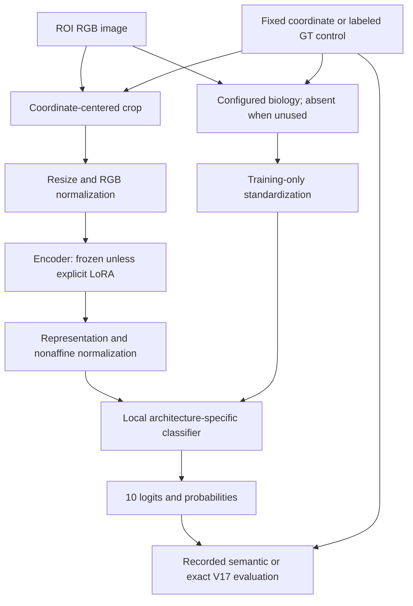

# Exploration3 / TierB-only diagnostic

**RECOVERED FROM SOURCE CODE.** This documentation was added inExploration4; it is not presented as originallywritten. Exactconfigs andresults remainunderthisarchitecture.

## Motivation

Assess standalone mask-feature discrimination; contaminated upstream.

## Exact forward

`z=Vb+a`. Predicted mask biology20→10. Here h is nonaffine-LN1536, b is the selected feature vector standardized using only current training rows.

## Parameter count

210 trainable head parameters. Encoder frozen; no LoRA. Models and per-run measured counts are in RUNS/<ID>/summary.json.

**Validity:** historical BioMask predictions are inference-available, but their upstreamcross-fitting overlapscurrentoutergroups. These runs are contaminated diagnostics and cannot promote a deployable architecture. Maskquality metrics and GTmasks are not inputs. B1usescolumns0:8,B2columns8:14,B3all20,B4TierA16+all20. B3/B4shuffleonlyTierB; TierAstaysrealinB4.

## Component contract

| Component | Input → output | State | Function / reason | Failure mode |
|---|---|---|---|---|
| Coordinates | ROIxy→cropcenter | Stage1immutable / GTcontrol labeled | Selectrequestednucleus; no tissue segmentation | GTvsproposal mismatch |
| Crop | 96×96RGB→224×224RGB | fixed | Whitepadding,bicubicresize; exactsourcefunction | Borders,physicalscale shift |
| Encoder | B×3×224×224→B×1536 | frozen unless explicitlyLoRA | VerifiedUNI2-hCLS; no registertokens mistakenforpatches | GlobalCLS dilution |
| Feature normalization | 1536→1536; bioD→D | LNnonaffine; train-onlystats | Stabilizesfeaturemagnitudes without valstatistics | Nearzero stdclamped1e-6 |
| Classifier / correction | h,b→10logits | trainable | Forwardequation above tests namedhypothesis | Overfit,tailcollapse,correctiondominance |
| Evaluation | coords,probabilities,full orsubsetGT→P/R/F1 | fixed | ExactsourceV17fromExploration2; historicalP1semantic | Never labelmatchedsubset asfullROI |

## Flowchart

The coordinate controls crop placement. The image encoder produces the appearance vector; only the configured biology path is active. Training-only normalization precedes the exact head equation. Logits become probabilities; their maximum determines semanticconfidence forV17matching. Coordinates remainfixed. ForB0andbiology-only,theencoder/appearancepath is absent; forCNNtheencoderistrainable andcropresize48; forA6theheadisreplaced bytheconcatbottleneck. These explicit exceptions govern thegenericdiagram.

## Training and inference

Exploration3: inverseclassreplacement sampling,ordinaryCE,AdamWLR.001WD.01,batch64,clip1,FP32,seeds17/29/43,10epochs. Eachfoldfitsbiostats ontrainingonly. Fixedepoch10endpoint. Controlsuseappearance-derivedtanhprojection seed1701 ortraining-rowshuffle seed+10000; realvalidationfeaturesremaincorrect forshuffledtraining. Seeexactconfig forwhichbranchisreplaced.

The standalone package reproduces cached-head training locally. Image inputs and the externalUNI2weights are separatelyreferenced; noimplicitnetworkdownload. Missing historical logfields are NOT RECORDED IN ORIGINAL RUN. Runtime is measuredperrun,notestimatedfromparametercount. LocalV17parity result is PROVENANCE/parity_result.json; codecopyhashes are PROVENANCE/code_hashes.json.

## Artifact map

- CODE/: independent localmodules andentrypoints.
- CONFIGS/original/ andconfig.json: exactrecipes orrecoveredfamilydefaults.
- RESULTS/: logs,checkpoints,predictions,metrics retainedwithoutconversion.
- RESULT_INDEX.csv andORIGINAL_PATH_MAP.csv: sourcepaths,hashes andattribution.
- PROVENANCE/: executablecopychanges,parity andverification.
