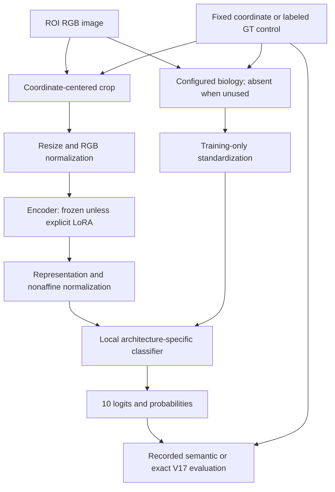

```mermaid
flowchart TD
 I[ROI RGB image] --> C[Coordinate-centered crop]
 X[Fixed coordinate or labeled GT control] --> C
 C --> N[Resize and RGB normalization]
 N --> E[Encoder: frozen unless explicit LoRA]
 E --> H[Representation and nonaffine normalization]
 H --> L[Local architecture-specific classifier]
 I --> B[Configured biology; absent when unused]
 X --> B
 B --> S[Training-only standardization]
 S --> L
 L --> Z[10 logits and probabilities]
 Z --> V[Recorded semantic or exact V17 evaluation]
 X --> V
```

CLS1536 plus36combined biology features→10zero-init

See ARCHITECTURE.md for component exceptions and equations.
