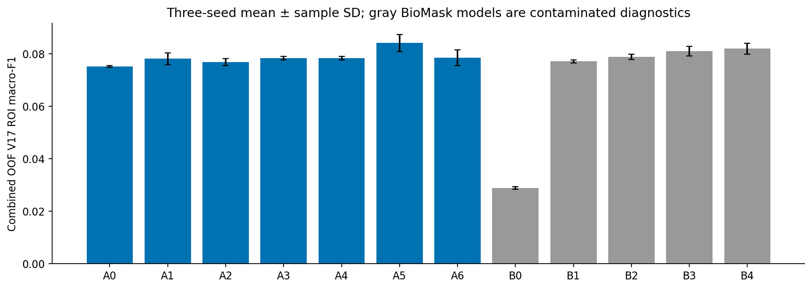
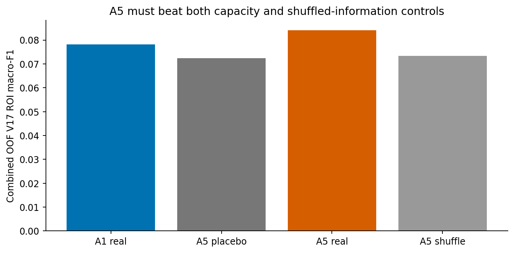
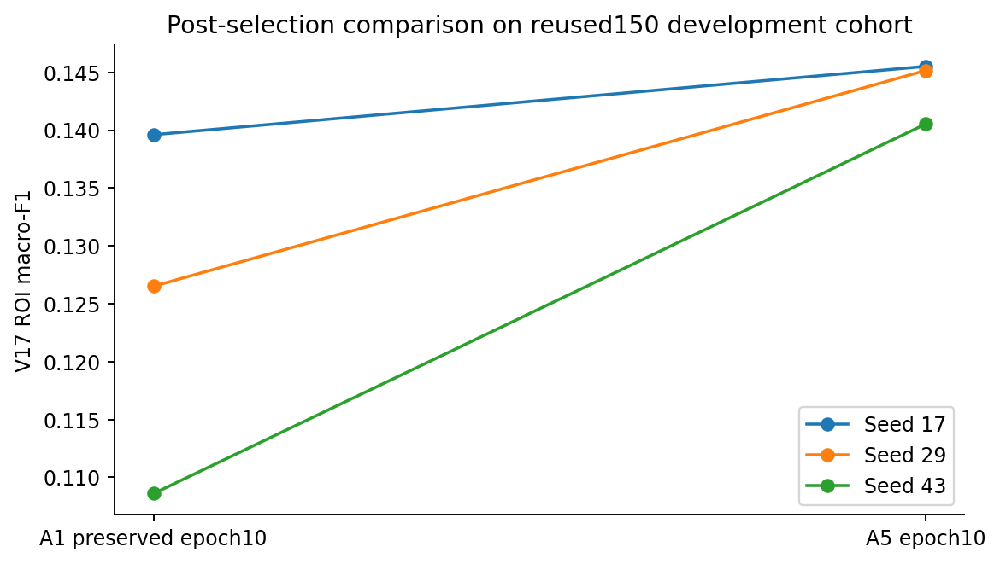
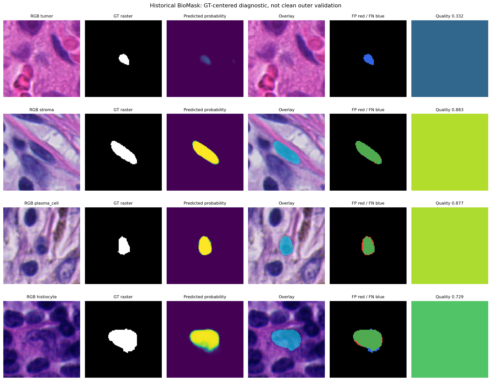

# Exploration 3: architecture ablations and A5 selection

This chapter keeps the original Exploration 3 findings in chronological order. Its completion claims and recommendations belong to that stage of the study, while Exploration 4 provides the later decision. Earlier recommendations remain here as part of the research record. Repeated blocks are listed in the root duplicate-lineage table and appear only once in the integrated report. I have not treated any historical result as new validation evidence.

# PUMA Stage 2 — integrated research report

## Architecture Stress Test and BioMask/Tier-B Investigation

**Exploration 3 is complete. I selected A5 as the one architecture to take into the next full-data experiment: frozen UNI2-h, FOV96, and a rank-eight multiplicative interaction between appearance and 16-D Tier-A features, added to the linear appearance logits.** The encoder remains frozen. The trainable head grows from 15,530 parameters in A1 to 27,866 in A5. The selected model does not include BioMask, Tier-B, LoRA, or another gate.

This report continues from the preserved Exploration 2 record below instead of restarting the study. The previous 30 runs and all caches remain intact. Exploration 3 ran 234 ten-epoch cross-validation fits (26 predeclared real/control configurations × 3 seeds × 3 folds) and 3 ten-epoch confirmation fits for the selected candidate. This gives 237 fits, not 237 different architectures. I did not open another model family, a rank-16 search, or a hyperparameter grid. Historical oracle results remain labeled as historical and nondeployable.

### Previous conclusion / new evidence / updated conclusion

**Previous architecture conclusion:** A1, a linear Tier-A correction, was the best-supported candidate among the Exploration 2 controls. **New evidence:** A5 passed all prospective cross-validation promotion tests and the fixed-final-epoch comparison against the saved A1 predictions. **Updated conclusion:** use A5 for one next full-scale experiment. The previous report and standalone A1 source are archived unchanged under `PROMPT2_REPORT_PRESERVED.md` and `EXPLORATION2_STANDALONE`. They are historical records, not current alternatives.

**Previous TierB conclusion:** no verified mask artifact had been established. **New evidence:** five historical final BioMask checkpoints and their fold/config metadata were recovered from Drive, and every checkpoint hash matched saved provenance. **Updated conclusion:** BioMask is available and can produce measurable masks, but its historical cross-fitting cannot support a clean current outer-validation estimate. B-series results are explicitly upstream-contaminated diagnostics and cannot justify promotion. High Dice does not repair that design issue.

### Architecture-selection protocol and validity

The existing300 training features were partitioned into3 ROI-disjoint StratifiedGroupKFold folds, random_state17. No additional expensive UNI2 extraction was needed. Each fold fits biology means/stds on its training rows only, and the same fold/seed uses the same replacement-balanced draw order across matched architectures. Every training fold includes all10 classes. Patient mapping is unverified; the saved historical case_id is just ROI ID. The existing150 cohort was withheld from internal architecture selection, although it had already influenced Exploration2 decisions.

All234 CV fits used frozen FOV96 CLS, nonaffine LayerNorm, ordinary CE, inverse-count sampling, AdamW LR.001 WD.01, batch64, gradient clip1, ten epochs and seeds17/29/43. The endpoint was **fixed epoch10**, not the best of ten validation epochs. Concatenate held-fold predictions for the300 features to compute exact V17 combined-OOF metrics; do not average semantic scores as if folds had equal size. The140-plus ROI grouping is the uncertainty unit, and different fitted models across folds are expected in cross-validation. Every per-fold metric, class count, confusion, exposure and gradient array is saved in the thin experiment directory.

Before new model outcomes, EXPLORATION3_PROTOCOL.md fixed the promotion conditions: ≥.003 mean ROI-F1 gain over A1, ≥2/3 positive seed deltas, ≥.002 superiority to each matched control, positive lower paired ROI-bootstrap interval endpoint, no class mean recall loss>.10, gap increase≤.05, plus a substantive gate spread for A3. These are pragmatic finite-study thresholds, not universal clinical significance criteria. No threshold was chosen after seeing a favorable architecture. A5 was the only passing model; rank8 was retained without a rank16 expansion.

### Confirmation protocol deviation

The selected candidate alone was fitted on the original300 training examples and compared with preserved A1 **final-epoch10** predictions on the original150. No A1 retraining, second-choice confirmation or best-epoch selection was performed. However, the generic training runner computed and logged intermediate validation metrics at all10 epochs instead of implementing the requested once-only evaluation interface. This is a protocol deviation. Only the predeclared final endpoint determined the decision, but the record must not be called a strictly blinded or untouched confirmation. Its uncertainty intervals are exploratory development intervals. Future locked full-data test evaluation must run only after all model choices are fixed.

### Exact evaluator parity and metric definitions

All Exploration2 V17 matcher/aggregator source remained byte-identical. Class-name conversion still maps canonical epithelium7/endothelium8 to local V17 IDs8/7. Strict radius<15, GT order, descending prediction score, stable distance ties and duplicate-centroid deletion behavior are preserved. Evaluation uses the existing component-aware GT centers, with prediction coordinates still the area-centroid crop points. This is a subset GT-point task, not all Stage1 proposals. Semantic accuracy is correctly classified annotation features / annotation features evaluated; it is not official PUMA accuracy. Classwise one-vs-rest accuracy is separately labeled in CSV and must not hide recall failure. ROI and pooled scores are both retained.

### Finite A-series and controls

A0 is the appearance-only1536→10 head. A1 adds zero-initialized biasless16→10 biology logits. A2 uses16→16 GELU→10 with the last layer zero initialized. A3 multiplies linear biology by10 sigmoid scalars. A4 multiplies it by sigmoid Linear2→1 of detached normalized appearance entropy and top1−top2 probability margin. A5 forms `(P_h h) elementwise*(P_b b)` with rank8 then a zero-initialized8→10 output, added to appearance logits. A6 replaces the head with1552→32 GELU→10.

For each A2–A6, a matched-capacity control replaces real biology with16 fixed tanh random-projected appearance features, and a shuffle control permutes training-row biology association only. Controls have the same architecture and parameter count. A6 cannot share the appearance-linear initialization because it replaces the head; its real/control bottlenecks are matched to each other. A3 is primarily a reparameterization of class-specific linear weights already expressible in A1, so gates alone cannot establish greater representational power. All additive/product residual output layers begin at zero, making initial predictions identical to their appearance head; projection gradients in A5 correctly begin at zero until the output matrix moves.

### BioMask architecture, checkpoints and fold audit

Direct folder fetches recovered binaries that Drive search omitted. The five final.pt files strict-loaded into the inspected model and matched saved SHA256 provenance. Saved epoch29 is epoch30 in human indexing; final checkpoints were used, not minimum held-loss checkpoints. Local V16.3.2/V17 BioMask inference ASTs agree; V16.3 differs. Complete source, metadata and checkpoint indexes are retained in biomask_audit.

The network accepts RGB plus a Gaussian point prompt, computes H/gradient internally, and uses a small GroupNorm/SiLU encoder-decoder with mask, prompt-conditioned presence, quality and center-offset outputs. Input crop96 uses historical reflect padding and valid masking. The weighted training objective combines mask BCE/Dice, empty-mask BCE, presence BCE, center smooth-L1 and quality BCE. No semantic GT class enters the forward input. See BIOMASK_AUDIT.md for exact channels, target/weight logic, loss coefficients and crop conventions.

Historical ROI fold counts are47,1,86,61,10; fold1 contains one ROI. The checkpoint for row-fold j excludes j but generally includes another outer-held fold k when it produces Stage2 training features. Every current held set spans multiple historical folds; none of the5 paths excludes all its outer groups. Using row-wise OOF outputs is therefore not nested cross-fitting. Additionally, upstream Stage1 OOF proposals used to train BioMask can carry outer information through other detector folds. No clean indirect independence is certified. We did not train20 nested models or silently exchange GT masks for predictions.

### Mask quality beyond segmentation loss

The five models were run once across the450 existing GT points, using their historical per-ROI fold, and cached. This is new GT-point inference, not the historical Stage1-proposal mask population. GT polygons were used only to measure quality; they never entered the predicted20D feature vectors. Binary quality uses threshold.5; soft-feature geometry retains historical formulas. Border and small/large strata, every ROI/class/fold, finite centroid counts and shape correlations are all reported. Empty masks have undefined centroid rather than artificial zero error.

### TierB feature families and downstream diagnostic scope

The unchanged historical20D extractor includes8 morphology quantities,6 mask-weighted H/gradient/texture quantities, ring contrast, mask maximum/mean and predicted quality, and2 ROI-relative proxies. Soft-mask axes/perimeter differ from binary regionprops quality measures; the entropy and percentile are historical proxies, not the TierA histogram entropy and empirical percentile. Exact schema and source hashes are preserved. Identity-token maps were discovered but excluded from these minimal models.

B0 tests TierB alone; B1 morphology; B2 weighted stain/texture; B3 fullB; B4 A+B. B3/B4 each have shuffledB and capacity-placeboB controls, with realA held constant in B4. B4's single zero-initialized biasless Linear36→10 is algebraically equivalent to the prescribed sum of separate16→10 and20→10 linear corrections under the same optimizer; its TierB correction norm is logged separately. All B runs carry upstream-contamination labels. The prior GT oracle is reused only as unmatched historical context, because its train/validation split differs from newCV. It remains nondeployable and is not a formal upper bound.

### Reviewer–architect conclusions

**A2 reviewer:** the tiny MLP may only add optimization noise. **Executed response:** it lost to A1 in meanCV; the extra282 parameters did not earn promotion. No hidden-width search followed.

**A3 reviewer:** class gates can reparameterize an already classwise linear correction and produce an interpretation story without predictive value. **Executed response:** gates had tiny within-fold class spreads (about.002–.005), failed the predeclared spread requirement, and supplied only a negligible average score change. Retain as a diagnostic, not a model component.

**A4 reviewer:** a gate correlated with uncertainty is not evidence it improves classification. **Executed response:** average gates remained approximately.514–.521 with within-fold standard deviations near.001. A3/A4 produced the same hard validation decisions in this screen. The small continuous-logit differences did not justify uncertainty gating.

**A5 reviewer:** a multiplicative residual can memorize the small cohort; its12,336 extra parameters need a control. **Executed response:** rank8 exceeded A1, the equal-capacity appearance placebo and shuffled biology across the aggregate CV comparisons, passed paired uncertainty and class/gap conditions, and improved the final endpoint in all3 confirmation seeds. This supports a conditional appearance/biology interaction within this study, not a proven causal biomarker. Rank16, LoRA and a larger branch were not tested or promoted.

**A6 reviewer:** a hidden head may improve simply by capacity. **Executed response:** the32-wide concat bottleneck did not meet the minimum gain/uncertainty criterion, despite some favorable class changes. Its50,026 parameters were not justified over A5 or A1.

**BioMask reviewer:** OOF labels and high Dice do not make the Stage2 evaluation clean. **Executed response:** agree. Quality was measured, fullB and A+B show modest diagnostic signals, but neither is promotion eligible. No segmentation-loss success claim was substituted for downstream validity. B0 is weak; B4 exceeds B3 only modestly. Additional mask inference/measurement complexity remains excluded from the selected architecture.

### Error complementarity and limitations

Disagreements are computed on combinedCV predictions for every real model with a positive mean delta. Counts pooled over3 seeds represent900 prediction-events on300 cells, not900 independent nuclei. QC examples are UID-ordered within each of four correctness categories; GT quality is diagnostic only. Mask quality/classification correlations are descriptive with repeated seed observations, not causal or significance tests. A good mask can be irrelevant to classification, and a poor mask can coincidentally change a decision favorably.

The full Stage1 proposal population, including missed/false proposals, has not been evaluated. ROI grouping is not verified patient grouping. Development reuse, small tail supports, only3 seeds, finite thresholds, uncertain acquisition confounding and the logged-intermediate-confirmation deviation remain material limitations. Neither the promoted A5 nor the historical BioMask has established clinical validity or SOTA.

### One next full-data experiment

Stop architecture expansion. Classify the complete fixed Stage1 proposal population using **A5 only**, seeds17/29/43 as independent repeats. Preserve coordinates, UIDs and detector metadata; do not change Stage1 thresholds, suppression or weights. Verify upstream out-of-fold training and all outer-group exclusions, use the highest genuinely verified patient/group unit, reserve natural calibration and a locked test, and retain zero-proposal ROIs and every FP/FN consequence in exact V17 evaluation. Unknown proposal semantics remain excluded only from semantic CE/conditional accuracy, not from PUMA counts. Do not add BioMask until a separate clean cross-fitting artifact establishes eligibility; that is not a second selected architecture.

Use the updated93_final_architecture package: FOV96→224 normalized RGB; frozen UNI2 CLS1536 with nonaffine LayerNorm; train-standardized16D TierA; biasless1536→8 and16→8 projections, elementwise product and zero-initialized8→10 correction; appearance1536→10 linear head. Balanced sampling and ordinary CE, AdamW.001/WD.01, batch64/clip1. The full-data maximum20 epochs/patience5 remains a prospective schedule, distinct from fixed10 architecture endpoints. Optional scalarT calibration uses a separate natural cohort and requires re-evaluation of confidence-based matching. There is no backbone adaptation, mask branch or gate.

### Seed-aggregated comparison

| Architecture | Control | Params | ROI F1 mean | SD | Delta vs A1 | 95% ROI delta interval | Semantic F1 | Accuracy | Decision |
| --- | --- | --- | --- | --- | --- | --- | --- | --- | --- |
| A0 | real | 15370 | 0.07521 | 0.00035 | -0.00289 | -0.00593 to 0.00008 | 0.39366 | 0.41667 | not promoted |
| A1 | real | 15530 | 0.07810 | 0.00224 | 0.00000 | 0.00000 to 0.00000 | 0.41128 | 0.43333 | not promoted |
| A2 | placebo | 15812 | 0.07505 | 0.00118 | -0.00305 | -0.00595 to -0.00016 | 0.39269 | 0.41667 | not promoted |
| A2 | real | 15812 | 0.07684 | 0.00130 | -0.00126 | -0.00344 to 0.00077 | 0.40050 | 0.42667 | not promoted |
| A2 | shuffle | 15812 | 0.07552 | 0.00212 | -0.00258 | -0.00579 to 0.00050 | 0.39509 | 0.41889 | not promoted |
| A3 | placebo | 15540 | 0.07584 | 0.00080 | -0.00226 | -0.00517 to 0.00047 | 0.39574 | 0.42000 | not promoted |
| A3 | real | 15540 | 0.07834 | 0.00071 | 0.00024 | -0.00125 to 0.00176 | 0.40921 | 0.43444 | not promoted |
| A3 | shuffle | 15540 | 0.07537 | 0.00107 | -0.00273 | -0.00587 to 0.00020 | 0.39497 | 0.41778 | not promoted |
| A4 | placebo | 15533 | 0.07584 | 0.00080 | -0.00226 | -0.00517 to 0.00047 | 0.39574 | 0.42000 | not promoted |
| A4 | real | 15533 | 0.07834 | 0.00071 | 0.00024 | -0.00125 to 0.00176 | 0.40921 | 0.43444 | not promoted |
| A4 | shuffle | 15533 | 0.07537 | 0.00107 | -0.00273 | -0.00587 to 0.00020 | 0.39497 | 0.41778 | not promoted |
| A5 | placebo | 27866 | 0.07236 | 0.00454 | -0.00574 | -0.01041 to -0.00121 | 0.38022 | 0.40333 | not promoted |
| A5 | real | 27866 | 0.08410 | 0.00324 | 0.00600 | 0.00161 to 0.01081 | 0.43300 | 0.45889 | eligible for one confirmation |
| A5 | shuffle | 27866 | 0.07340 | 0.00220 | -0.00470 | -0.00887 to -0.00054 | 0.38108 | 0.40778 | not promoted |
| A6 | placebo | 50026 | 0.07422 | 0.00423 | -0.00388 | -0.00831 to 0.00035 | 0.39366 | 0.41667 | not promoted |
| A6 | real | 50026 | 0.07853 | 0.00303 | 0.00043 | -0.00362 to 0.00445 | 0.41934 | 0.44111 | not promoted |
| A6 | shuffle | 50026 | 0.07544 | 0.00367 | -0.00266 | -0.00749 to 0.00199 | 0.39924 | 0.42222 | not promoted |
| B0 | real | 210 | 0.02888 | 0.00056 | -0.04922 | -0.06024 to -0.03863 | 0.14220 | 0.15667 | diagnostic only |
| B1 | real | 15450 | 0.07717 | 0.00058 | -0.00093 | -0.00378 to 0.00193 | 0.40469 | 0.42778 | diagnostic only |
| B2 | real | 15430 | 0.07883 | 0.00107 | 0.00073 | -0.00134 to 0.00299 | 0.41309 | 0.43667 | diagnostic only |
| B3 | placebo | 15570 | 0.07465 | 0.00059 | -0.00345 | -0.00649 to -0.00054 | 0.39064 | 0.41444 | diagnostic only |
| B3 | real | 15570 | 0.08102 | 0.00189 | 0.00292 | 0.00055 to 0.00559 | 0.42469 | 0.44778 | diagnostic only |
| B3 | shuffle | 15570 | 0.07548 | 0.00172 | -0.00262 | -0.00590 to 0.00056 | 0.39715 | 0.41889 | diagnostic only |
| B4 | placebo | 15730 | 0.07786 | 0.00225 | -0.00024 | -0.00180 to 0.00136 | 0.40909 | 0.43333 | diagnostic only |
| B4 | real | 15730 | 0.08194 | 0.00211 | 0.00384 | 0.00162 to 0.00646 | 0.42840 | 0.45333 | diagnostic only |
| B4 | shuffle | 15730 | 0.07753 | 0.00148 | -0.00057 | -0.00273 to 0.00157 | 0.40674 | 0.43000 | diagnostic only |

### Final-epoch confirmation

| Seed | A1 ROI F1 | A5 ROI F1 | Delta | A1 semantic F1 | A5 semantic F1 | A1 accuracy | A5 accuracy |
| --- | --- | --- | --- | --- | --- | --- | --- |
| 17 | 0.13961 | 0.14551 | 0.00590 | 0.55382 | 0.56554 | 0.59333 | 0.60667 |
| 29 | 0.12652 | 0.14515 | 0.01864 | 0.50613 | 0.57416 | 0.56000 | 0.60667 |
| 43 | 0.10860 | 0.14053 | 0.03193 | 0.47473 | 0.57620 | 0.50667 | 0.61333 |

Mean paired delta 0.01882; exploratory40-ROI bootstrap95% interval [0.006034920634920635, 0.032253422619047616]. No comparison uses A1’s earlier best checkpoint as a mismatched endpoint.

### BioMask measured quality

| Measurement | Mean | Median | Finite n |
| --- | --- | --- | --- |
| dice | 0.85741 | 0.91361 | 450 |
| iou | 0.77957 | 0.84096 | 450 |
| area_relative_error | 0.22726 | 0.13033 | 450 |
| centroid_error | 1.70489 | 0.87277 | 446 |
| occupancy | 0.05401 | 0.04677 | 450 |
| quality_confidence | 0.79870 | 0.83990 | 450 |

| Morphology | Prediction–GT Pearson r |
| --- | --- |
| area | 0.89426 |
| major | 0.84135 |
| minor | 0.85325 |
| eccentricity | 0.70233 |
| perimeter | 0.81965 |
| circularity | 0.55336 |

Predicted quality versus IoU Pearson r=0.72300. These diagnostics include450 GT-point cases and cannot certify clean outer generalization.

### Complementarity (900 seed-events; not independent observations)

| Model | A1 wrong→correct | A1 correct→wrong | Both wrong | Both correct | Dice vs delta r | Correction norm vs delta r |
| --- | --- | --- | --- | --- | --- | --- |
| A3 | 6 | 5 | 504 | 385 | -0.01615 | 0.01214 |
| A4 | 6 | 5 | 504 | 385 | -0.01615 | 0.01211 |
| A5 | 51 | 28 | 459 | 362 | -0.04839 | 0.08229 |
| A6 | 58 | 51 | 452 | 339 | -0.00625 | NA |
| B2 | 11 | 8 | 499 | 382 | -0.10621 | 0.04249 |
| B3 | 17 | 4 | 493 | 386 | -0.05834 | 0.10303 |
| B4 | 20 | 2 | 490 | 388 | -0.06033 | 0.18474 |

B3/B4 Dice-to-classification-delta correlations are weakly negative in these contaminated diagnostics. Better Dice did not imply larger downstream gain. Good/poor-mask contingency tables and morphology-error correlations are in91_error_analysis/exploration3/complementarity.json.
### Per-class combinedCV means for each real architecture

P/R/F1 are conditional semantic metrics here; the accompanying CSV supplies every seed’s exact V17 pooled and ROI P/R/F1, TP/FP/FN, dominant errors, support and positive-ROI count. One-vs-rest accuracy is separately named and does not replace recall.

#### A0

| Class | n | Positive ROIs | Semantic P | R | F1 | OvR acc | Δ recall vs A1 | ROI P | R | F1 |
| --- | --- | --- | --- | --- | --- | --- | --- | --- | --- | --- |
| tumor | 71 | 57 | 0.56257 | 0.49765 | 0.52665 | 0.79000 | -0.01878 | 0.21355 | 0.20922 | 0.20607 |
| lymphocyte | 37 | 32 | 0.39238 | 0.42342 | 0.40713 | 0.84778 | -0.03604 | 0.07329 | 0.08983 | 0.07904 |
| plasma_cell | 24 | 22 | 0.30417 | 0.27778 | 0.28580 | 0.89000 | -0.01389 | 0.02561 | 0.03310 | 0.02813 |
| histiocyte | 24 | 23 | 0.16383 | 0.18056 | 0.17029 | 0.86444 | -0.05556 | 0.02778 | 0.03073 | 0.02853 |
| melanophage | 24 | 24 | 0.56616 | 0.73611 | 0.63937 | 0.93333 | 0.01389 | 0.11072 | 0.12530 | 0.11545 |
| neutrophil | 24 | 24 | 0.60079 | 0.54167 | 0.56886 | 0.93444 | -0.01389 | 0.08058 | 0.09220 | 0.08408 |
| stroma | 24 | 24 | 0.25359 | 0.22222 | 0.23263 | 0.88667 | -0.02778 | 0.03546 | 0.03783 | 0.03625 |
| epithelium | 24 | 24 | 0.56009 | 0.58333 | 0.57132 | 0.93000 | 0.01389 | 0.09220 | 0.09929 | 0.09456 |
| endothelium | 24 | 24 | 0.26098 | 0.27778 | 0.26086 | 0.87000 | 0.01389 | 0.03586 | 0.04728 | 0.03940 |
| apoptosis | 24 | 23 | 0.29551 | 0.26389 | 0.27374 | 0.88667 | -0.02778 | 0.04098 | 0.04255 | 0.04058 |

#### A1

| Class | n | Positive ROIs | Semantic P | R | F1 | OvR acc | Δ recall vs A1 | ROI P | R | F1 |
| --- | --- | --- | --- | --- | --- | --- | --- | --- | --- | --- |
| tumor | 71 | 57 | 0.55836 | 0.51643 | 0.53536 | 0.78889 | 0.00000 | 0.22065 | 0.21710 | 0.21277 |
| lymphocyte | 37 | 32 | 0.43205 | 0.45946 | 0.44532 | 0.85889 | 0.00000 | 0.07998 | 0.09771 | 0.08589 |
| plasma_cell | 24 | 22 | 0.32697 | 0.29167 | 0.30297 | 0.89444 | 0.00000 | 0.02778 | 0.03546 | 0.03026 |
| histiocyte | 24 | 23 | 0.21430 | 0.23611 | 0.22248 | 0.87000 | 0.00000 | 0.03605 | 0.03901 | 0.03641 |
| melanophage | 24 | 24 | 0.55302 | 0.72222 | 0.62444 | 0.93000 | 0.00000 | 0.10717 | 0.12293 | 0.11229 |
| neutrophil | 24 | 24 | 0.67974 | 0.55556 | 0.60782 | 0.94333 | 0.00000 | 0.08471 | 0.09456 | 0.08786 |
| stroma | 24 | 24 | 0.26505 | 0.25000 | 0.25321 | 0.88444 | 0.00000 | 0.04019 | 0.04255 | 0.04098 |
| epithelium | 24 | 24 | 0.56222 | 0.56944 | 0.56576 | 0.93000 | 0.00000 | 0.08983 | 0.09693 | 0.09220 |
| endothelium | 24 | 24 | 0.26751 | 0.26389 | 0.25721 | 0.87667 | 0.00000 | 0.03349 | 0.04492 | 0.03704 |
| apoptosis | 24 | 23 | 0.31170 | 0.29167 | 0.29820 | 0.89000 | 0.00000 | 0.04571 | 0.04728 | 0.04531 |

#### A2

| Class | n | Positive ROIs | Semantic P | R | F1 | OvR acc | Δ recall vs A1 | ROI P | R | F1 |
| --- | --- | --- | --- | --- | --- | --- | --- | --- | --- | --- |
| tumor | 71 | 57 | 0.57193 | 0.52582 | 0.54648 | 0.79444 | 0.00939 | 0.22656 | 0.22065 | 0.21749 |
| lymphocyte | 37 | 32 | 0.39932 | 0.43243 | 0.41518 | 0.85000 | -0.02703 | 0.07407 | 0.09220 | 0.08022 |
| plasma_cell | 24 | 22 | 0.31471 | 0.29167 | 0.29847 | 0.89222 | 0.00000 | 0.02778 | 0.03546 | 0.03026 |
| histiocyte | 24 | 23 | 0.17643 | 0.18056 | 0.17565 | 0.87000 | -0.05556 | 0.02778 | 0.03073 | 0.02853 |
| melanophage | 24 | 24 | 0.56791 | 0.73611 | 0.63929 | 0.93333 | 0.01389 | 0.10954 | 0.12530 | 0.11466 |
| neutrophil | 24 | 24 | 0.61667 | 0.55556 | 0.58287 | 0.93667 | 0.00000 | 0.08294 | 0.09456 | 0.08645 |
| stroma | 24 | 24 | 0.24865 | 0.22222 | 0.23149 | 0.88556 | -0.02778 | 0.03546 | 0.03783 | 0.03625 |
| epithelium | 24 | 24 | 0.56778 | 0.58333 | 0.57540 | 0.93111 | 0.01389 | 0.09220 | 0.09929 | 0.09456 |
| endothelium | 24 | 24 | 0.27165 | 0.27778 | 0.26513 | 0.87222 | 0.01389 | 0.03586 | 0.04728 | 0.03940 |
| apoptosis | 24 | 23 | 0.29637 | 0.26389 | 0.27501 | 0.88778 | -0.02778 | 0.04098 | 0.04255 | 0.04058 |

#### A3

| Class | n | Positive ROIs | Semantic P | R | F1 | OvR acc | Δ recall vs A1 | ROI P | R | F1 |
| --- | --- | --- | --- | --- | --- | --- | --- | --- | --- | --- |
| tumor | 71 | 57 | 0.57208 | 0.52113 | 0.54445 | 0.79444 | 0.00469 | 0.22419 | 0.21828 | 0.21513 |
| lymphocyte | 37 | 32 | 0.42079 | 0.45946 | 0.43904 | 0.85556 | 0.00000 | 0.07959 | 0.09771 | 0.08550 |
| plasma_cell | 24 | 22 | 0.32428 | 0.29167 | 0.30260 | 0.89444 | 0.00000 | 0.02797 | 0.03546 | 0.03050 |
| histiocyte | 24 | 23 | 0.19071 | 0.19444 | 0.18979 | 0.87111 | -0.04167 | 0.03014 | 0.03310 | 0.03089 |
| melanophage | 24 | 24 | 0.57833 | 0.75000 | 0.65120 | 0.93556 | 0.02778 | 0.11190 | 0.12766 | 0.11702 |
| neutrophil | 24 | 24 | 0.61667 | 0.55556 | 0.58287 | 0.93667 | 0.00000 | 0.08294 | 0.09456 | 0.08645 |
| stroma | 24 | 24 | 0.27585 | 0.25000 | 0.25893 | 0.88778 | 0.00000 | 0.04019 | 0.04255 | 0.04098 |
| epithelium | 24 | 24 | 0.56009 | 0.58333 | 0.57132 | 0.93000 | 0.01389 | 0.09220 | 0.09929 | 0.09456 |
| endothelium | 24 | 24 | 0.27615 | 0.27778 | 0.26860 | 0.87556 | 0.01389 | 0.03586 | 0.04728 | 0.03940 |
| apoptosis | 24 | 23 | 0.29745 | 0.27778 | 0.28328 | 0.88778 | -0.01389 | 0.04334 | 0.04492 | 0.04295 |

#### A4

#### A5

| Class | n | Positive ROIs | Semantic P | R | F1 | OvR acc | Δ recall vs A1 | ROI P | R | F1 |
| --- | --- | --- | --- | --- | --- | --- | --- | --- | --- | --- |
| tumor | 71 | 57 | 0.60311 | 0.52582 | 0.56089 | 0.80556 | 0.00939 | 0.22774 | 0.21986 | 0.21946 |
| lymphocyte | 37 | 32 | 0.52372 | 0.58559 | 0.55238 | 0.88333 | 0.12613 | 0.11899 | 0.12884 | 0.12175 |
| plasma_cell | 24 | 22 | 0.38431 | 0.30556 | 0.33487 | 0.90333 | 0.01389 | 0.02916 | 0.03783 | 0.03207 |
| histiocyte | 24 | 23 | 0.24924 | 0.27778 | 0.25764 | 0.87444 | 0.04167 | 0.04452 | 0.04610 | 0.04452 |
| melanophage | 24 | 24 | 0.51376 | 0.68056 | 0.58357 | 0.92222 | -0.04167 | 0.09890 | 0.11584 | 0.10441 |
| neutrophil | 24 | 24 | 0.67105 | 0.54167 | 0.59937 | 0.94222 | -0.01389 | 0.08471 | 0.09220 | 0.08708 |
| stroma | 24 | 24 | 0.28617 | 0.25000 | 0.26548 | 0.89000 | 0.00000 | 0.03783 | 0.04255 | 0.03940 |
| epithelium | 24 | 24 | 0.56341 | 0.55556 | 0.55940 | 0.93000 | -0.01389 | 0.08865 | 0.09456 | 0.09062 |
| endothelium | 24 | 24 | 0.28090 | 0.36111 | 0.30744 | 0.87444 | 0.09722 | 0.05319 | 0.06147 | 0.05595 |
| apoptosis | 24 | 23 | 0.31636 | 0.30556 | 0.30894 | 0.89222 | 0.01389 | 0.04531 | 0.04846 | 0.04571 |

#### A6

| Class | n | Positive ROIs | Semantic P | R | F1 | OvR acc | Δ recall vs A1 | ROI P | R | F1 |
| --- | --- | --- | --- | --- | --- | --- | --- | --- | --- | --- |
| tumor | 71 | 57 | 0.56247 | 0.48826 | 0.51956 | 0.79000 | -0.02817 | 0.19701 | 0.20134 | 0.19535 |
| lymphocyte | 37 | 32 | 0.53030 | 0.46847 | 0.49745 | 0.88333 | 0.00901 | 0.08077 | 0.09693 | 0.08597 |
| plasma_cell | 24 | 22 | 0.37519 | 0.34722 | 0.35794 | 0.90111 | 0.05556 | 0.03546 | 0.04492 | 0.03877 |
| histiocyte | 24 | 23 | 0.25650 | 0.26389 | 0.25988 | 0.88111 | 0.02778 | 0.04098 | 0.04374 | 0.04192 |
| melanophage | 24 | 24 | 0.53186 | 0.79167 | 0.63341 | 0.92667 | 0.06944 | 0.11860 | 0.13475 | 0.12372 |
| neutrophil | 24 | 24 | 0.61734 | 0.51389 | 0.55998 | 0.93556 | -0.04167 | 0.07782 | 0.08747 | 0.08054 |
| stroma | 24 | 24 | 0.24832 | 0.26389 | 0.24127 | 0.87444 | 0.01389 | 0.03783 | 0.04492 | 0.04019 |
| epithelium | 24 | 24 | 0.54804 | 0.61111 | 0.57626 | 0.92778 | 0.04167 | 0.09456 | 0.10402 | 0.09771 |
| endothelium | 24 | 24 | 0.26488 | 0.27778 | 0.26136 | 0.87333 | 0.01389 | 0.03586 | 0.04728 | 0.03940 |
| apoptosis | 24 | 23 | 0.30185 | 0.27778 | 0.28628 | 0.88889 | -0.01389 | 0.04177 | 0.04374 | 0.04177 |

#### B0

| Class | n | Positive ROIs | Semantic P | R | F1 | OvR acc | Δ recall vs A1 | ROI P | R | F1 |
| --- | --- | --- | --- | --- | --- | --- | --- | --- | --- | --- |
| tumor | 71 | 57 | 0.26427 | 0.05634 | 0.09192 | 0.73889 | -0.46009 | 0.02837 | 0.02246 | 0.02443 |
| lymphocyte | 37 | 32 | 0.30829 | 0.21622 | 0.22655 | 0.84778 | -0.24324 | 0.04807 | 0.04768 | 0.04610 |
| plasma_cell | 24 | 22 | 0.19444 | 0.11111 | 0.12906 | 0.88333 | -0.18056 | 0.01655 | 0.01773 | 0.01694 |
| histiocyte | 24 | 23 | 0.05808 | 0.09722 | 0.07241 | 0.84000 | -0.13889 | 0.01064 | 0.01655 | 0.01261 |
| melanophage | 24 | 24 | 0.09706 | 0.05556 | 0.06556 | 0.87111 | -0.66667 | 0.00946 | 0.00946 | 0.00946 |
| neutrophil | 24 | 24 | 0.10135 | 0.08333 | 0.08667 | 0.85222 | -0.47222 | 0.01064 | 0.01418 | 0.01182 |
| stroma | 24 | 24 | 0.20510 | 0.41667 | 0.27133 | 0.83111 | 0.16667 | 0.05871 | 0.07092 | 0.06265 |
| epithelium | 24 | 24 | 0.23160 | 0.15278 | 0.17345 | 0.88778 | -0.41667 | 0.02482 | 0.02600 | 0.02522 |
| endothelium | 24 | 24 | 0.08311 | 0.16667 | 0.10859 | 0.79444 | -0.09722 | 0.02325 | 0.02837 | 0.02482 |
| apoptosis | 24 | 23 | 0.13487 | 0.37500 | 0.19643 | 0.76667 | 0.08333 | 0.05240 | 0.06147 | 0.05477 |

#### B1

| Class | n | Positive ROIs | Semantic P | R | F1 | OvR acc | Δ recall vs A1 | ROI P | R | F1 |
| --- | --- | --- | --- | --- | --- | --- | --- | --- | --- | --- |
| tumor | 71 | 57 | 0.57267 | 0.51643 | 0.54146 | 0.79444 | 0.00000 | 0.21946 | 0.21592 | 0.21198 |
| lymphocyte | 37 | 32 | 0.38794 | 0.42342 | 0.40480 | 0.84667 | -0.03604 | 0.07250 | 0.08983 | 0.07857 |
| plasma_cell | 24 | 22 | 0.30429 | 0.27778 | 0.28666 | 0.89000 | -0.01389 | 0.02541 | 0.03310 | 0.02790 |
| histiocyte | 24 | 23 | 0.17209 | 0.18056 | 0.17441 | 0.86889 | -0.05556 | 0.02896 | 0.03073 | 0.02931 |
| melanophage | 24 | 24 | 0.56562 | 0.75000 | 0.64359 | 0.93333 | 0.02778 | 0.11308 | 0.12766 | 0.11781 |
| neutrophil | 24 | 24 | 0.62879 | 0.54167 | 0.58169 | 0.93778 | -0.01389 | 0.08077 | 0.09220 | 0.08432 |
| stroma | 24 | 24 | 0.28220 | 0.25000 | 0.26073 | 0.88889 | 0.00000 | 0.04019 | 0.04255 | 0.04098 |
| epithelium | 24 | 24 | 0.56531 | 0.59722 | 0.58047 | 0.93111 | 0.02778 | 0.09338 | 0.10165 | 0.09614 |
| endothelium | 24 | 24 | 0.28533 | 0.29167 | 0.28007 | 0.87444 | 0.02778 | 0.03822 | 0.04965 | 0.04177 |
| apoptosis | 24 | 23 | 0.32424 | 0.27778 | 0.29303 | 0.89000 | -0.01389 | 0.04334 | 0.04492 | 0.04295 |

#### B2

| Class | n | Positive ROIs | Semantic P | R | F1 | OvR acc | Δ recall vs A1 | ROI P | R | F1 |
| --- | --- | --- | --- | --- | --- | --- | --- | --- | --- | --- |
| tumor | 71 | 57 | 0.57966 | 0.52113 | 0.54711 | 0.79667 | 0.00469 | 0.22301 | 0.21828 | 0.21434 |
| lymphocyte | 37 | 32 | 0.42860 | 0.46847 | 0.44759 | 0.85778 | 0.00901 | 0.08235 | 0.10008 | 0.08826 |
| plasma_cell | 24 | 22 | 0.30994 | 0.27778 | 0.28993 | 0.89222 | -0.01389 | 0.02561 | 0.03310 | 0.02813 |
| histiocyte | 24 | 23 | 0.20903 | 0.22222 | 0.21338 | 0.87111 | -0.01389 | 0.03487 | 0.03664 | 0.03483 |
| melanophage | 24 | 24 | 0.57803 | 0.75000 | 0.65152 | 0.93556 | 0.02778 | 0.11308 | 0.12766 | 0.11781 |
| neutrophil | 24 | 24 | 0.63519 | 0.54167 | 0.58261 | 0.93778 | -0.01389 | 0.08117 | 0.09220 | 0.08471 |
| stroma | 24 | 24 | 0.28375 | 0.26389 | 0.26808 | 0.88778 | 0.01389 | 0.04255 | 0.04492 | 0.04334 |
| epithelium | 24 | 24 | 0.55444 | 0.56944 | 0.56179 | 0.92889 | 0.00000 | 0.08983 | 0.09693 | 0.09220 |
| endothelium | 24 | 24 | 0.27816 | 0.27778 | 0.26931 | 0.87556 | 0.01389 | 0.03586 | 0.04728 | 0.03940 |
| apoptosis | 24 | 23 | 0.31705 | 0.29167 | 0.29954 | 0.89000 | 0.00000 | 0.04571 | 0.04728 | 0.04531 |

#### B3

| Class | n | Positive ROIs | Semantic P | R | F1 | OvR acc | Δ recall vs A1 | ROI P | R | F1 |
| --- | --- | --- | --- | --- | --- | --- | --- | --- | --- | --- |
| tumor | 71 | 57 | 0.58792 | 0.53991 | 0.56157 | 0.80111 | 0.02347 | 0.23010 | 0.22537 | 0.22222 |
| lymphocyte | 37 | 32 | 0.43082 | 0.45946 | 0.44425 | 0.85889 | 0.00000 | 0.07880 | 0.09771 | 0.08511 |
| plasma_cell | 24 | 22 | 0.32085 | 0.29167 | 0.30094 | 0.89333 | 0.00000 | 0.02778 | 0.03546 | 0.03026 |
| histiocyte | 24 | 23 | 0.20458 | 0.22222 | 0.21064 | 0.86889 | -0.01389 | 0.03605 | 0.03664 | 0.03562 |
| melanophage | 24 | 24 | 0.57301 | 0.75000 | 0.64794 | 0.93444 | 0.02778 | 0.11308 | 0.12766 | 0.11781 |
| neutrophil | 24 | 24 | 0.67349 | 0.56944 | 0.61462 | 0.94333 | 0.01389 | 0.08589 | 0.09693 | 0.08944 |
| stroma | 24 | 24 | 0.31887 | 0.29167 | 0.30138 | 0.89333 | 0.04167 | 0.04728 | 0.04965 | 0.04807 |
| epithelium | 24 | 24 | 0.54667 | 0.56944 | 0.55782 | 0.92778 | 0.00000 | 0.08865 | 0.09693 | 0.09141 |
| endothelium | 24 | 24 | 0.32599 | 0.30556 | 0.30803 | 0.88444 | 0.04167 | 0.04177 | 0.05201 | 0.04492 |
| apoptosis | 24 | 23 | 0.31851 | 0.29167 | 0.29968 | 0.89000 | 0.00000 | 0.04571 | 0.04728 | 0.04531 |

#### B4

| Class | n | Positive ROIs | Semantic P | R | F1 | OvR acc | Δ recall vs A1 | ROI P | R | F1 |
| --- | --- | --- | --- | --- | --- | --- | --- | --- | --- | --- |
| tumor | 71 | 57 | 0.58898 | 0.54460 | 0.56544 | 0.80222 | 0.02817 | 0.23325 | 0.23010 | 0.22577 |
| lymphocyte | 37 | 32 | 0.48280 | 0.50450 | 0.49255 | 0.87333 | 0.04505 | 0.09220 | 0.10796 | 0.09748 |
| plasma_cell | 24 | 22 | 0.32449 | 0.29167 | 0.30402 | 0.89444 | 0.00000 | 0.02778 | 0.03546 | 0.03026 |
| histiocyte | 24 | 23 | 0.21667 | 0.23611 | 0.22304 | 0.87000 | 0.00000 | 0.03605 | 0.03901 | 0.03641 |
| melanophage | 24 | 24 | 0.56543 | 0.70833 | 0.62750 | 0.93222 | -0.01389 | 0.10481 | 0.12057 | 0.10993 |
| neutrophil | 24 | 24 | 0.65664 | 0.58333 | 0.61637 | 0.94222 | 0.02778 | 0.08786 | 0.09929 | 0.09141 |
| stroma | 24 | 24 | 0.28766 | 0.27778 | 0.28055 | 0.88889 | 0.02778 | 0.04374 | 0.04728 | 0.04492 |
| epithelium | 24 | 24 | 0.54667 | 0.56944 | 0.55782 | 0.92778 | 0.00000 | 0.08865 | 0.09693 | 0.09141 |
| endothelium | 24 | 24 | 0.32718 | 0.30556 | 0.30497 | 0.88444 | 0.04167 | 0.04058 | 0.05201 | 0.04413 |
| apoptosis | 24 | 23 | 0.32676 | 0.30556 | 0.31178 | 0.89111 | 0.01389 | 0.04807 | 0.04965 | 0.04768 |

### Complete per-fit ledger

Each row is a10-epoch fit with fixed final checkpoint. Full epoch histories, confusion matrices, prevalence and per-ROI counts remain in its linked directory; all per-class numerical arrays are preserved rather than rounded away.

| Fit | Params | ROI P | R | F1 | Pooled P | R | F1 | Accuracy | BA | NLL | ECE | Gap | Seconds |
| --- | --- | --- | --- | --- | --- | --- | --- | --- | --- | --- | --- | --- | --- |
| p3_A0_real_s17_cv0 | 15370 | 0.07319 | 0.08152 | 0.07565 | 0.36849 | 0.38859 | 0.35872 | 0.43478 | 0.38859 | 1.76483 | 0.11898 | 0.54709 | 0.33855 |
| p3_A0_real_s17_cv1 | 15370 | 0.06701 | 0.07604 | 0.06944 | 0.28625 | 0.30387 | 0.27802 | 0.36697 | 0.30387 | 1.72644 | 0.16444 | 0.60122 | 0.31549 |
| p3_A0_real_s17_cv2 | 15370 | 0.07908 | 0.08617 | 0.08035 | 0.47312 | 0.46373 | 0.43792 | 0.47475 | 0.46651 | 1.63433 | 0.11123 | 0.45494 | 0.32101 |
| p3_A0_real_s29_cv0 | 15370 | 0.06268 | 0.06848 | 0.06406 | 0.41019 | 0.37292 | 0.32124 | 0.35870 | 0.37292 | 1.81196 | 0.15774 | 0.55903 | 0.30579 |
| p3_A0_real_s29_cv1 | 15370 | 0.07465 | 0.07917 | 0.07535 | 0.40144 | 0.37137 | 0.35595 | 0.37615 | 0.37137 | 1.85865 | 0.18962 | 0.52219 | 0.29986 |
| p3_A0_real_s29_cv2 | 15370 | 0.08316 | 0.09149 | 0.08511 | 0.51433 | 0.48595 | 0.48383 | 0.50505 | 0.48734 | 1.56436 | 0.11100 | 0.40588 | 0.30063 |
| p3_A0_real_s43_cv0 | 15370 | 0.07428 | 0.08261 | 0.07638 | 0.44452 | 0.40530 | 0.39056 | 0.43478 | 0.40530 | 1.83580 | 0.14695 | 0.52080 | 0.30485 |
| p3_A0_real_s43_cv1 | 15370 | 0.07309 | 0.07917 | 0.07410 | 0.34247 | 0.36907 | 0.33532 | 0.35780 | 0.36907 | 1.78034 | 0.15436 | 0.51396 | 0.30836 |
| p3_A0_real_s43_cv2 | 15370 | 0.07518 | 0.08191 | 0.07638 | 0.44047 | 0.45750 | 0.43417 | 0.45455 | 0.45889 | 1.61142 | 0.09668 | 0.46907 | 0.32028 |
| p3_A1_real_s17_cv0 | 15530 | 0.06884 | 0.07935 | 0.07203 | 0.39429 | 0.38685 | 0.36117 | 0.42391 | 0.38685 | 1.68631 | 0.16213 | 0.55044 | 0.34872 |
| p3_A1_real_s17_cv1 | 15530 | 0.07361 | 0.08333 | 0.07604 | 0.32524 | 0.35720 | 0.32779 | 0.40367 | 0.35720 | 1.68695 | 0.14605 | 0.56222 | 0.32018 |
| p3_A1_real_s17_cv2 | 15530 | 0.08759 | 0.09255 | 0.08816 | 0.51760 | 0.49218 | 0.47746 | 0.50505 | 0.49635 | 1.56100 | 0.10912 | 0.42550 | 0.32248 |
| p3_A1_real_s29_cv0 | 15530 | 0.06359 | 0.06957 | 0.06457 | 0.35392 | 0.37478 | 0.31873 | 0.36957 | 0.37478 | 1.71912 | 0.14784 | 0.58019 | 0.31264 |
| p3_A1_real_s29_cv1 | 15530 | 0.07465 | 0.07917 | 0.07535 | 0.40414 | 0.37137 | 0.35811 | 0.37615 | 0.37137 | 1.80768 | 0.13819 | 0.53212 | 0.29803 |
| p3_A1_real_s29_cv2 | 15530 | 0.08422 | 0.09326 | 0.08667 | 0.51218 | 0.49151 | 0.48463 | 0.51515 | 0.49290 | 1.49016 | 0.13272 | 0.41455 | 0.31391 |
| p3_A1_real_s43_cv0 | 15530 | 0.07645 | 0.08478 | 0.07855 | 0.51035 | 0.43101 | 0.42690 | 0.44565 | 0.43101 | 1.75859 | 0.17165 | 0.49666 | 0.30433 |
| p3_A1_real_s43_cv1 | 15530 | 0.08021 | 0.08611 | 0.08056 | 0.37945 | 0.40538 | 0.37484 | 0.39450 | 0.40538 | 1.73227 | 0.12556 | 0.48411 | 0.30281 |
| p3_A1_real_s43_cv2 | 15530 | 0.07943 | 0.08617 | 0.08064 | 0.45908 | 0.47278 | 0.45032 | 0.47475 | 0.47556 | 1.54418 | 0.09858 | 0.47677 | 0.31344 |
| p3_A2_placebo_s17_cv0 | 15812 | 0.07210 | 0.08152 | 0.07493 | 0.36849 | 0.38859 | 0.35872 | 0.43478 | 0.38859 | 1.76463 | 0.14298 | 0.54976 | 0.33594 |
| p3_A2_placebo_s17_cv1 | 15812 | 0.06701 | 0.07604 | 0.06944 | 0.28625 | 0.30387 | 0.27802 | 0.36697 | 0.30387 | 1.72848 | 0.16431 | 0.60039 | 0.32323 |
| p3_A2_placebo_s17_cv2 | 15812 | 0.07908 | 0.08617 | 0.08035 | 0.47312 | 0.46373 | 0.43792 | 0.47475 | 0.46651 | 1.63147 | 0.11038 | 0.45815 | 0.33728 |
| p3_A2_placebo_s29_cv0 | 15812 | 0.05942 | 0.06630 | 0.06116 | 0.37413 | 0.36042 | 0.30110 | 0.34783 | 0.36042 | 1.81194 | 0.15889 | 0.57917 | 0.34914 |
| p3_A2_placebo_s29_cv1 | 15812 | 0.07465 | 0.07917 | 0.07535 | 0.40144 | 0.37137 | 0.35595 | 0.37615 | 0.37137 | 1.86213 | 0.19947 | 0.52219 | 0.33892 |
| p3_A2_placebo_s29_cv2 | 15812 | 0.08316 | 0.09149 | 0.08511 | 0.51433 | 0.48595 | 0.48383 | 0.50505 | 0.48734 | 1.56614 | 0.11139 | 0.41127 | 0.37661 |
| p3_A2_placebo_s43_cv0 | 15812 | 0.07428 | 0.08261 | 0.07638 | 0.44670 | 0.40530 | 0.39170 | 0.43478 | 0.40530 | 1.83371 | 0.17345 | 0.52347 | 0.39122 |
| p3_A2_placebo_s43_cv1 | 15812 | 0.07309 | 0.07917 | 0.07410 | 0.34247 | 0.36907 | 0.33532 | 0.35780 | 0.36907 | 1.77994 | 0.16121 | 0.50832 | 0.34016 |
| p3_A2_placebo_s43_cv2 | 15812 | 0.07730 | 0.08404 | 0.07851 | 0.44431 | 0.46167 | 0.43834 | 0.46465 | 0.46306 | 1.61251 | 0.12025 | 0.46836 | 0.34718 |
| p3_A2_real_s17_cv0 | 15812 | 0.06993 | 0.07935 | 0.07275 | 0.37740 | 0.38090 | 0.35387 | 0.42391 | 0.38090 | 1.73138 | 0.13940 | 0.56067 | 0.33081 |
| p3_A2_real_s17_cv1 | 15812 | 0.06806 | 0.07812 | 0.07083 | 0.28917 | 0.30744 | 0.28196 | 0.37615 | 0.30744 | 1.71428 | 0.17349 | 0.60298 | 0.31462 |
| p3_A2_real_s17_cv2 | 15812 | 0.08121 | 0.08830 | 0.08248 | 0.47657 | 0.46929 | 0.44256 | 0.48485 | 0.47206 | 1.60614 | 0.11421 | 0.44974 | 0.33518 |
| p3_A2_real_s29_cv0 | 15812 | 0.06685 | 0.07174 | 0.06746 | 0.39202 | 0.38728 | 0.33589 | 0.38043 | 0.38728 | 1.76698 | 0.11656 | 0.56365 | 0.33086 |
| p3_A2_real_s29_cv1 | 15812 | 0.07674 | 0.08125 | 0.07743 | 0.40525 | 0.37970 | 0.36292 | 0.38532 | 0.37970 | 1.83771 | 0.18352 | 0.51817 | 0.37050 |
| p3_A2_real_s29_cv2 | 15812 | 0.08528 | 0.09362 | 0.08723 | 0.51910 | 0.49012 | 0.48822 | 0.51515 | 0.49151 | 1.52891 | 0.17321 | 0.40483 | 0.33767 |
| p3_A2_real_s43_cv0 | 15812 | 0.07428 | 0.08261 | 0.07638 | 0.48535 | 0.41101 | 0.40908 | 0.43478 | 0.41101 | 1.78913 | 0.15721 | 0.50478 | 0.33294 |
| p3_A2_real_s43_cv1 | 15812 | 0.07795 | 0.08403 | 0.07826 | 0.36355 | 0.39288 | 0.35886 | 0.38532 | 0.39288 | 1.75928 | 0.13999 | 0.49967 | 0.32164 |
| p3_A2_real_s43_cv2 | 15812 | 0.07730 | 0.08404 | 0.07851 | 0.44486 | 0.46167 | 0.43796 | 0.46465 | 0.46306 | 1.57344 | 0.10101 | 0.46512 | 0.33588 |
| p3_A2_shuffle_s17_cv0 | 15812 | 0.07319 | 0.08152 | 0.07565 | 0.36849 | 0.38859 | 0.35872 | 0.43478 | 0.38859 | 1.76989 | 0.13786 | 0.54374 | 0.35127 |
| p3_A2_shuffle_s17_cv1 | 15812 | 0.07118 | 0.08229 | 0.07431 | 0.30682 | 0.33839 | 0.30419 | 0.39450 | 0.33839 | 1.72825 | 0.15453 | 0.57422 | 0.30989 |
| p3_A2_shuffle_s17_cv2 | 15812 | 0.08121 | 0.08830 | 0.08248 | 0.47657 | 0.46929 | 0.44256 | 0.48485 | 0.47206 | 1.62873 | 0.12042 | 0.44974 | 0.33146 |
| p3_A2_shuffle_s29_cv0 | 15812 | 0.05725 | 0.06413 | 0.05899 | 0.39985 | 0.35337 | 0.30435 | 0.33696 | 0.35337 | 1.83058 | 0.17183 | 0.57592 | 0.33696 |
| p3_A2_shuffle_s29_cv1 | 15812 | 0.07465 | 0.07917 | 0.07535 | 0.40144 | 0.37137 | 0.35595 | 0.37615 | 0.37137 | 1.85485 | 0.21110 | 0.52497 | 0.31792 |
| p3_A2_shuffle_s29_cv2 | 15812 | 0.08316 | 0.09149 | 0.08511 | 0.51433 | 0.48595 | 0.48383 | 0.50505 | 0.48734 | 1.57058 | 0.11340 | 0.40588 | 0.36230 |
| p3_A2_shuffle_s43_cv0 | 15812 | 0.07210 | 0.08152 | 0.07493 | 0.42924 | 0.40004 | 0.38489 | 0.42391 | 0.40004 | 1.83816 | 0.11816 | 0.52264 | 0.33014 |
| p3_A2_shuffle_s43_cv1 | 15812 | 0.07517 | 0.08125 | 0.07618 | 0.34908 | 0.37264 | 0.34162 | 0.36697 | 0.37264 | 1.77444 | 0.14493 | 0.50637 | 0.30557 |
| p3_A2_shuffle_s43_cv2 | 15812 | 0.07518 | 0.08191 | 0.07638 | 0.44047 | 0.45750 | 0.43417 | 0.45455 | 0.45889 | 1.61894 | 0.11096 | 0.47574 | 0.31763 |
| p3_A3_placebo_s17_cv0 | 15540 | 0.07428 | 0.08370 | 0.07710 | 0.38954 | 0.41359 | 0.37242 | 0.44565 | 0.41359 | 1.76566 | 0.14155 | 0.53606 | 0.33984 |
| p3_A3_placebo_s17_cv1 | 15540 | 0.06910 | 0.07812 | 0.07153 | 0.29690 | 0.32053 | 0.29109 | 0.37615 | 0.32053 | 1.73000 | 0.15536 | 0.59267 | 0.31609 |
| p3_A3_placebo_s17_cv2 | 15540 | 0.07908 | 0.08617 | 0.08035 | 0.47312 | 0.46373 | 0.43792 | 0.47475 | 0.46651 | 1.63185 | 0.11218 | 0.45828 | 0.33340 |
| p3_A3_placebo_s29_cv0 | 15540 | 0.06268 | 0.06848 | 0.06406 | 0.41019 | 0.37292 | 0.32124 | 0.35870 | 0.37292 | 1.80918 | 0.17569 | 0.56434 | 0.33437 |
| p3_A3_placebo_s29_cv1 | 15540 | 0.07257 | 0.07708 | 0.07326 | 0.38802 | 0.35887 | 0.34270 | 0.36697 | 0.35887 | 1.86301 | 0.19680 | 0.54090 | 0.32094 |
| p3_A3_placebo_s29_cv2 | 15540 | 0.08528 | 0.09362 | 0.08723 | 0.51910 | 0.49012 | 0.48822 | 0.51515 | 0.49151 | 1.56473 | 0.13375 | 0.40687 | 0.34057 |
| p3_A3_placebo_s43_cv0 | 15540 | 0.07428 | 0.08261 | 0.07638 | 0.44452 | 0.40530 | 0.39056 | 0.43478 | 0.40530 | 1.83505 | 0.16368 | 0.52461 | 0.31413 |
| p3_A3_placebo_s43_cv1 | 15540 | 0.07309 | 0.07917 | 0.07410 | 0.34247 | 0.36907 | 0.33532 | 0.35780 | 0.36907 | 1.78340 | 0.15552 | 0.50832 | 0.30452 |
| p3_A3_placebo_s43_cv2 | 15540 | 0.07730 | 0.08404 | 0.07851 | 0.44431 | 0.46167 | 0.43834 | 0.46465 | 0.46306 | 1.61007 | 0.10769 | 0.47124 | 0.32069 |
| p3_A3_real_s17_cv0 | 15540 | 0.07101 | 0.08152 | 0.07420 | 0.38291 | 0.39518 | 0.36209 | 0.43478 | 0.39518 | 1.71866 | 0.15571 | 0.54676 | 0.32719 |
| p3_A3_real_s17_cv1 | 15540 | 0.06979 | 0.08021 | 0.07257 | 0.29721 | 0.33720 | 0.30185 | 0.38532 | 0.33720 | 1.70397 | 0.15061 | 0.59268 | 0.40729 |
| p3_A3_real_s17_cv2 | 15540 | 0.08652 | 0.09255 | 0.08745 | 0.50681 | 0.49357 | 0.47088 | 0.50505 | 0.49635 | 1.59236 | 0.12309 | 0.42141 | 0.31359 |
| p3_A3_real_s29_cv0 | 15540 | 0.06703 | 0.07174 | 0.06768 | 0.39005 | 0.38728 | 0.33579 | 0.38043 | 0.38728 | 1.75894 | 0.11898 | 0.56782 | 0.32157 |
| p3_A3_real_s29_cv1 | 15540 | 0.07674 | 0.08125 | 0.07743 | 0.40450 | 0.37970 | 0.36275 | 0.38532 | 0.37970 | 1.82980 | 0.18302 | 0.52201 | 0.30933 |
| p3_A3_real_s29_cv2 | 15540 | 0.08635 | 0.09433 | 0.08809 | 0.52321 | 0.49567 | 0.49350 | 0.52525 | 0.49706 | 1.52239 | 0.16938 | 0.39956 | 0.32087 |
| p3_A3_real_s43_cv0 | 15540 | 0.07428 | 0.08261 | 0.07638 | 0.47154 | 0.41101 | 0.40511 | 0.43478 | 0.41101 | 1.79117 | 0.13065 | 0.51236 | 0.32069 |
| p3_A3_real_s43_cv1 | 15540 | 0.08003 | 0.08611 | 0.08035 | 0.37557 | 0.40538 | 0.37113 | 0.39450 | 0.40538 | 1.75365 | 0.15619 | 0.48739 | 0.30614 |
| p3_A3_real_s43_cv2 | 15540 | 0.07943 | 0.08617 | 0.08064 | 0.45908 | 0.47278 | 0.45032 | 0.47475 | 0.47556 | 1.57281 | 0.11341 | 0.46219 | 0.30903 |
| p3_A3_shuffle_s17_cv0 | 15540 | 0.06884 | 0.07717 | 0.07130 | 0.35939 | 0.37256 | 0.34459 | 0.41304 | 0.37256 | 1.76796 | 0.12548 | 0.55786 | 0.36799 |
| p3_A3_shuffle_s17_cv1 | 15540 | 0.07118 | 0.07917 | 0.07292 | 0.29298 | 0.31577 | 0.29318 | 0.38532 | 0.31577 | 1.73679 | 0.15901 | 0.59540 | 0.30299 |
| p3_A3_shuffle_s17_cv2 | 15540 | 0.08121 | 0.08830 | 0.08248 | 0.47657 | 0.46929 | 0.44256 | 0.48485 | 0.47206 | 1.62519 | 0.11478 | 0.44987 | 0.31575 |
| p3_A3_shuffle_s29_cv0 | 15540 | 0.06051 | 0.06630 | 0.06188 | 0.40991 | 0.36766 | 0.31698 | 0.34783 | 0.36766 | 1.83678 | 0.15996 | 0.55826 | 0.32504 |
| p3_A3_shuffle_s29_cv1 | 15540 | 0.07465 | 0.07917 | 0.07535 | 0.40144 | 0.37137 | 0.35595 | 0.37615 | 0.37137 | 1.85048 | 0.21003 | 0.52125 | 0.32668 |
| p3_A3_shuffle_s29_cv2 | 15540 | 0.08316 | 0.09149 | 0.08511 | 0.50925 | 0.48595 | 0.47987 | 0.50505 | 0.48734 | 1.57498 | 0.12411 | 0.41522 | 0.31613 |
| p3_A3_shuffle_s43_cv0 | 15540 | 0.07428 | 0.08261 | 0.07638 | 0.44675 | 0.40530 | 0.39134 | 0.43478 | 0.40530 | 1.83439 | 0.11019 | 0.52382 | 0.31622 |
| p3_A3_shuffle_s43_cv1 | 15540 | 0.07517 | 0.08125 | 0.07618 | 0.35483 | 0.37264 | 0.34294 | 0.36697 | 0.37264 | 1.77115 | 0.13609 | 0.50135 | 0.30538 |
| p3_A3_shuffle_s43_cv2 | 15540 | 0.07518 | 0.08191 | 0.07638 | 0.44047 | 0.45750 | 0.43417 | 0.45455 | 0.45889 | 1.61981 | 0.14723 | 0.46652 | 0.31786 |
| p3_A4_placebo_s17_cv0 | 15533 | 0.07428 | 0.08370 | 0.07710 | 0.38954 | 0.41359 | 0.37242 | 0.44565 | 0.41359 | 1.76568 | 0.14157 | 0.53606 | 0.33617 |
| p3_A4_placebo_s17_cv1 | 15533 | 0.06910 | 0.07812 | 0.07153 | 0.29690 | 0.32053 | 0.29109 | 0.37615 | 0.32053 | 1.73007 | 0.15537 | 0.59267 | 0.33581 |
| p3_A4_placebo_s17_cv2 | 15533 | 0.07908 | 0.08617 | 0.08035 | 0.47312 | 0.46373 | 0.43792 | 0.47475 | 0.46651 | 1.63178 | 0.11217 | 0.45828 | 0.34430 |
| p3_A4_placebo_s29_cv0 | 15533 | 0.06268 | 0.06848 | 0.06406 | 0.41019 | 0.37292 | 0.32124 | 0.35870 | 0.37292 | 1.80913 | 0.17571 | 0.56434 | 0.34391 |
| p3_A4_placebo_s29_cv1 | 15533 | 0.07257 | 0.07708 | 0.07326 | 0.38802 | 0.35887 | 0.34270 | 0.36697 | 0.35887 | 1.86309 | 0.19681 | 0.54090 | 0.32092 |
| p3_A4_placebo_s29_cv2 | 15533 | 0.08528 | 0.09362 | 0.08723 | 0.51910 | 0.49012 | 0.48822 | 0.51515 | 0.49151 | 1.56472 | 0.13375 | 0.40687 | 0.40708 |
| p3_A4_placebo_s43_cv0 | 15533 | 0.07428 | 0.08261 | 0.07638 | 0.44452 | 0.40530 | 0.39056 | 0.43478 | 0.40530 | 1.83502 | 0.16371 | 0.52461 | 0.33437 |
| p3_A4_placebo_s43_cv1 | 15533 | 0.07309 | 0.07917 | 0.07410 | 0.34247 | 0.36907 | 0.33532 | 0.35780 | 0.36907 | 1.78345 | 0.15555 | 0.50832 | 0.31920 |
| p3_A4_placebo_s43_cv2 | 15533 | 0.07730 | 0.08404 | 0.07851 | 0.44431 | 0.46167 | 0.43834 | 0.46465 | 0.46306 | 1.61003 | 0.10771 | 0.47124 | 0.33345 |
| p3_A4_real_s17_cv0 | 15533 | 0.07101 | 0.08152 | 0.07420 | 0.38291 | 0.39518 | 0.36209 | 0.43478 | 0.39518 | 1.71754 | 0.16567 | 0.54676 | 0.33085 |
| p3_A4_real_s17_cv1 | 15533 | 0.06979 | 0.08021 | 0.07257 | 0.29721 | 0.33720 | 0.30185 | 0.38532 | 0.33720 | 1.70365 | 0.15069 | 0.59268 | 0.31222 |
| p3_A4_real_s17_cv2 | 15533 | 0.08652 | 0.09255 | 0.08745 | 0.50681 | 0.49357 | 0.47088 | 0.50505 | 0.49635 | 1.59139 | 0.12306 | 0.42141 | 0.33143 |
| p3_A4_real_s29_cv0 | 15533 | 0.06703 | 0.07174 | 0.06768 | 0.39005 | 0.38728 | 0.33579 | 0.38043 | 0.38728 | 1.75772 | 0.12377 | 0.56782 | 0.33423 |
| p3_A4_real_s29_cv1 | 15533 | 0.07674 | 0.08125 | 0.07743 | 0.40450 | 0.37970 | 0.36275 | 0.38532 | 0.37970 | 1.82935 | 0.18303 | 0.52201 | 0.31138 |
| p3_A4_real_s29_cv2 | 15533 | 0.08635 | 0.09433 | 0.08809 | 0.52321 | 0.49567 | 0.49350 | 0.52525 | 0.49706 | 1.52146 | 0.15974 | 0.39956 | 0.33279 |
| p3_A4_real_s43_cv0 | 15533 | 0.07428 | 0.08261 | 0.07638 | 0.47154 | 0.41101 | 0.40511 | 0.43478 | 0.41101 | 1.79019 | 0.13071 | 0.51236 | 0.33748 |
| p3_A4_real_s43_cv1 | 15533 | 0.08003 | 0.08611 | 0.08035 | 0.37557 | 0.40538 | 0.37113 | 0.39450 | 0.40538 | 1.75324 | 0.15621 | 0.48739 | 0.31093 |
| p3_A4_real_s43_cv2 | 15533 | 0.07943 | 0.08617 | 0.08064 | 0.45908 | 0.47278 | 0.45032 | 0.47475 | 0.47556 | 1.57188 | 0.10399 | 0.46756 | 0.33366 |
| p3_A4_shuffle_s17_cv0 | 15533 | 0.06884 | 0.07717 | 0.07130 | 0.35939 | 0.37256 | 0.34459 | 0.41304 | 0.37256 | 1.76806 | 0.12550 | 0.55786 | 0.43876 |
| p3_A4_shuffle_s17_cv1 | 15533 | 0.07118 | 0.07917 | 0.07292 | 0.29298 | 0.31577 | 0.29318 | 0.38532 | 0.31577 | 1.73701 | 0.15902 | 0.59540 | 0.32215 |
| p3_A4_shuffle_s17_cv2 | 15533 | 0.08121 | 0.08830 | 0.08248 | 0.47657 | 0.46929 | 0.44256 | 0.48485 | 0.47206 | 1.62497 | 0.11479 | 0.44987 | 0.33284 |
| p3_A4_shuffle_s29_cv0 | 15533 | 0.06051 | 0.06630 | 0.06188 | 0.40991 | 0.36766 | 0.31698 | 0.34783 | 0.36766 | 1.83740 | 0.15994 | 0.55826 | 0.33466 |
| p3_A4_shuffle_s29_cv1 | 15533 | 0.07465 | 0.07917 | 0.07535 | 0.40041 | 0.37137 | 0.35565 | 0.37615 | 0.37137 | 1.85033 | 0.21002 | 0.52155 | 0.31623 |
| p3_A4_shuffle_s29_cv2 | 15533 | 0.08316 | 0.09149 | 0.08511 | 0.50925 | 0.48595 | 0.47987 | 0.50505 | 0.48734 | 1.57527 | 0.12409 | 0.41522 | 0.33787 |
| p3_A4_shuffle_s43_cv0 | 15533 | 0.07428 | 0.08261 | 0.07638 | 0.44675 | 0.40530 | 0.39134 | 0.43478 | 0.40530 | 1.83432 | 0.11017 | 0.52382 | 0.33542 |
| p3_A4_shuffle_s43_cv1 | 15533 | 0.07517 | 0.08125 | 0.07618 | 0.35483 | 0.37264 | 0.34294 | 0.36697 | 0.37264 | 1.77101 | 0.13609 | 0.50135 | 0.31709 |
| p3_A4_shuffle_s43_cv2 | 15533 | 0.07518 | 0.08191 | 0.07638 | 0.44047 | 0.45750 | 0.43417 | 0.45455 | 0.45889 | 1.62009 | 0.14721 | 0.46652 | 0.33393 |
| p3_A5_placebo_s17_cv0 | 27866 | 0.07283 | 0.08043 | 0.07457 | 0.35940 | 0.37575 | 0.35360 | 0.42391 | 0.37575 | 1.83736 | 0.19811 | 0.56116 | 0.35203 |
| p3_A5_placebo_s17_cv1 | 27866 | 0.07049 | 0.07812 | 0.07257 | 0.32051 | 0.33839 | 0.31190 | 0.37615 | 0.33839 | 1.72543 | 0.16688 | 0.59129 | 0.38019 |
| p3_A5_placebo_s17_cv2 | 27866 | 0.08262 | 0.08936 | 0.08426 | 0.50431 | 0.47944 | 0.46821 | 0.49495 | 0.48222 | 1.62665 | 0.08953 | 0.44758 | 0.33639 |
| p3_A5_placebo_s29_cv0 | 27866 | 0.06051 | 0.06522 | 0.06159 | 0.33815 | 0.34136 | 0.29155 | 0.33696 | 0.34136 | 1.84283 | 0.14866 | 0.59954 | 0.33262 |
| p3_A5_placebo_s29_cv1 | 27866 | 0.06528 | 0.07083 | 0.06667 | 0.35095 | 0.32759 | 0.31705 | 0.33945 | 0.32759 | 1.99625 | 0.19451 | 0.57313 | 0.31984 |
| p3_A5_placebo_s29_cv2 | 27866 | 0.08422 | 0.09468 | 0.08723 | 0.50622 | 0.49595 | 0.48589 | 0.51515 | 0.49734 | 1.55915 | 0.13386 | 0.42272 | 0.32702 |
| p3_A5_placebo_s43_cv0 | 27866 | 0.05906 | 0.06848 | 0.06188 | 0.30972 | 0.31491 | 0.29250 | 0.35870 | 0.31491 | 1.89144 | 0.15571 | 0.63271 | 0.33523 |
| p3_A5_placebo_s43_cv1 | 27866 | 0.06806 | 0.07604 | 0.07007 | 0.34777 | 0.35582 | 0.32747 | 0.34862 | 0.35582 | 1.84825 | 0.15444 | 0.53256 | 0.31723 |
| p3_A5_placebo_s43_cv2 | 27866 | 0.06986 | 0.07872 | 0.07213 | 0.42302 | 0.42889 | 0.41405 | 0.44444 | 0.43028 | 1.64747 | 0.12127 | 0.48693 | 0.33297 |
| p3_A5_real_s17_cv0 | 27866 | 0.07862 | 0.08478 | 0.08000 | 0.42428 | 0.41106 | 0.39725 | 0.44565 | 0.41106 | 1.65375 | 0.16226 | 0.52662 | 0.33336 |
| p3_A5_real_s17_cv1 | 27866 | 0.08507 | 0.09167 | 0.08646 | 0.41306 | 0.41070 | 0.38598 | 0.44037 | 0.41070 | 1.65169 | 0.15003 | 0.50690 | 0.32114 |
| p3_A5_real_s17_cv2 | 27866 | 0.09113 | 0.09539 | 0.09149 | 0.51292 | 0.49663 | 0.47807 | 0.51515 | 0.49940 | 1.46524 | 0.14680 | 0.43874 | 0.32835 |
| p3_A5_real_s29_cv0 | 27866 | 0.08116 | 0.08913 | 0.08290 | 0.45109 | 0.47828 | 0.42725 | 0.46739 | 0.47828 | 1.61733 | 0.12779 | 0.48498 | 0.33650 |
| p3_A5_real_s29_cv1 | 27866 | 0.06875 | 0.07604 | 0.07049 | 0.33513 | 0.34807 | 0.32969 | 0.36697 | 0.34807 | 1.79957 | 0.19208 | 0.55690 | 0.31548 |
| p3_A5_real_s29_cv2 | 27866 | 0.08688 | 0.09220 | 0.08794 | 0.46679 | 0.46667 | 0.45125 | 0.50505 | 0.46944 | 1.34984 | 0.13744 | 0.45487 | 0.32769 |
| p3_A5_real_s43_cv0 | 27866 | 0.07971 | 0.08587 | 0.08145 | 0.50142 | 0.41890 | 0.42411 | 0.45652 | 0.41890 | 1.72338 | 0.17593 | 0.50342 | 0.34888 |
| p3_A5_real_s43_cv1 | 27866 | 0.08160 | 0.08750 | 0.08264 | 0.40137 | 0.41669 | 0.39349 | 0.41284 | 0.41669 | 1.68691 | 0.14093 | 0.47108 | 0.33216 |
| p3_A5_real_s43_cv2 | 27866 | 0.09326 | 0.09645 | 0.09362 | 0.53387 | 0.50940 | 0.47935 | 0.53535 | 0.51218 | 1.42833 | 0.10107 | 0.47092 | 0.34095 |
| p3_A5_shuffle_s17_cv0 | 27866 | 0.06957 | 0.07935 | 0.07246 | 0.35713 | 0.36188 | 0.32460 | 0.41304 | 0.36188 | 1.88458 | 0.19621 | 0.59852 | 0.32889 |
| p3_A5_shuffle_s17_cv1 | 27866 | 0.06753 | 0.07500 | 0.06889 | 0.28139 | 0.29911 | 0.27719 | 0.36697 | 0.29911 | 1.79204 | 0.16773 | 0.62471 | 0.32043 |
| p3_A5_shuffle_s17_cv2 | 27866 | 0.08475 | 0.08759 | 0.08461 | 0.49420 | 0.47167 | 0.45419 | 0.49495 | 0.47583 | 1.59222 | 0.11437 | 0.47146 | 0.33562 |
| p3_A5_shuffle_s29_cv0 | 27866 | 0.05507 | 0.06196 | 0.05688 | 0.29498 | 0.29337 | 0.26318 | 0.31522 | 0.29337 | 2.05334 | 0.19649 | 0.63274 | 0.33850 |
| p3_A5_shuffle_s29_cv1 | 27866 | 0.07431 | 0.07986 | 0.07465 | 0.39011 | 0.37792 | 0.35027 | 0.36697 | 0.37792 | 1.85327 | 0.17453 | 0.53418 | 0.32432 |
| p3_A5_shuffle_s29_cv2 | 27866 | 0.07908 | 0.08723 | 0.08106 | 0.52993 | 0.47433 | 0.45247 | 0.48485 | 0.47571 | 1.61900 | 0.09787 | 0.45972 | 0.33046 |
| p3_A5_shuffle_s43_cv0 | 27866 | 0.06522 | 0.07500 | 0.06804 | 0.42611 | 0.37682 | 0.37432 | 0.39130 | 0.37682 | 1.86423 | 0.14695 | 0.53669 | 0.33038 |
| p3_A5_shuffle_s43_cv1 | 27866 | 0.07483 | 0.08333 | 0.07653 | 0.35709 | 0.38455 | 0.35183 | 0.37615 | 0.38455 | 1.79753 | 0.15814 | 0.51976 | 0.32678 |
| p3_A5_shuffle_s43_cv2 | 27866 | 0.07589 | 0.08262 | 0.07695 | 0.46753 | 0.46429 | 0.44251 | 0.46465 | 0.46706 | 1.66179 | 0.15007 | 0.48678 | 0.33519 |
| p3_A6_placebo_s17_cv0 | 50026 | 0.07428 | 0.08370 | 0.07710 | 0.48349 | 0.40984 | 0.40591 | 0.44565 | 0.40984 | 1.67828 | 0.10649 | 0.44878 | 0.32436 |
| p3_A6_placebo_s17_cv1 | 50026 | 0.07795 | 0.08646 | 0.08000 | 0.33161 | 0.35894 | 0.33188 | 0.42202 | 0.35894 | 1.75115 | 0.10499 | 0.52666 | 0.31763 |
| p3_A6_placebo_s17_cv2 | 50026 | 0.07482 | 0.08298 | 0.07681 | 0.42479 | 0.43528 | 0.40628 | 0.46465 | 0.43806 | 1.68522 | 0.08350 | 0.49598 | 0.32578 |
| p3_A6_placebo_s29_cv0 | 50026 | 0.06051 | 0.06957 | 0.06333 | 0.34938 | 0.40392 | 0.33539 | 0.35870 | 0.40392 | 1.75895 | 0.15253 | 0.49400 | 0.31908 |
| p3_A6_placebo_s29_cv1 | 50026 | 0.07552 | 0.08368 | 0.07715 | 0.37568 | 0.39050 | 0.34824 | 0.38532 | 0.39050 | 1.83098 | 0.10366 | 0.45906 | 0.31930 |
| p3_A6_placebo_s29_cv2 | 50026 | 0.08085 | 0.09078 | 0.08426 | 0.49990 | 0.49472 | 0.46438 | 0.51515 | 0.49611 | 1.57792 | 0.09775 | 0.40618 | 0.32886 |
| p3_A6_placebo_s43_cv0 | 50026 | 0.06667 | 0.07609 | 0.06986 | 0.33989 | 0.35182 | 0.32408 | 0.39130 | 0.35182 | 1.73119 | 0.12014 | 0.52207 | 0.32696 |
| p3_A6_placebo_s43_cv1 | 50026 | 0.06493 | 0.06806 | 0.06486 | 0.35371 | 0.32454 | 0.31233 | 0.32110 | 0.32454 | 1.92869 | 0.17316 | 0.53032 | 0.31425 |
| p3_A6_placebo_s43_cv2 | 50026 | 0.07199 | 0.08085 | 0.07433 | 0.41648 | 0.46944 | 0.42298 | 0.45455 | 0.47083 | 1.71195 | 0.07302 | 0.49253 | 0.32592 |
| p3_A6_real_s17_cv0 | 50026 | 0.07536 | 0.08587 | 0.07855 | 0.45796 | 0.43366 | 0.42546 | 0.45652 | 0.43366 | 1.61835 | 0.08523 | 0.43226 | 0.32549 |
| p3_A6_real_s17_cv1 | 50026 | 0.08073 | 0.09062 | 0.08313 | 0.37130 | 0.37994 | 0.35598 | 0.44037 | 0.37994 | 1.72223 | 0.11738 | 0.52492 | 0.32101 |
| p3_A6_real_s17_cv2 | 50026 | 0.07943 | 0.08723 | 0.08142 | 0.42270 | 0.46067 | 0.42165 | 0.48485 | 0.46484 | 1.62460 | 0.12629 | 0.47449 | 0.32752 |
| p3_A6_real_s29_cv0 | 50026 | 0.07065 | 0.08043 | 0.07384 | 0.41172 | 0.46408 | 0.39215 | 0.41304 | 0.46408 | 1.71966 | 0.13041 | 0.44541 | 0.33912 |
| p3_A6_real_s29_cv1 | 50026 | 0.07604 | 0.08438 | 0.07812 | 0.38752 | 0.39574 | 0.35502 | 0.39450 | 0.39574 | 1.79143 | 0.10621 | 0.47112 | 0.32447 |
| p3_A6_real_s29_cv2 | 50026 | 0.08262 | 0.09291 | 0.08603 | 0.52201 | 0.48321 | 0.46483 | 0.52525 | 0.48460 | 1.54105 | 0.12287 | 0.40886 | 0.39808 |
| p3_A6_real_s43_cv0 | 50026 | 0.06848 | 0.07826 | 0.07167 | 0.36526 | 0.38653 | 0.34941 | 0.40217 | 0.38653 | 1.71161 | 0.05719 | 0.49460 | 0.43953 |
| p3_A6_real_s43_cv1 | 50026 | 0.07083 | 0.07639 | 0.07194 | 0.37982 | 0.36872 | 0.34663 | 0.36697 | 0.36872 | 1.86398 | 0.13643 | 0.49724 | 0.32449 |
| p3_A6_real_s43_cv2 | 50026 | 0.08014 | 0.08794 | 0.08191 | 0.47453 | 0.49762 | 0.45743 | 0.49495 | 0.50040 | 1.63121 | 0.05301 | 0.45007 | 0.32828 |
| p3_A6_shuffle_s17_cv0 | 50026 | 0.07283 | 0.08261 | 0.07572 | 0.40690 | 0.39832 | 0.37805 | 0.43478 | 0.39832 | 1.70438 | 0.09984 | 0.46423 | 0.32747 |
| p3_A6_shuffle_s17_cv1 | 50026 | 0.07691 | 0.08576 | 0.07889 | 0.29521 | 0.35791 | 0.31643 | 0.41284 | 0.35791 | 1.75294 | 0.08762 | 0.54398 | 0.31297 |
| p3_A6_shuffle_s17_cv2 | 50026 | 0.07270 | 0.08085 | 0.07468 | 0.39525 | 0.44123 | 0.39831 | 0.45455 | 0.44401 | 1.70644 | 0.07007 | 0.48813 | 0.33258 |
| p3_A6_shuffle_s29_cv0 | 50026 | 0.06685 | 0.07609 | 0.06964 | 0.38225 | 0.43168 | 0.37377 | 0.39130 | 0.43168 | 1.77742 | 0.11648 | 0.44038 | 0.33326 |
| p3_A6_shuffle_s29_cv1 | 50026 | 0.07917 | 0.08576 | 0.08049 | 0.37909 | 0.40602 | 0.35991 | 0.39450 | 0.40602 | 1.79684 | 0.11513 | 0.47498 | 0.31402 |
| p3_A6_shuffle_s29_cv2 | 50026 | 0.08156 | 0.09220 | 0.08511 | 0.48008 | 0.49044 | 0.45561 | 0.51515 | 0.49183 | 1.59273 | 0.15154 | 0.40468 | 0.32956 |
| p3_A6_shuffle_s43_cv0 | 50026 | 0.06630 | 0.07500 | 0.06920 | 0.41187 | 0.33594 | 0.35056 | 0.38043 | 0.33594 | 1.72700 | 0.09424 | 0.49292 | 0.32261 |
| p3_A6_shuffle_s43_cv1 | 50026 | 0.06528 | 0.07222 | 0.06729 | 0.37663 | 0.34720 | 0.33223 | 0.34862 | 0.34720 | 1.90998 | 0.17030 | 0.51594 | 0.30784 |
| p3_A6_shuffle_s43_cv2 | 50026 | 0.07589 | 0.08369 | 0.07766 | 0.45532 | 0.48611 | 0.44849 | 0.47475 | 0.48889 | 1.72729 | 0.10451 | 0.45587 | 0.34431 |
| p3_B0_real_s17_cv0 | 210 | 0.02283 | 0.02717 | 0.02391 | 0.12168 | 0.18505 | 0.11528 | 0.14130 | 0.18505 | 2.25755 | 0.11034 | 0.08874 | 0.28131 |
| p3_B0_real_s17_cv1 | 210 | 0.02778 | 0.03438 | 0.02986 | 0.21613 | 0.17711 | 0.16627 | 0.15596 | 0.17711 | 2.21481 | 0.05281 | -0.03078 | 0.31773 |
| p3_B0_real_s17_cv2 | 210 | 0.03227 | 0.03830 | 0.03404 | 0.23014 | 0.19774 | 0.15873 | 0.18182 | 0.20468 | 2.26003 | 0.07456 | 0.00287 | 0.28164 |
| p3_B0_real_s29_cv0 | 210 | 0.02935 | 0.02826 | 0.02826 | 0.14376 | 0.16624 | 0.11958 | 0.15217 | 0.16624 | 2.33202 | 0.07453 | 0.03133 | 0.28009 |
| p3_B0_real_s29_cv1 | 210 | 0.02708 | 0.03229 | 0.02847 | 0.13943 | 0.16263 | 0.12597 | 0.14679 | 0.16263 | 2.31766 | 0.05209 | -0.00325 | 0.26294 |
| p3_B0_real_s29_cv2 | 210 | 0.03085 | 0.03156 | 0.03050 | 0.18833 | 0.18591 | 0.14495 | 0.16162 | 0.19008 | 2.22464 | 0.03986 | -0.02546 | 0.26420 |
| p3_B0_real_s43_cv0 | 210 | 0.03406 | 0.03804 | 0.03478 | 0.20845 | 0.19260 | 0.15460 | 0.19565 | 0.19260 | 2.27163 | 0.05194 | 0.00639 | 0.26779 |
| p3_B0_real_s43_cv1 | 210 | 0.02708 | 0.03021 | 0.02778 | 0.13714 | 0.15818 | 0.12625 | 0.13761 | 0.15818 | 2.28292 | 0.04811 | 0.00804 | 0.26385 |
| p3_B0_real_s43_cv2 | 210 | 0.02340 | 0.02305 | 0.02234 | 0.13220 | 0.12218 | 0.12469 | 0.14141 | 0.12357 | 2.32473 | 0.05218 | 0.04649 | 0.26669 |
| p3_B1_real_s17_cv0 | 15450 | 0.07536 | 0.08370 | 0.07783 | 0.39408 | 0.41359 | 0.37593 | 0.44565 | 0.41359 | 1.74583 | 0.15186 | 0.53255 | 0.31870 |
| p3_B1_real_s17_cv1 | 15450 | 0.06910 | 0.08021 | 0.07222 | 0.31880 | 0.33482 | 0.30068 | 0.38532 | 0.33482 | 1.69864 | 0.14877 | 0.59363 | 0.30841 |
| p3_B1_real_s17_cv2 | 15450 | 0.08050 | 0.08936 | 0.08277 | 0.50003 | 0.47790 | 0.45706 | 0.49495 | 0.48067 | 1.59542 | 0.09583 | 0.44743 | 0.31984 |
| p3_B1_real_s29_cv0 | 15450 | 0.06250 | 0.06848 | 0.06384 | 0.42534 | 0.37292 | 0.32140 | 0.35870 | 0.37292 | 1.78724 | 0.15679 | 0.58435 | 0.31929 |
| p3_B1_real_s29_cv1 | 15450 | 0.07986 | 0.08333 | 0.08021 | 0.42168 | 0.39082 | 0.37822 | 0.39450 | 0.39082 | 1.82066 | 0.14779 | 0.50363 | 0.30539 |
| p3_B1_real_s29_cv2 | 15450 | 0.08316 | 0.09149 | 0.08511 | 0.49794 | 0.48595 | 0.47840 | 0.50505 | 0.48734 | 1.52431 | 0.13065 | 0.41758 | 0.32066 |
| p3_B1_real_s43_cv0 | 15450 | 0.07428 | 0.08261 | 0.07638 | 0.46201 | 0.40530 | 0.39200 | 0.43478 | 0.40530 | 1.82019 | 0.10047 | 0.53998 | 0.31231 |
| p3_B1_real_s43_cv1 | 15450 | 0.07951 | 0.08403 | 0.07951 | 0.36855 | 0.38872 | 0.36011 | 0.38532 | 0.38872 | 1.74419 | 0.14509 | 0.49860 | 0.30772 |
| p3_B1_real_s43_cv2 | 15450 | 0.07518 | 0.08191 | 0.07638 | 0.43673 | 0.45611 | 0.43263 | 0.45455 | 0.45750 | 1.57475 | 0.12097 | 0.48731 | 0.31808 |
| p3_B2_real_s17_cv0 | 15430 | 0.07210 | 0.08152 | 0.07493 | 0.43462 | 0.40525 | 0.36827 | 0.43478 | 0.40525 | 1.70827 | 0.13120 | 0.54334 | 0.31188 |
| p3_B2_real_s17_cv1 | 15430 | 0.07361 | 0.08333 | 0.07604 | 0.34706 | 0.35720 | 0.32663 | 0.40367 | 0.35720 | 1.69594 | 0.14936 | 0.55792 | 0.30617 |
| p3_B2_real_s17_cv2 | 15430 | 0.08440 | 0.09043 | 0.08532 | 0.50230 | 0.48802 | 0.46544 | 0.49495 | 0.49079 | 1.58977 | 0.13370 | 0.42729 | 0.31846 |
| p3_B2_real_s29_cv0 | 15430 | 0.06486 | 0.06957 | 0.06551 | 0.41943 | 0.37819 | 0.32803 | 0.36957 | 0.37819 | 1.74838 | 0.11834 | 0.57050 | 0.41752 |
| p3_B2_real_s29_cv1 | 15430 | 0.07674 | 0.08125 | 0.07743 | 0.40450 | 0.37970 | 0.36275 | 0.38532 | 0.37970 | 1.82074 | 0.18218 | 0.51835 | 0.32578 |
| p3_B2_real_s29_cv2 | 15430 | 0.08848 | 0.09645 | 0.09021 | 0.53114 | 0.50567 | 0.50316 | 0.53535 | 0.50706 | 1.51518 | 0.16920 | 0.38654 | 0.33051 |
| p3_B2_real_s43_cv0 | 15430 | 0.07645 | 0.08478 | 0.07855 | 0.44500 | 0.41299 | 0.39952 | 0.44565 | 0.41299 | 1.77908 | 0.14134 | 0.52044 | 0.37885 |
| p3_B2_real_s43_cv1 | 15430 | 0.07813 | 0.08403 | 0.07847 | 0.37013 | 0.39288 | 0.36264 | 0.38532 | 0.39288 | 1.74382 | 0.15624 | 0.49588 | 0.31775 |
| p3_B2_real_s43_cv2 | 15430 | 0.08156 | 0.08830 | 0.08277 | 0.46520 | 0.48278 | 0.46112 | 0.48485 | 0.48556 | 1.56358 | 0.12798 | 0.45561 | 0.32954 |
| p3_B3_placebo_s17_cv0 | 15570 | 0.07101 | 0.07935 | 0.07348 | 0.36468 | 0.38090 | 0.35316 | 0.42391 | 0.38090 | 1.77043 | 0.21738 | 0.55265 | 0.33213 |
| p3_B3_placebo_s17_cv1 | 15570 | 0.07014 | 0.07917 | 0.07222 | 0.29345 | 0.32649 | 0.29521 | 0.38532 | 0.32649 | 1.72657 | 0.15533 | 0.60292 | 0.31711 |
| p3_B3_placebo_s17_cv2 | 15570 | 0.07695 | 0.08404 | 0.07823 | 0.45334 | 0.45262 | 0.42315 | 0.46465 | 0.45401 | 1.63379 | 0.09482 | 0.47020 | 0.37935 |
| p3_B3_placebo_s29_cv0 | 15570 | 0.06051 | 0.06630 | 0.06188 | 0.40128 | 0.35864 | 0.30895 | 0.34783 | 0.35864 | 1.81373 | 0.14107 | 0.57663 | 0.32875 |
| p3_B3_placebo_s29_cv1 | 15570 | 0.07257 | 0.07639 | 0.07285 | 0.37744 | 0.35530 | 0.33816 | 0.35780 | 0.35530 | 1.85748 | 0.17142 | 0.54369 | 0.32163 |
| p3_B3_placebo_s29_cv2 | 15570 | 0.08528 | 0.09362 | 0.08723 | 0.51910 | 0.49012 | 0.48822 | 0.51515 | 0.49151 | 1.56793 | 0.12112 | 0.41330 | 0.31627 |
| p3_B3_placebo_s43_cv0 | 15570 | 0.06993 | 0.07935 | 0.07275 | 0.42714 | 0.37504 | 0.36994 | 0.41304 | 0.37504 | 1.84484 | 0.15152 | 0.54569 | 0.31612 |
| p3_B3_placebo_s43_cv1 | 15570 | 0.07274 | 0.07917 | 0.07375 | 0.34354 | 0.36907 | 0.33544 | 0.35780 | 0.36907 | 1.78394 | 0.14479 | 0.50810 | 0.31395 |
| p3_B3_placebo_s43_cv2 | 15570 | 0.07730 | 0.08511 | 0.07922 | 0.44972 | 0.46583 | 0.44352 | 0.47475 | 0.46722 | 1.60883 | 0.11327 | 0.46962 | 0.31720 |
| p3_B3_real_s17_cv0 | 15570 | 0.07319 | 0.08152 | 0.07565 | 0.45198 | 0.41185 | 0.37714 | 0.43478 | 0.41185 | 1.66073 | 0.13629 | 0.54136 | 0.32391 |
| p3_B3_real_s17_cv1 | 15570 | 0.07361 | 0.08333 | 0.07604 | 0.34706 | 0.35720 | 0.32663 | 0.40367 | 0.35720 | 1.65393 | 0.14251 | 0.57975 | 0.31246 |
| p3_B3_real_s17_cv2 | 15570 | 0.08333 | 0.09149 | 0.08532 | 0.50967 | 0.48790 | 0.47140 | 0.50505 | 0.49067 | 1.52703 | 0.10975 | 0.44362 | 0.31929 |
| p3_B3_real_s29_cv0 | 15570 | 0.07120 | 0.07609 | 0.07181 | 0.41727 | 0.40504 | 0.36110 | 0.40217 | 0.40504 | 1.69126 | 0.11480 | 0.55392 | 0.32480 |
| p3_B3_real_s29_cv1 | 15570 | 0.08194 | 0.08542 | 0.08229 | 0.42986 | 0.39439 | 0.38499 | 0.40367 | 0.39439 | 1.76224 | 0.12525 | 0.50660 | 0.30551 |
| p3_B3_real_s29_cv2 | 15570 | 0.08741 | 0.09645 | 0.08950 | 0.50700 | 0.50567 | 0.49474 | 0.53535 | 0.50706 | 1.45259 | 0.09697 | 0.41685 | 0.32265 |
| p3_B3_real_s43_cv0 | 15570 | 0.08188 | 0.08913 | 0.08362 | 0.52819 | 0.45299 | 0.44386 | 0.46739 | 0.45299 | 1.73572 | 0.14509 | 0.49914 | 0.31915 |
| p3_B3_real_s43_cv1 | 15570 | 0.08021 | 0.08611 | 0.08056 | 0.37954 | 0.40538 | 0.37599 | 0.39450 | 0.40538 | 1.68636 | 0.11898 | 0.48671 | 0.30700 |
| p3_B3_real_s43_cv2 | 15570 | 0.08262 | 0.08936 | 0.08418 | 0.46886 | 0.48694 | 0.46654 | 0.49495 | 0.48972 | 1.50765 | 0.12177 | 0.46299 | 0.32307 |
| p3_B3_shuffle_s17_cv0 | 15570 | 0.07536 | 0.08370 | 0.07783 | 0.39408 | 0.41359 | 0.37593 | 0.44565 | 0.41359 | 1.76155 | 0.16475 | 0.53238 | 0.32133 |
| p3_B3_shuffle_s17_cv1 | 15570 | 0.07465 | 0.08438 | 0.07743 | 0.33926 | 0.34839 | 0.31875 | 0.40367 | 0.34839 | 1.74460 | 0.19075 | 0.57643 | 0.30965 |
| p3_B3_shuffle_s17_cv2 | 15570 | 0.07589 | 0.08191 | 0.07681 | 0.42556 | 0.43262 | 0.40658 | 0.45455 | 0.43401 | 1.63929 | 0.08308 | 0.49940 | 0.32088 |
| p3_B3_shuffle_s29_cv0 | 15570 | 0.05507 | 0.06304 | 0.05754 | 0.37728 | 0.34152 | 0.29755 | 0.32609 | 0.34152 | 1.83638 | 0.16191 | 0.57542 | 0.31913 |
| p3_B3_shuffle_s29_cv1 | 15570 | 0.07569 | 0.08125 | 0.07674 | 0.40818 | 0.38566 | 0.36572 | 0.38532 | 0.38566 | 1.83453 | 0.17344 | 0.52468 | 0.30796 |
| p3_B3_shuffle_s29_cv2 | 15570 | 0.08528 | 0.09362 | 0.08723 | 0.51784 | 0.49595 | 0.49011 | 0.51515 | 0.49734 | 1.57768 | 0.11172 | 0.41105 | 0.31822 |
| p3_B3_shuffle_s43_cv0 | 15570 | 0.07210 | 0.08152 | 0.07493 | 0.43167 | 0.40004 | 0.38851 | 0.42391 | 0.40004 | 1.83304 | 0.12374 | 0.52673 | 0.32163 |
| p3_B3_shuffle_s43_cv1 | 15570 | 0.07587 | 0.08194 | 0.07618 | 0.35266 | 0.38931 | 0.35143 | 0.37615 | 0.38931 | 1.77081 | 0.16059 | 0.49833 | 0.31092 |
| p3_B3_shuffle_s43_cv2 | 15570 | 0.07305 | 0.07979 | 0.07426 | 0.43290 | 0.45194 | 0.42846 | 0.44444 | 0.45333 | 1.62714 | 0.16219 | 0.48562 | 0.31501 |
| p3_B4_placebo_s17_cv0 | 15730 | 0.06667 | 0.07717 | 0.06986 | 0.37989 | 0.37916 | 0.35298 | 0.41304 | 0.37916 | 1.69330 | 0.11955 | 0.56432 | 0.31325 |
| p3_B4_placebo_s17_cv1 | 15730 | 0.07222 | 0.08125 | 0.07431 | 0.30500 | 0.34553 | 0.31479 | 0.39450 | 0.34553 | 1.68794 | 0.14956 | 0.58994 | 0.40732 |
| p3_B4_placebo_s17_cv2 | 15730 | 0.08546 | 0.09043 | 0.08603 | 0.50389 | 0.48913 | 0.46638 | 0.49495 | 0.49329 | 1.56162 | 0.08736 | 0.43623 | 0.31937 |
| p3_B4_placebo_s29_cv0 | 15730 | 0.06703 | 0.07174 | 0.06768 | 0.40396 | 0.37825 | 0.33441 | 0.38043 | 0.37825 | 1.72201 | 0.12647 | 0.56842 | 0.31148 |
| p3_B4_placebo_s29_cv1 | 15730 | 0.07257 | 0.07708 | 0.07326 | 0.38949 | 0.35887 | 0.34477 | 0.36697 | 0.35887 | 1.80729 | 0.16269 | 0.54417 | 0.30932 |
| p3_B4_placebo_s29_cv2 | 15730 | 0.08635 | 0.09433 | 0.08809 | 0.52321 | 0.49567 | 0.49350 | 0.52525 | 0.49706 | 1.49465 | 0.12039 | 0.41211 | 0.34950 |
| p3_B4_placebo_s43_cv0 | 15730 | 0.07645 | 0.08478 | 0.07855 | 0.51035 | 0.43101 | 0.42690 | 0.44565 | 0.43101 | 1.76844 | 0.16513 | 0.49476 | 0.32651 |
| p3_B4_placebo_s43_cv1 | 15730 | 0.08021 | 0.08611 | 0.08056 | 0.38483 | 0.40538 | 0.37579 | 0.39450 | 0.40538 | 1.73679 | 0.14632 | 0.47947 | 0.37000 |
| p3_B4_placebo_s43_cv2 | 15730 | 0.08050 | 0.08794 | 0.08220 | 0.47070 | 0.48250 | 0.46092 | 0.49495 | 0.48528 | 1.54215 | 0.11059 | 0.46616 | 0.33180 |
| p3_B4_real_s17_cv0 | 15730 | 0.07428 | 0.08370 | 0.07710 | 0.40517 | 0.41454 | 0.38465 | 0.44565 | 0.41454 | 1.61452 | 0.16175 | 0.55977 | 0.32612 |
| p3_B4_real_s17_cv1 | 15730 | 0.07326 | 0.08333 | 0.07569 | 0.35040 | 0.35720 | 0.32865 | 0.40367 | 0.35720 | 1.62970 | 0.19564 | 0.58775 | 0.30631 |
| p3_B4_real_s17_cv2 | 15730 | 0.08972 | 0.09468 | 0.09028 | 0.52736 | 0.50647 | 0.49066 | 0.51515 | 0.51063 | 1.47748 | 0.11588 | 0.42261 | 0.32569 |
| p3_B4_real_s29_cv0 | 15730 | 0.07120 | 0.07826 | 0.07254 | 0.46403 | 0.41780 | 0.36997 | 0.41304 | 0.41780 | 1.62963 | 0.11354 | 0.56422 | 0.32247 |
| p3_B4_real_s29_cv1 | 15730 | 0.07743 | 0.08333 | 0.07847 | 0.42903 | 0.38129 | 0.37671 | 0.39450 | 0.38129 | 1.73017 | 0.15470 | 0.51744 | 0.30854 |
| p3_B4_real_s29_cv2 | 15730 | 0.08741 | 0.09752 | 0.09021 | 0.52609 | 0.51262 | 0.50206 | 0.53535 | 0.51540 | 1.40141 | 0.10411 | 0.41541 | 0.33679 |
| p3_B4_real_s43_cv0 | 15730 | 0.08188 | 0.08913 | 0.08362 | 0.52789 | 0.44640 | 0.44029 | 0.46739 | 0.44640 | 1.68869 | 0.13158 | 0.50681 | 0.32301 |
| p3_B4_real_s43_cv1 | 15730 | 0.08056 | 0.08611 | 0.08090 | 0.38247 | 0.40538 | 0.37779 | 0.39450 | 0.40538 | 1.65390 | 0.13530 | 0.48997 | 0.30972 |
| p3_B4_real_s43_cv2 | 15730 | 0.08688 | 0.09433 | 0.08858 | 0.49238 | 0.50222 | 0.48236 | 0.52525 | 0.50500 | 1.46206 | 0.10887 | 0.46009 | 0.32762 |
| p3_B4_shuffle_s17_cv0 | 15730 | 0.06993 | 0.07935 | 0.07275 | 0.39315 | 0.38506 | 0.35927 | 0.42391 | 0.38506 | 1.68224 | 0.17468 | 0.55804 | 0.32250 |
| p3_B4_shuffle_s17_cv1 | 15730 | 0.07569 | 0.08542 | 0.07812 | 0.35278 | 0.37149 | 0.33532 | 0.41284 | 0.37149 | 1.70291 | 0.17248 | 0.56524 | 0.30927 |
| p3_B4_shuffle_s17_cv2 | 15730 | 0.08227 | 0.08830 | 0.08319 | 0.46767 | 0.46802 | 0.44862 | 0.48485 | 0.47079 | 1.56722 | 0.07580 | 0.46509 | 0.31946 |
| p3_B4_shuffle_s29_cv0 | 15730 | 0.06159 | 0.06848 | 0.06333 | 0.36724 | 0.36292 | 0.31012 | 0.35870 | 0.36292 | 1.73579 | 0.12343 | 0.60633 | 0.32335 |
| p3_B4_shuffle_s29_cv1 | 15730 | 0.07361 | 0.07917 | 0.07465 | 0.40111 | 0.36661 | 0.35652 | 0.37615 | 0.36661 | 1.79054 | 0.15717 | 0.54538 | 0.30611 |
| p3_B4_shuffle_s29_cv2 | 15730 | 0.08741 | 0.09574 | 0.08936 | 0.52261 | 0.50012 | 0.49450 | 0.52525 | 0.50151 | 1.50138 | 0.10916 | 0.41539 | 0.32543 |
| p3_B4_shuffle_s43_cv0 | 15730 | 0.07645 | 0.08587 | 0.07928 | 0.49677 | 0.41511 | 0.42185 | 0.44565 | 0.41511 | 1.75762 | 0.11988 | 0.49812 | 0.31422 |
| p3_B4_shuffle_s43_cv1 | 15730 | 0.07795 | 0.08403 | 0.07826 | 0.36080 | 0.39288 | 0.35994 | 0.38532 | 0.39288 | 1.72526 | 0.16148 | 0.52331 | 0.30632 |
| p3_B4_shuffle_s43_cv2 | 15730 | 0.07730 | 0.08404 | 0.07851 | 0.44486 | 0.46167 | 0.43796 | 0.46465 | 0.46306 | 1.55813 | 0.08954 | 0.49173 | 0.32515 |

### Compute and verification

The234 CV fits took 76.32 cumulative measured training/evaluation seconds, excluding orchestration/imports and the3 confirmation fits. One-time BioMask450-point extraction took 27.19 seconds on CPU and strict-loaded all5 checkpoints. UNI2/TierA caches were reused; no encoder training or new full-image cache was needed. All source-hash checks and standalone verification results are in93_final_architecture/VERIFICATION.json. The updated A5 head reproduces executed confirmation logits within floating-point tolerance; this is implementation parity, not an external performance test.

### Deliverable map and completion

[BioMask audit](../SUPPORTING/00_reference/biomask_audit/BIOMASK_AUDIT.md), [fold provenance](../../RESULTS/METRICS/00_reference/biomask_audit/fold_provenance.csv), [mask quality](../../RESULTS/METRICS/00_reference/biomask_audit/quality_grouped.csv), TierB schema recorded by hash but not packaged, [architecture fits](../../RESULTS/METRICS/90_comparative_analysis/architecture_stress_test.csv), [seed summary](../../RESULTS/METRICS/90_comparative_analysis/architecture_seed_summary.csv), [per-class metrics](../../RESULTS/METRICS/90_comparative_analysis/architecture_per_class.csv), [confirmation classes](../../RESULTS/METRICS/90_comparative_analysis/prompt3_confirmation_per_class.csv), [paired uncertainty](../../RESULTS/METRICS/90_comparative_analysis/architecture_paired_uncertainty.json), [final implementation](../../../SHARED/REPORTS/ARCHITECTURES/FINAL_RECOMMENDED_A5/README.md). Exploration3’s finite tests, controls, artifact audit, quality analysis and final selection are complete. Stage1/full-data clinical and SOTA validation are not claimed.

---

# Preserved Exploration2 integrated record — historical conclusions below

The following record is preserved to avoid silently erasing earlier conclusions. Its A1 recommendation was current at Exploration2 completion; the A5 decision above is the single current recommendation. Original experiment results remain valid within their stated scope.

# PUMA Stage 2 — integrated research continuation

## Executive decision

## Authority, continuity and completed scope

## Data census and the actual long tail

## Exact evaluation before comparison

## Historical dissection and theoretical grounding

## Reviewer–architect decision record

## Compute economics and stopping rationale

## Fixed Stage 1 and the next full-scale experiment

## Limitations and falsification criteria

## Reproduction and evidence navigation

## Empirical master table: all 30 new runs

## Figures

FOV screen; no error bars from a single seed.

Matched loss/sampling screen at selected FOV.

All three seeds; lines connect matched experimental controls, not time.

Training and validation loss, and exact ROI-F1, for seed 17.

Conditional semantic scores; consult the V17 TP/FP/FN tables for end-to-end definitions.

## Exact sample and positive-ROI support

## Matched seed promotion evidence

## Detailed run-by-run evidence and dialectic

### exp_biology_lr_0.003

**Hypothesis:** Exploratory correction of linear biology under-optimization.

### exp_biology_lr_0.01

**Hypothesis:** Exploratory correction of linear biology under-optimization.

### exp_biology_only

**Hypothesis:** Does direct RGB biology generalize by itself?.

### exp_drop_gradient_texture

**Hypothesis:** Leave one family out of the qualifying full TierA model.

### exp_drop_ring

**Hypothesis:** Leave one family out of the qualifying full TierA model.

### exp_drop_roi_relative

**Hypothesis:** Leave one family out of the qualifying full TierA model.

### exp_drop_stain

**Hypothesis:** Leave one family out of the qualifying full TierA model.

### exp_family_gradient_texture

**Hypothesis:** Which biological family contributes beyond appearance?.

### exp_family_ring

**Hypothesis:** Which biological family contributes beyond appearance?.

### exp_family_roi_relative

**Hypothesis:** Which biological family contributes beyond appearance?.

### exp_family_stain

**Hypothesis:** Which biological family contributes beyond appearance?.

### exp_fov128_la

**Hypothesis:** Matched single-field-of-view screen.

### exp_fov64_la

**Hypothesis:** Matched single-field-of-view screen.

### exp_fov96_la

**Hypothesis:** Matched single-field-of-view screen.

### exp_fusion_oracle

**Hypothesis:** Incremental biology with matched capacity and information controls.

### exp_fusion_placebo

**Hypothesis:** Incremental biology with matched capacity and information controls.

### exp_fusion_shuffle

**Hypothesis:** Incremental biology with matched capacity and information controls.

### exp_fusion_tierA

**Hypothesis:** Incremental biology with matched capacity and information controls.

### exp_loss_balanced_ce

**Hypothesis:** Isolate effective prior and exposure.

### exp_loss_ce

**Hypothesis:** Isolate effective prior and exposure.

### exp_rep_none_29

**Hypothesis:** Repeat apparent biological increment across initialization and sampling seeds.

### exp_rep_none_43

**Hypothesis:** Repeat apparent biological increment across initialization and sampling seeds.

### exp_rep_placebo_29

**Hypothesis:** Repeat apparent biological increment across initialization and sampling seeds.

### exp_rep_placebo_43

**Hypothesis:** Repeat apparent biological increment across initialization and sampling seeds.

### exp_rep_shuffle_29

**Hypothesis:** Repeat apparent biological increment across initialization and sampling seeds.

### exp_rep_shuffle_43

**Hypothesis:** Repeat apparent biological increment across initialization and sampling seeds.

### exp_rep_tierA_29

**Hypothesis:** Repeat apparent biological increment across initialization and sampling seeds.

### exp_rep_tierA_43

**Hypothesis:** Repeat apparent biological increment across initialization and sampling seeds.

### exp_tune_bio_lr_0.0003

**Hypothesis:** Prespecified small head LR refinement for surviving minimal biology fusion.

### exp_tune_bio_lr_0.003

**Hypothesis:** Prespecified small head LR refinement for surviving minimal biology fusion.

## Selected architecture specification

### Current implementation

## Inputs and representation

`32cc070acd809d087debdbe483f388561cf03de825cc7c2935d1732dfb427ffe`

## Exact 16-feature schema

## Head, initialization and objective

For raw CLS h and standardized biology b, logits are

`z = W_a LayerNorm(h) + a + W_b b`.

## Metrics, calibration and inference

## Provenance and validity boundary

## Compute profile

# Measured CPU performance

## Literature synthesis retained and contextualized

# Literature grounding and transfer limits

## Synthesis

## Prior empirical record (historical appendix)

# PUMA Stage 2 nuclei classification research report

## 1. Executive summary and theoretical grounding

### 1.1 Data and provenance audit

### 1.2 Prior failures and what they actually establish

### 1.3 Literature synthesis

## 2. Reviewer–architect dialectic and empirical record

### Round 1 — The prevalence premise

### Round 2 — The encoder identity

**Reviewer:** “A filename is not model provenance. Did you actually run UNI2?”

### Round 3 — The fusion mechanism

### Round 4 — The learning criterion

### Round 5 — Loss and sampler interaction

### Round 6 — Is this a representative sample?

### Round 7 — Does LoRA earn its parameters?

### Round 8 — What counts as convergence?

**Reviewer:** “You have repeated development-set feedback. Where is the independent evidence?”

### 2.1 Newly executed probe results

**CNN controls, one seed, ten epochs each.**

**Real frozen UNI2, three seeds, ten epochs per run.**

**Classwise F1 / recall at seed17 development-selected UNI2 checkpoints.**

**frozen:**

**lora:**

**Complete ten-epoch trajectories (objective / validation Macro-F1).**

**cnn, seed17:**

**uni2, seed17:**

### 2.2 Integrity checks and limitations

## 3. Minimal architecture and mathematical specification

### 3.1 Input and encoder

### 3.2 Head and optional adapter

Let `h_i=f_theta(x_i)` be the 1536-dimensional CLS vector. The head is

\[
u_i=\operatorname{LayerNorm}_{\text{no affine}}(h_i),\qquad z_i=Wu_i+b,\quad W\in\mathbb R^{10\times1536}.
\]

For optional LoRA on blocks 20–23 (zero-based), update Q and V separately inside timm's fused QKV projection:

\[
Q'=Q+\frac{\alpha}{r}X A_Q^T B_Q^T,\qquad
V'=V+\frac{\alpha}{r}X A_V^T B_V^T.
\]

### 3.3 Loss and inference semantics

\[
\mathcal L_{\tau}(z,y)=-\log\frac{\exp(z_y+\tau\log q_y)}{\sum_{k=1}^{10}\exp(z_k+\tau\log q_k)}.
\]

\[
z_k(x)=\log p(x\mid y=k)+(1-\tau)\log q_k+C(x).
\]

### 3.4 Calibration

## 4. Execution blueprint and hyperparameters

### 4.1 Locked sequence

### 4.2 Starting hyperparameters, not claimed optima

### 4.3 Metrics and inferential discipline

### 4.4 Failure-specific next decisions

### 4.5 Conditions still required for a publication-level claim

## 5. Self-contained PyTorch implementation and reproducibility

### dataset.py

### model.py

### loss.py

### train_eval.py

## Completion audit

