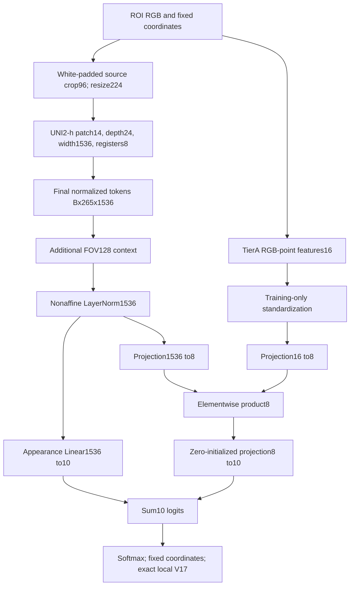

```mermaid
flowchart TD
 I[ROI RGB and fixed coordinates] --> C[White-padded source crop96; resize224]
 C --> E[UNI2-h patch14, depth24, width1536, registers8]
 E --> T[Final normalized tokens Bx265x1536]
 T --> H[Additional FOV128 context]
 H --> N[Nonaffine LayerNorm1536]
 N --> A[Appearance Linear1536 to10]
 I --> B[TierA RGB-point features16]
 B --> S[Training-only standardization]
 N --> PH[Projection1536 to8]
 S --> PB[Projection16 to8]
 PH --> P[Elementwise product8]
 PB --> P
 P --> R[Zero-initialized projection8 to10]
 A --> Z[Sum10 logits]
 R --> Z
 Z --> V[Softmax; fixed coordinates; exact local V17]
```

Identical extra capacity to B1; failed promotion.
