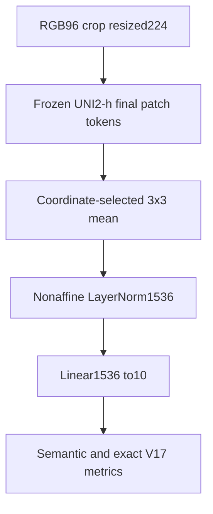

# Plain local linear diagnostic

Exploration4 architecture ID: `DIAG_A3LINEAR`. **15,370 trainable parameters** for the executed configuration. No TierA. Diagnostic-only comparison against reused Exploration3 appearance-only CLS predictions; excluded from selection.

## Mathematical and tensor contract

`z = W LN(mean target3×3 tokens) + a`

The UNI2-h final feature sequence has265 tokens: CLS at0, eight registers at1–8, and256 spatial tokens at9–264 in row-major order. Each token has1536 channels. The 224-pixel image gives16×16 patches of14 pixels. The coordinate transformation is `left=floor(x-48+.5)`, `top=floor(y-48+.5)`, `u=(x-left)/6`, `v=(y-top)/6`. Tokens are selected after the encoder's final LayerNorm. Registers are never interpreted as spatial tokens. Local tokens remain globally contextualized by self-attention.

Except for the explicitly plain linear diagnostic and mask network, the retained head uses appearance `W:1536→10` with bias, `P_h:1536→8`, `P_b:16→8`, and `R:8→10`, all three projections biasless. Parameters are15370+12288+128+80=27866. `R` starts at zero; initially only its output projection can receive an interaction-branch gradient. This deliberate initialization is not proof of minority gradient starvation. All per-epoch measured gradients are retained.

## Forward flowchart

## Training and inference

Frozen-head arms use FP32, inverse-class replacement sampling, ordinary CE, AdamW LR.001, weight decay.01, batch64, norm clip1, seeds17/29/43 and fixed epoch10. D1 changes only the sampler. E0 and E1 use fixed epoch5; E1 adds Q/V LoRA r8 alpha16 at adapter LR1e-5, microbatch4 and effective batch64. F mask-network training uses its separate documented loss and fixed ten-epoch recipe. No train-time augmentation was applied to the fixed encoder caches. No fitted temperature was used; temperature1 preserves the recorded confidence contract.

Train-only TierA mean and standard deviation are saved per run, with standard deviation floored at1e-6. The ten class names and the epithelium/endothelium evaluator permutation are defined in local code. Coordinates are never moved by classification. The archived small-sample metrics are conditional development metrics. Only the full-data evaluator in the final package can score complete proposals against complete ROI annotations, including empty proposal ROIs.

## Controls, provenance and execution

Broken-coordinate A controls use fixed uniform grid centers in[2,14]², independent of labels. Literal shuffling of almost-identical centered coordinates is a weak control and was retained only as a diagnostic. Multiscale controls add an identical rank-eight branch using duplicate96 features. Mask controls use independent mask-shape permutations with fixed seed1701. The exact configuration, normalizer, checkpoint, epoch history and saved predictions for each run are under RESULTS and indexed in RESULT_INDEX.csv. Missing original measurements are not reconstructed as observations.

CODE contains local runtime modules. Cache references identify shared immutable inputs, not code imported from another architecture. README gives the entrypoint commands. PROVENANCE contains source hashes, evaluator parity and execution checks. All recommendations are governed by TABLES/final_decision.json; historical or internal-CV successes do not override failed confirmation.
