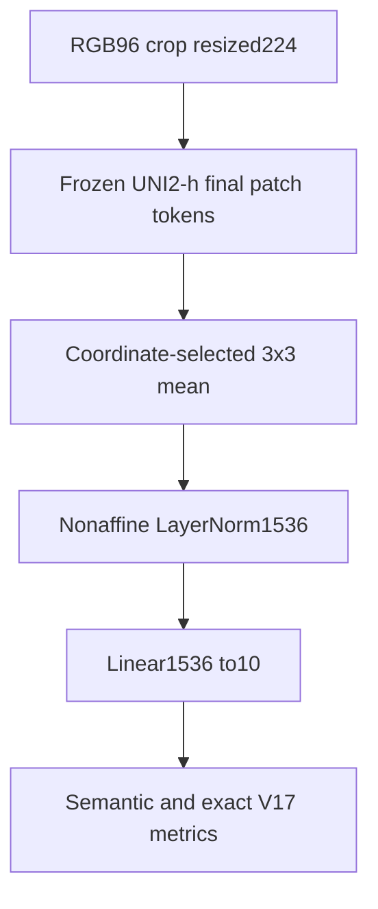

```mermaid
flowchart TD
 I[RGB96 crop resized224] --> E[Frozen UNI2-h final patch tokens]
 E --> P[Coordinate-selected 3x3 mean]
 P --> N[Nonaffine LayerNorm1536]
 N --> L[Linear1536 to10]
 L --> V[Semantic and exact V17 metrics]
```

No TierA. Diagnostic-only comparison against reused Exploration3 appearance-only CLS predictions; excluded from selection.
