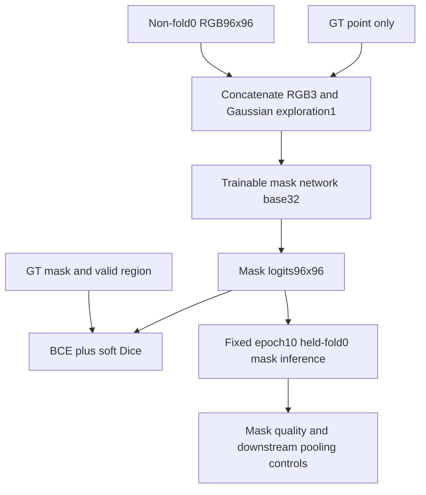

```mermaid
flowchart TD
 I[Non-fold0 RGB96x96] --> X[Concatenate RGB3 and Gaussian exploration1]
 C[GT point only] --> X
 X --> M[Trainable mask network base32]
 M --> L[Mask logits96x96]
 G[GT mask and valid region] --> B[BCE plus soft Dice]
 L --> B
 L --> H[Fixed epoch10 held-fold0 mask inference]
 H --> Q[Mask quality and downstream pooling controls]
```

Random initialization;294 non-fold0 GT-prompt training rows,156 held fold0; no semantic-label or Stage1-proposal training input.
