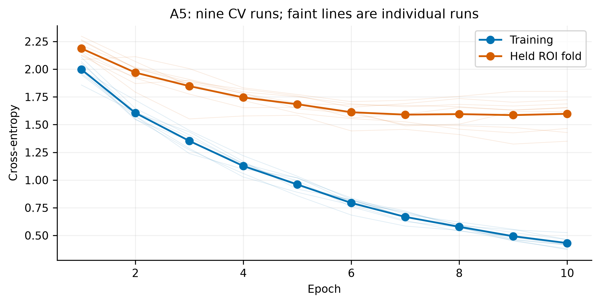
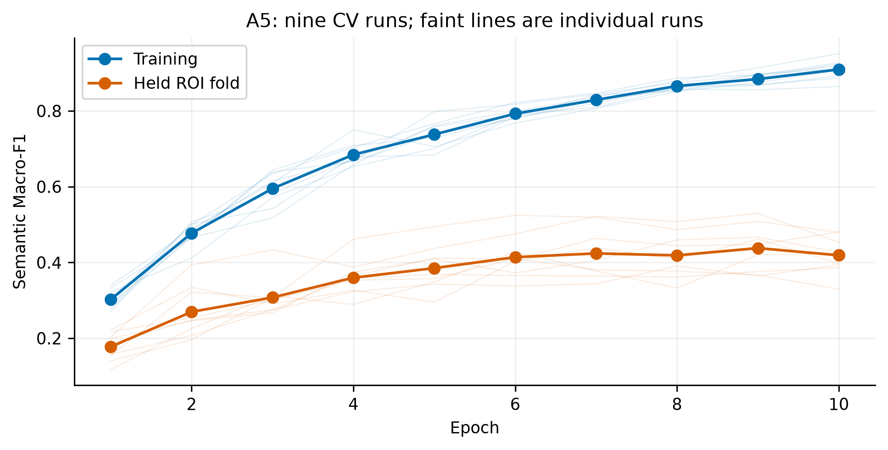
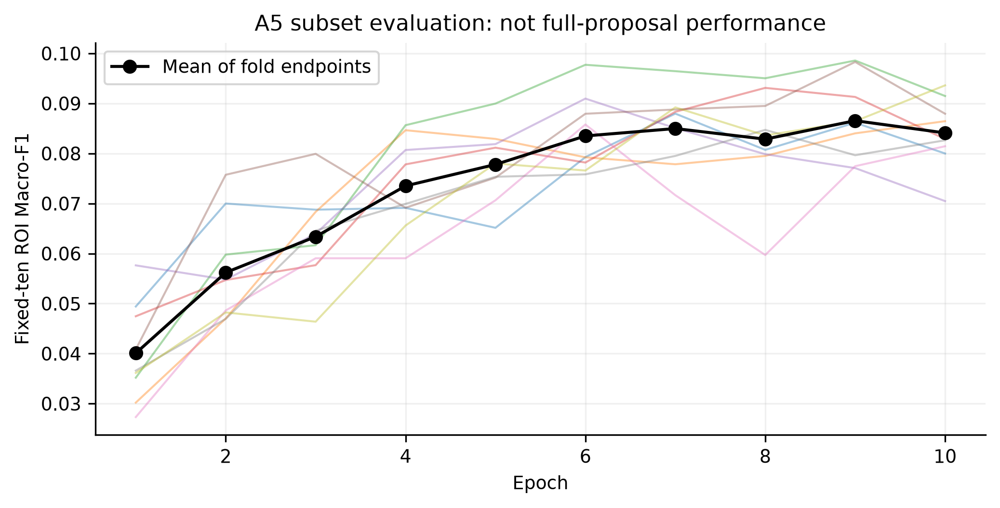
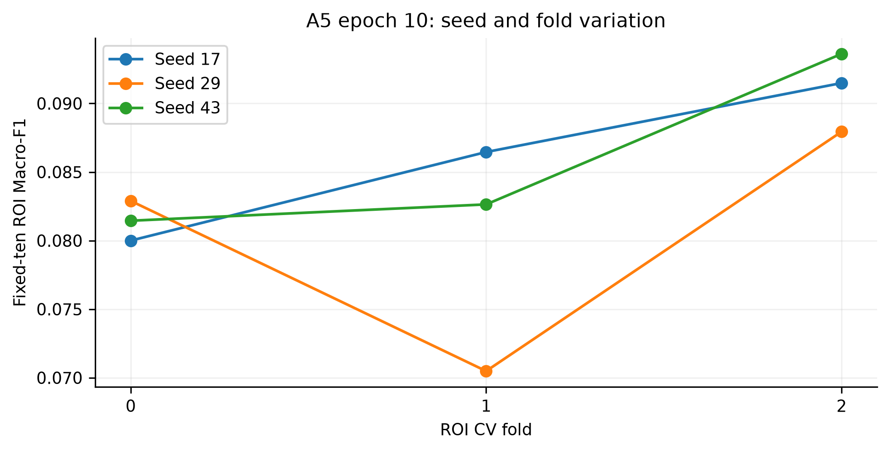
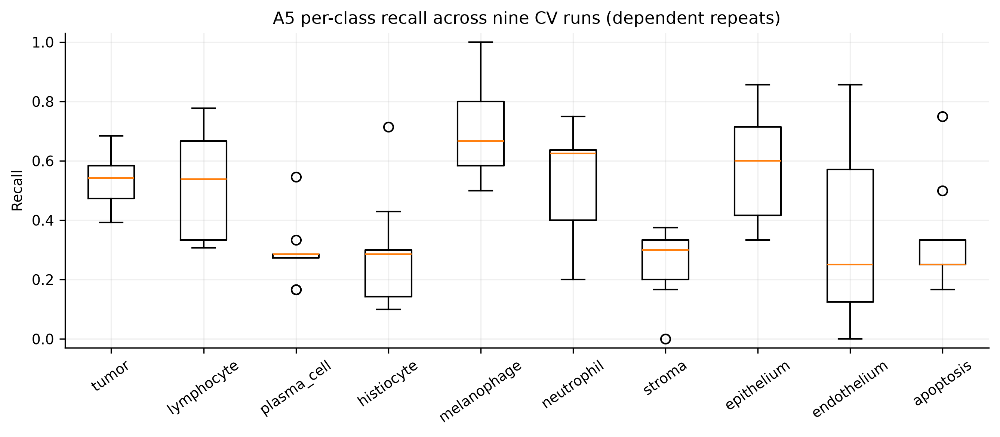
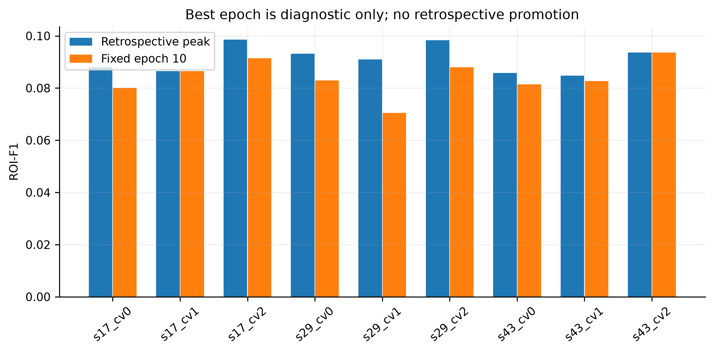
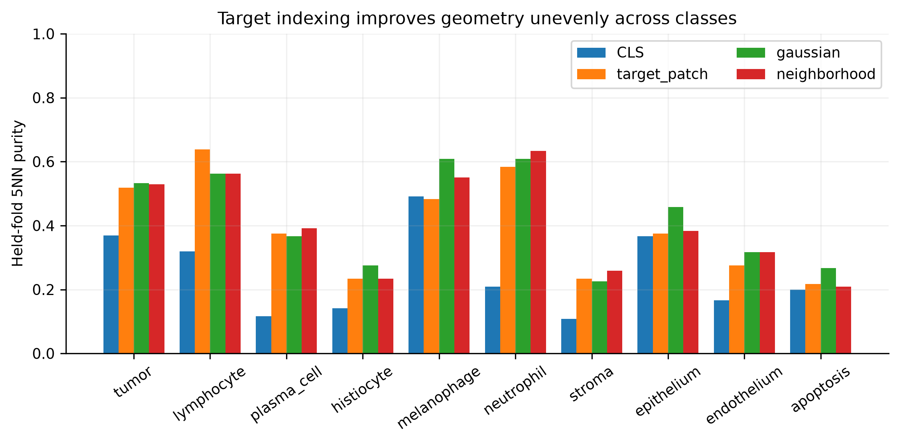
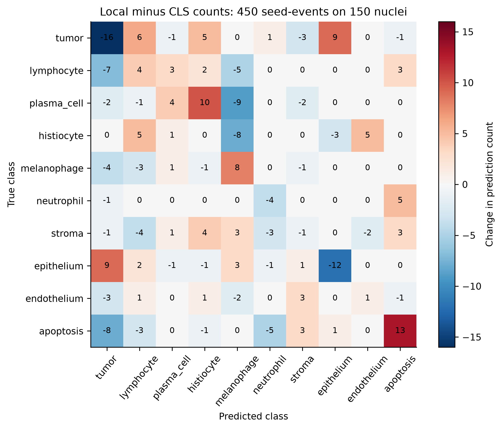

# PUMA Stage 2 — Exploration 5 root-cause investigation

## 1. Executive conclusion

**Retain Exploration 3 A5. The current evidence does not justify a new architecture.** The clearest problem is generalization overfitting in a small, enriched development study. Limited independent support for rare classes and unverified higher-level grouping make both learning and model selection less reliable. Representation alignment is a second issue supported by the experiments, but the results do not show that the frozen encoder is always the limitation.

Across the nine A5 cross-validation runs, mean training semantic Macro-F1 reaches **0.90950**, compared with **0.41901** on the held-out folds at epoch 10, a gap of **0.49049**. Training cross-entropy falls from 1.9973 to 0.4310, while validation cross-entropy levels off near 1.59. This pattern does not suggest that the head needs more capacity. Local target representations improve macro-averaged held-fold 5-NN purity from 0.2488 for CLS to 0.4067 for 3×3 pooling, but confirmation errors remain concentrated in particular class boundaries with very limited independent support.

**The next experiment should establish a clean, full-population A5 baseline with a controlled training-coverage comparison, after the provenance checks pass.** I did not find a clean full-data A5 run in the archive or the local project evidence. The complete proposal collection exists, but upstream outer-group independence has not been verified because every historical fold contributes to the training of other detectors. Under the current fixed-Stage-1 contract, this prevents a scientifically valid launch. The baseline protocol is ready in [FULL_DATA_A5_PROTOCOL.md](../METHODS/FULL_DATA_A5_PROTOCOL.md), but it has not been executed.

This investigation produced new diagnostics, not new classifier fits. No model has been promoted using the reused confirmation population.

## 2. Reconstructing the research state

I inventoried 14,607 non-git files in the project directory. I treated reports as historical evidence and checked them against configurations, source code, raw epoch logs, predictions, manifests, and caches. The 82 MB master report was not used as a substitute for raw records. [SOURCE_HASHES.json](../../RESULTS/METRICS/SOURCE_HASHES.json) lists 1,466 sources used in the review and confirms that their hashes were unchanged during verification. [ARCHIVE_INVENTORY.csv](../../RESULTS/METRICS/ARCHIVE_INVENTORY.csv) records directory coverage; it does not mean that every checkpoint was retrained or every duplicate binary was loaded.

Exploration1 established feasibility and corrected encoder identity. Exploration2 established preserved-local-V17 parity, favored FOV96 and inverse-count sampling plus CE, and supported a small Tier-A correction against controls. Exploration3 tested26 real/control configurations across3×3 CV fits and promoted only A5. BioMask classification diagnostics were upstream-contaminated. Exploration4 found stronger internal target-token representation gains, but its selected3×3 candidate failed confirmation class guards. A5 remained retained.

Stage1 architecture, checkpoints, proposal coordinates, threshold0.03, suppression and generation were not modified. Tissue segmentation was not introduced. Patient/case/slide independence is unverified; case_id in the recovered ROI array is an ROI proxy. The existing450 nuclei span181 ROIs;300 training nuclei use141 ROIs and150 reused confirmation nuclei use40. These are development partitions, not a locked test.

### Verified task census

Raw GeoJSON features were recounted: **97,193 annotation features,205 ROIs**. Polygon-component matching instead uses97,378 GT components. The distinction is preserved.

| Class | Full annotation features | Historical full train | Historical full development | Actual screen train / confirmation |
|---|---:|---:|---:|---:|
| tumor |57,234|44,494|12,740|71 /39|
| lymphocyte |21,643|18,450|3,193|37 /15|
| plasma_cell |520|449|71|24 /12|
| histiocyte |7,168|6,442|726|24 /12|
| melanophage |695|458|237|24 /12|
| neutrophil |366|196|170|24 /12|
| stroma |3,856|3,301|555|24 /12|
| epithelium |2,211|1,958|253|24 /12|
| endothelium |1,696|1,427|269|24 /12|
| apoptosis |1,804|1,402|402|24 /12|

Historical full-partition counts are recorded in Exploration2; they are not a newly admitted four-way split. Screen counts were recomputed from the UID manifest. Full head:tail ratio is57,234/366=156.377. No ratio-file prior was substituted.

The fixed Stage1 manifest contains **109,637 proposals:94,345 matched and15,292 unmatched**, across205 ROIs, with zero zero-proposal ROIs. Matched GT indices are unique and map to the correct ROI in nuclei.npy. Direct complement against97,378 GT components yields **3,033 missed GT components**, saved in [MISSED_GT_COMPONENTS.csv](../../RESULTS/METRICS/MISSED_GT_COMPONENTS.csv). Do not subtract proposal matches from the97,193 feature census to manufacture a feature-level miss count. The450-cell alignment subset has433 matches and17 misses.

### Exact retained implementation

Source inspection of `prompt3_models.py`, `exploration3_train.py`, `biology.py`, and the retained package confirms:

`z = W h + a + R((P_h h) ⊙ (P_b b))`.

FOV96 coordinate-centered RGB, white padding, bicubic224 resize, ImageNet normalization, frozen verified UNI2-h CLS1536, functional nonaffine LayerNorm. `W`:1536→10 with bias (15,370 parameters); biasless `P_h`:1536→8 (12,288), `P_b`:16→8 (128), `R`:8→10 (80), total **27,866**. `R` starts at zero. Projection gradients can therefore be zero on the first step without an optimization defect. LayerNorm is applied before the architecture forward rather than being an affine trainable module inside it.

Tier-A: H_mean/std/p10/p50/p90; H_gradient_mean/std, H_abs_laplacian_mean, H_entropy32; H_center_minus_ring, gray_center_minus_ring, H_ring_std, central_valid_fraction, ring_valid_fraction; H_robust_z, H_ROI_percentile. Statistics use training rows only, std floor1e-6. These are RGB/point proxies, not causal biological measurements. Frozen encoder checkpoint SHA256 is `32cc070acd809d087debdbe483f388561cf03de825cc7c2935d1732dfb427ffe`.

Historical CV: inverse-count replacement sampler, ordinary CE, AdamW LR0.001/WD0.01, batch64, clip1, seeds17/29/43, fixed10 epochs. The prospective full-data20-epoch/patience5 recipe is a blueprint, not another configuration silently called an executed A5. No material discrepancy from the requested A5 architecture was found.

## 3. Negative-evidence ledger

[NEGATIVE_EVIDENCE_LEDGER.csv](../../RESULTS/EPOCH_HISTORY/NEGATIVE_EVIDENCE_LEDGER.csv) contains90 historical experiment/control rows. [HISTORICAL_RUN_ENDPOINTS.csv](../../RESULTS/METRICS/HISTORICAL_RUN_ENDPOINTS.csv) adds individual fixed-epoch P3/P4 run context. Missing fields are explicitly `NOT RECORDED IN ORIGINAL RUN`; some raw information resides in linked histories rather than a historical aggregate statistic. P2 selected-best development endpoints and P3/P4 fixed-epoch endpoints are explicitly distinguished.

P2 FOV64/96/128 with logit adjustment scored0.11345/0.12555/0.11855 ROI-F1. Ordinary CE0.12120; balanced replacement+CE0.13317. These are historical selected endpoints, not fresh paired fixed-epoch evidence. Real Tier-A seed17 scored0.13961 versus placebo0.13367 and shuffle0.13292. Three-seed mean gain over appearance was0.009453, exploratory ROI interval[0.001355,0.017505]. Biology-only was weak (0.03575 in the base run); GT morphology oracle0.13367 was nondeployable and not an upper bound. Single-family and all four leave-family-out runs are retained; removals gave0.13283–0.13636 versus0.13961. They support an incremental combination in this cohort, not all individual features or a causal biology claim.

P3 A0/A1/A2/A3/A4/A5/A6 real mean ROI-F1:0.07521/0.07810/0.07684/0.07834/0.07834/0.08410/0.07853. A2–A6 have equal-capacity placebo and shuffled-information controls. A5 placebo0.07236 and shuffle0.07340 lose to real0.08410. A5–A1 gain0.00600, interval[0.00161,0.01081]; it alone passed the full gain/control/uncertainty/class/gap criteria and then improved all three confirmation seeds. Tiny class-gate spread and almost constant uncertainty gates did not earn promotion; A6’s50,026 parameters did not justify expansion.

BioMask five-fold checkpoint quality: Dice0.85741, IoU0.77957 on450 GT-point diagnostic crops. Historical fold counts47/1/86/61/10 and row-wise OOF lineage do not provide nested outer exclusion. B0–B4 results, including B3/B4 shuffled/capacity controls, cannot justify promotion irrespective of segmentation quality. B4 real0.08194 was only a contaminated diagnostic.

P4 representation A1 target0.10173, A2 Gaussian0.10665, A3 neighborhood0.10876, A4 CLS/Gaussian0.10469 versus A0 (P3 A5)0.08410. A3 broken-coordinate0.05856. Plain linear local representation gained0.032785 without Tier-A, interval[0.021797,0.043743]. Local extraction improves information available to a simple classifier; it does not require a larger head. The already-tested equal CLS/Gaussian mixture is locked negative/conditional evidence, not a new candidate.

P4 FOV64/FOV128/duplicate96 residual gains0.000236/0.001631/0.000292 did not qualify. D1 ROI-class sampler gain−0.000063, interval[−0.005564,0.005508], one positive seed. Do not repeat these configurations.

P4 LoRA: blocks20–23, Q/V only, r8, alpha16, adapterLR1e-5/headLR1e-3, five epochs, three seeds,196,608 adapter parameters plus27,866 head. Initial parity0, gradients and parameter changes recorded, but all ROI-F1 deltas0 against matched frozen controls. Small NLL differences show the continuous outputs were not identical. This is a finite-budget null, not a rejection of all adaptation.

P4 clean GT-only mask network:294 non-fold0 training crops;156 excluded fold0 crops; ten epochs. Dice0.78396, IoU0.66914. Mask-only classification gain0.000730 over A3, interval[−0.030367,0.028509], and0.011136 worse than Gaussian. Histiocyte/neutrophil recall fell0.291667/0.194444. CLS+mask lost0.013995. Clean provenance, good segmentation, and useful classification are separate propositions.

P4 detector-held coordinate2×2 comparison: mean shift2.3448px, median1.8980, p904.3117, p955.8393. Stage1-centered training gain0.005635 for Stage1-centered evaluation, interval[−0.006667,0.017857]; apoptosis recall−0.166667. Matched-only evidence does not establish full-proposal improvement.

## 4. A5 learning dynamics

All9 CV histories and3 confirmation histories were extracted:120 epochs, no best-epoch filtering. `train_loss` is full training CE, separate from the replacement-sampled optimization objective. Gradient fields preserve their actual scope: mean positive-target output-head contributions, not total encoder gradients. All recorded interaction/projection/correction vectors are retained alongside their means.

| Mean over nine CV runs | Epoch1 | Epoch7 | Epoch9 | Epoch10 |
|---|---:|---:|---:|---:|
| Training CE |1.9973|0.6672|0.4929|0.4310|
| Validation CE |2.1869|1.5897|1.5855|1.5973|
| Training semantic Macro-F1 |0.3023|0.8292|0.8841|0.9095|
| Held-fold semantic Macro-F1 |0.1774|0.4239|0.4379|0.4190|
| ROI-F1 |0.0401|0.0850|0.0866|0.0841|
| Validation ECE15 |0.0762|0.1291|0.1504|0.1483|

The mean of held-fold semantic F1 (0.4190) is not the pooled OOF semantic F1 (historical0.4330). Fold sizes and nonlinear metrics make them different estimands. Neither is full-proposal performance.

Mean run-specific retrospectively best epochs are8.11 for ROI-F1 and8.33 for semantic F1. Mean peak-to-final losses are0.00695 and0.03447. This motivates prospective stopping as a possible small regularization benefit, but does not explain away the much larger0.4905 gap. Selecting epoch9 now would be reused-development tuning and was not done. Confidence rises without commensurate held accuracy, consistent with the worsening calibration estimate; NLL/ECE remain sensitive to the enriched evaluation prior.

## 5. A5 per-class stability

[A5_PER_CLASS_STABILITY.csv](../../RESULTS/METRICS/A5_PER_CLASS_STABILITY.csv) includes1,200 class×run×epoch rows: precision, recall, F1, support, predicted counts, confusion destinations, best epochs, best-to-final changes, and separately fold-mean/seed-mean variability. Raw runs remain the uncertainty source; three seeds do not constitute independent biological samples.

Rare-class sample counts are approximately12–20 per training CV fold and4–12 per held fold, depending on class/fold. A zero recall remains visible. Large fold variation can be hidden by pooled seed summaries. The report does not treat per-run best recall as a prospective model.

## 6. Representation geometry

Output SHA256 values match the saved target/Gaussian/neighborhood cache contract; CLS arrays exactly equal the preserved P2 FOV96 arrays. P4 token contract UIDs and P3/P4 class labels align to the450-row manifest. No UNI2 extraction was performed. Geometry uses cosine-normalized post-encoder cached vectors, not an invented new classifier. Class centroids and neighbors use only the training side of each ROI fold. Covariance differences are computed with an exact Gram-matrix identity, avoiding a noisy inverse of1536×1536 covariance from tiny samples.

| Representation | Macro held-fold5NN purity | Mean held-fold centroid margin | Fisher between/within scatter |
|---|---:|---:|---:|
| CLS |0.2488|−0.0069|0.0948|
| Target patch |0.3931|0.0056|0.1798|
| Gaussian |0.4220|0.0158|0.2011|
| 3×3 neighborhood |0.4067|0.0131|0.1961|

These descriptive diagnostics support H5. Gaussian ranking above3×3 here does **not** authorize selecting Gaussian after failed confirmation. The earlier classifier endpoint selection remains unchanged.

[REPRESENTATION_GEOMETRY.csv](../../RESULTS/METRICS/REPRESENTATION_GEOMETRY.csv) provides all ten classes: within/between cosine, same/different ROI similarity, held-group purity, silhouette-like margin, train-confirmation centroid shift, covariance change, nearest competing class, and margin/entropy changes. [REPRESENTATION_CENTROIDS.csv](../../RESULTS/METRICS/REPRESENTATION_CENTROIDS.csv) contains all class-pair distances. The entropy diagnostic is a fixed-temperature cosine pseudo-distribution, explicitly not model calibration. Different-case similarity is unavailable.

Same-class/same-ROI versus same-class/different-ROI cosine means: CLS0.6779/0.5191;3×3 0.5742/0.4313. There is residual group structure in both. Sparse same-ROI pairs and unknown cases prevent concluding that ROI identity is universally more strongly represented than phenotype. No group classifier or causal intervention established that interpretation.

## 7. Why the local representation failed confirmation

Preserved fixed-epoch paired ROI-F1 gains are **0.012703,0.010800,0.024619**, mean **0.016041**; descriptive ROI bootstrap95% **[−0.008603,0.039256]**. All seeds improve the average, but tumor recall−0.136752, neutrophil−0.111111 and epithelium−0.333333 violate the0.10 guard. Other recall deltas in canonical order are lymphocyte+0.088889, plasma+0.111111, histiocyte0, melanophage+0.222222, stroma−0.027778, endothelium+0.027778, apoptosis+0.361111.

UID-aligned prediction comparison quantifies the changed boundaries. Counts below sum three predictions per nucleus and are **seed-events**, not independent nuclei:

| True→predicted | CLS events | Local events | Change |
|---|---:|---:|---:|
| epithelium→tumor |1|10|+9|
| tumor→epithelium |3|12|+9|
| tumor→lymphocyte |2|8|+6|
| tumor→histiocyte |5|10|+5|
| neutrophil→apoptosis |1|6|+5|

Correct events fall89→73 for tumor,34→30 for neutrophil and30→18 for epithelium. Local geometry improves average neighborhood purity yet worsens these trained decisions. Epithelial confirmation centroid margin decreases fromCLS0.0607 to3×3 0.0141; tumor is negative in both (−0.0025→−0.0073). Neutrophil geometry actually improves (purity0.2083→0.6333; confirmation centroid margin0.0442→0.1105) while its trained recall drops. Thus a blanket “local representation lost morphology” explanation is contradicted for neutrophils; boundary/sampling/finite-support effects remain plausible.

The confirmation neutrophils occupy4 ROIs (effective1.714); epithelium5 (effective2.118). This directly supports instability from group concentration. Useful context removal is plausible for epithelial/tumor discrimination but not demonstrated causally. Patch tokens themselves contain global-attention context. Increased stain sensitivity, adverse Tier-A interaction and coordinate susceptibility were not isolated in this confirmation comparison. The plain linear diagnostic shows local value without Tier-A; it does not prove Tier-A caused the failed classes. GT-centered confirmation cannot attribute its failure directly to detector-coordinate shift. Label ambiguity requires adjudication that is absent.

[CONFUSION_CHANGES.csv](../../RESULTS/METRICS/CONFUSION_CHANGES.csv), [CONFIRMATION_CELL_EVENTS.csv](../../RESULTS/METRICS/CONFIRMATION_CELL_EVENTS.csv), and [CONFIRMATION_ROI_HARM.csv](../../RESULTS/METRICS/CONFIRMATION_ROI_HARM.csv) preserve exact pairs and ROI localization. No damaged class was rescued by retuning.

## 8. Dataset and effective diversity

Effective positive ROI count is `(sum n_g)^2 / sum(n_g^2)`, a concentration descriptor, not a claim that ROIs are independent patients. Full census effective counts: tumor152.86, lymphocyte81.37, plasma7.20, histiocyte65.21, melanophage22.68, neutrophil4.35, stroma75.59, epithelium12.49, endothelium68.51, apoptosis26.43. Thus hundreds of rare nuclei can represent very few dominant source groups.

Full raw nuclei, ROI counts, median/group, maximum one-group share, and screen partitions are in [DATA_DIVERSITY_AUDIT.csv](../../RESULTS/METRICS/DATA_DIVERSITY_AUDIT.csv). Full class-by-ROI counts are independently recomputed from GeoJSON. Patient/case/slide counts remain unverified, not inferred from file names.

Original P3 per-epoch unique UID draw counts were not recorded. They are not silently reconstructed from a seed. The parity-admitted P4 A0 reruns explicitly recorded them: mean121.13 unique samples and73.42 ROIs per roughly200-draw training epoch, mean repeat fraction0.3943 (range0.3333–0.4293). [A5_SAMPLING_EXPOSURE.csv](../../RESULTS/METRICS/A5_SAMPLING_EXPOSURE.csv) clearly attributes these90 epochs to P4, not P3. P3 original class exposures are preserved in its dynamics table. Repeated gradient exposure does not add nuclei, ROIs or patients.

## 9. Tier-A confounding audit

The raw16D cache was audited against class, ROI, split, primary/metastatic filename category, border distance and seed-averaged OOF correctness. Filename category is a cohort descriptor, not verified acquisition metadata. ROI eta-squared is strongly inflated by181 group levels, so a class-conditioned499-permutation diagnostic was added before interpreting it.

For H_mean, class-residual ROI eta²0.714 versus conditional-null mean0.409, excess0.305; H_p100.674 versus0.405, excess0.269. H_robust_z retains excess0.255 despite ROI normalization. Fourteen non-valid-fraction features show positive excess association; valid-fraction features do not. These correlated exploratory permutation results are not independent tests or a causal decomposition. The class-conditional exchangeability assumption is limited by the enriched sample and unknown cases.

Split eta² is small (up to about0.021), so a simple train/confirmation mean difference alone is not a complete explanation. Border-distance correlations are strongest for central/ring valid fractions (0.306/0.442), as expected from their definitions. No patient mapping or stain/acquisition metadata exists to separate biological spatial clustering from nuisance variation. [TIER_A_CORRECTNESS_AUDIT.csv](../../RESULTS/METRICS/TIER_A_CORRECTNESS_AUDIT.csv) reports OOF associations, including class-residual correlations, without claiming feature removal will improve performance.

Conclusion: Tier-A contains both class signal and measurable group structure. P2/P3 matched controls justify retaining its incremental signal for now; the association audit prevents calling that signal causal biology. Neither automatic removal nor unconditional endorsement is supported.

## 10. Ranked root causes: evidence for and against

| Rank / hypothesis | Evidence for | Evidence against / unresolved | Confidence |
|---|---|---|---|
|1 H3 generalization overfitting|0.91 training vs0.42 held-fold F1; late CE plateau and confidence growth|does not identify whether nuisance, diversity or margins cause the gap|High, directly observed|
|2 H8 insufficient independent diversity|only300 enriched training nuclei; effective confirmation tail ROIs1.7/2.1; full tail concentration|full-data learning curve not executed; ROI is not patient|High support limitation; moderate causal attribution|
|3 H5 target-representation misalignment|same-capacity local gains, broken-coordinate controls, linear-head gain and better held-fold geometry|local candidate fails class guard; no universal class benefit|High internal evidence; limited generalization|
|4 H7 ROI/case confounding|same-class ROI similarity; class-conditioned Tier-A ROI association|not proof of harmful shortcut; case/acquisition metadata absent|Moderate association, low causal certainty|
|5 H6 long-tail boundary bias|balanced sampling helps historically; neutrophil geometry/decision discrepancy; natural prior differs|head classes also harmed; D1 null; no clean calibration/boundary isolation|Moderate plausible contributor|
|6 H4 frozen-feature nonseparability|CLS low5NN purity and some negative margins|local tokens materially improve without changing encoder; training fit strong|Class-specific residual problem; global claim unsupported|
|7 H9 Stage1 coordinate mismatch|2.34px mean displacement; paired coordinate study small positive mean|interval crosses0, class harm, GT-centered confirmation failure|Real shift; dominance unproven|
|8 H10 label ambiguity/noise|specific confusions are compatible with ambiguity|no inter-rater or annotation-adjudication evidence|Unknown; cannot diagnose from predictions|
|9 H2 optimization failure|some late oscillation|CE falls strongly; gradients/output changes; high train fit|Low as dominant cause|
|10 H1 underfitting|training F1 not exactly1|0.91 train fit and larger-head failures|Low as dominant cause|

The most defensible answer is therefore **small-group generalization failure with a representation-alignment contribution**, not “the encoder is weak,” “LoRA is useless,” or “biology causes starvation.” No causal ranking can be certified beyond these observations without new clean data coverage.

## 11. Literature-grounded candidate hypotheses

Targeted literature was searched only after local dynamics, geometry, diversity and confusion analysis. Cawley and Talbot explain how repeated model selection can overfit the selection criterion; this supports a new independent evaluation, not another search on150 cells. [JMLR,2010](https://www.jmlr.org/beta/papers/v11/cawley10a.html). The UNI paper supports testing pretrained representations across tasks but does not establish cell-centered CLS sufficiency or this UNI2 checkpoint's PUMA performance. [Chen et al.,2024](https://www.nature.com/articles/s41591-024-02857-3). Kang et al. separate representation quality from classifier balancing; their natural-image evidence motivates a future boundary diagnostic, not automatic transfer of its gains to nuclei. [ICLR paper](https://arxiv.org/abs/1910.09217).

Only three distinct candidates are considered:

**C1 — increase clean training coverage with unchanged A5 (selected next).** Targets H3/H8. More unique phenotype/group examples constrain a fixed-capacity estimator. Exact change: all eligible matched training proposals versus a predeclared300-row training-only coverage control, retaining full held-population evaluation. All Stage1 settings, FOV96, UNI2, Tier-A, head, loss and optimizer stay frozen; parameter delta0. Expected benefit: stable held-group and tail recall, smaller generalization gap. Risk: additional nuclei remain concentrated or upstream-contaminated. Match split, seed, shared initialization, evaluator and maximum draw budget; document draw identities. Estimated extraction cost is roughly50 CPU hours at historical0.6 crops/s for the full proposal collection, before parallelism or different hardware; cache-head cost must be measured. Reject the improvement hypothesis if clean controlled gain fails the predeclared paired/class/gap conditions. Admission is currently blocked, so no result is invented.

**C2 — prospective stopping as one training-rule change (deferred).** Targets late H3. Exact change: predeclared development-only stopping versus fixed-budget A5, no feature/loss change, parameter delta0. Other components and per-seed draw prefixes remain fixed. Compare a matched fixed-budget control and account for different effective updates; evaluate the chosen checkpoint once on independent held groups. Expected benefit is small peak-to-final recovery, not elimination of the0.49 gap. Risk: noisy tiny-group selection. Cost: one matched frozen-head trajectory per seed after new split admission. Reject if its independent paired effect or class/gap guard fails. Do not implement epoch9 from these curves as if prospectively selected.

**C3 — classifier-only prior/boundary diagnostic (deferred).** Targets H6, distinct from C1/C2. Freeze representation and Tier-A interaction, retrain only the existing linear appearance classifier under one explicitly chosen natural-prior versus balanced objective, with equal update budget and unchanged evaluation thresholds. Parameter delta0; no stacked weighting/logit corrections. This is not a rerun of P2 logit adjustment: representation/interaction is frozen first and only boundary recalibration is isolated. Main risk is sacrificing tails or optimizing the wrong prevalence. Require admitted natural development/calibration cohorts and demonstrate geometry/decision disagreement before launch. Three matched seed fits, negligible extraction if admitted caches exist. Reject if balanced recall or any class guard collapses, even if accuracy rises. Current evidence does not select this candidate.

A global-local mixture is not offered as a fourth hypothesis: P4 already tested one. Larger heads, contrastive adaptation and a LoRA grid do not earn new studies from the current evidence.

## 12. New empirical probes

Exploration5 executed retrospective dynamics extraction, per-class trajectories, verified-cache geometry, UID-paired confusion changes, raw GeoJSON diversity, observed P4 sampling exposure, Tier-A class-conditioned ROI permutation/correctness associations, and full-proposal provenance/miss auditing. Every result is exploratory; none is a new classifier efficacy trial. [PROMPT5_EXPERIMENT_REGISTRY.csv](../../RESULTS/METRICS/PROMPT5_EXPERIMENT_REGISTRY.csv) distinguishes completed diagnostics from the prepared baseline.

I first locked the diagnostic protocol at git commit `4461dee`, then measured the failure, checked source and cache identities, compared possible explanations, reviewed the relevant literature, and selected one next step. I stopped the architecture search once the evidence pointed to a data and generalization problem rather than a missing model branch.

## 13. Promotion analysis

No new trained candidate exists, so no new promotion decision can be statistically valid. P4 A3 still fails three recall guards and has an exploratory aggregate interval crossing zero. Better post-hoc Gaussian geometry does not rescue it or promote a runner-up. Current outcome: **retain A5**.

The future rule is fixed in protocol.md: paired ROI-F1 gain≥0.003,≥2/3 positive seeds, highest verified group-bootstrap95% lower bound>0, no mean class recall loss>0.10, gap increase≤0.05, control advantage≥0.002 where relevant, clean upstream lineage, and one locked confirmation. The data-coverage control has no added-capacity advantage to explain away. These pragmatic thresholds do not create power where independent tail support is absent.

## 14. Exactly one recommended next experiment

**Clean full-population retained A5 with controlled training coverage.** Resolve grouping, untouched evaluation availability and upstream exclusions first; then lock UID partitions and training draw budget. Train independent seeds17/29/43 and report conditional classification and complete preserved-V17 metrics separately. No ensemble.

The current artifact is an executable-admission preparation, not a promise that the existing data can satisfy the contract. `FULL_BASELINE_ADMISSION.json` fails complete-population outer independence. A subset restricted to detector-held fold0 can be clean for that detector but cannot be described as the requested complete-population baseline. No prohibited Stage1 change was made to bypass this obstacle.

## 15. Rejected alternatives

No additional head complexity: prior A2/A3/A4/A6 controls already argue against it. No naive multiscale stacking or D1 repeat. No identical five-epoch LoRA rerun. No mask-guided pooling justified by Dice. No local-pooling radius, sigma, mixing, class threshold or epoch rescue on the150 cohort. No contrastive positives inferred from repeated oversampling. No eleventh class. No label-noise diagnosis without annotation review.

## 16. Limitations and unresolved measurements

The dominant observed failure mode is well established; its causal decomposition is not. All diagnostic confirmation use is reused development. The full data are long-tailed, but the analyzed450 were intentionally enriched. Geometry describes cached representations and a fixed descriptive metric; high-dimensional covariance estimates from small classes are uncertain. Same-ROI pairs are sparse for several classes. Group eta² and permutation tests are exploratory and correlated. Cases, slides, acquisition identifiers, physical scale and annotation agreement are unavailable. P3 original UID repeats and unlogged measurements are `NOT RECORDED IN ORIGINAL RUN`. No new full-data or external test metrics exist.

Full-data split design cannot be called clean merely by drawing new random ROI labels. Upstream dependencies are a structural barrier in the recovered all-fold proposal mixture, not a model hyperparameter. Search absence is bounded to accessible workspace evidence; it does not assert that no remote/private run exists anywhere.

## 17. Conditions required before SOTA/Q1 claims

Execute a clean admitted full-proposal study; verify highest independent grouping and detector exclusions; preserve all FP/FN and zero-proposal cases; use untouched confirmation with adequate independent tail support; compare relevant baselines under the same evaluator, population and compute contract; report uncertainty and class harm; establish external replication and reproducibility. Publication tier, clinical readiness, patient-level generalization and SOTA are not established by this report.

**Final conclusion:** The strongest demonstrated bottleneck is **generalization overfitting under limited independent and representative training and evaluation coverage**. CLS target alignment is a real secondary limitation, but the local improvements vary too much by class to justify a new architecture. The next experiment should therefore be a clean full-population study of **unchanged A5**, after the provenance checks pass. This is the smallest useful step for separating a generalization problem from a remaining representation or classifier-boundary problem.
